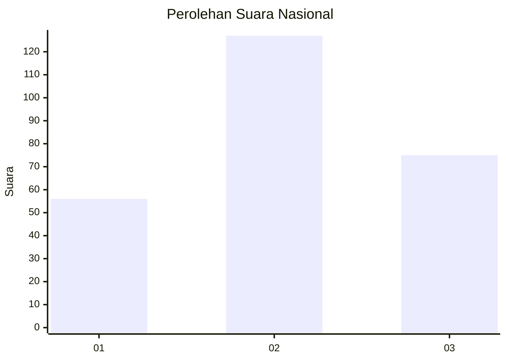
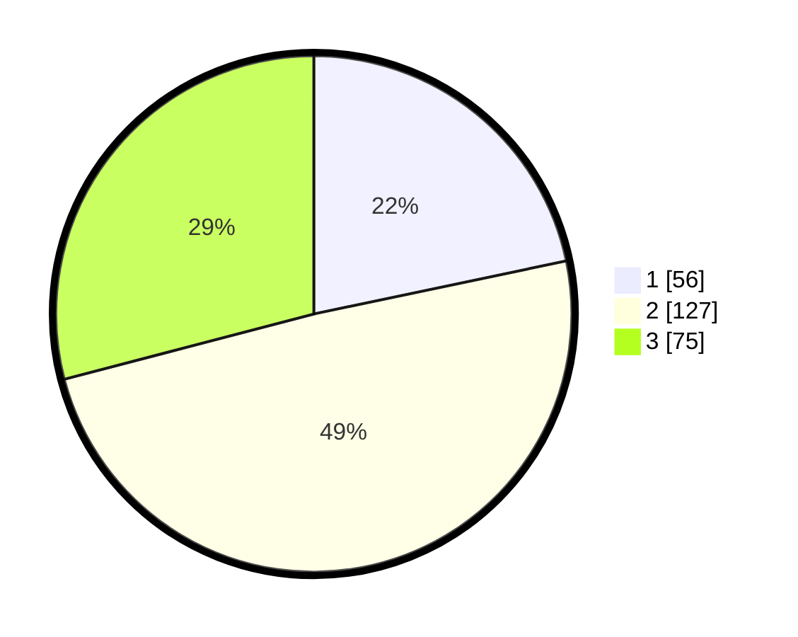

# Hasil

## Grafik

## Tabel

| No. | Nama Paslon    | Suara | Suara (raw) | Persentase |
|:--- |:-------------- | -----:| -----------:| ----------:|
| 1   | ANIES MUHAIMIN | 56    | [56][p-1]   | 21,71      |
| 2   | PRABOWO GIBRAN | 127   | [127][p-2]  | 49,22      |
| 3   | GANJAR MAHFUD  | 75    | [75][p-3]   | 29,07      |

[p-1]: https://github.com/gigit-pemilu/pemilu-2024/blob/main/pilpres/hitung-suara/sub/34-di-yogyakarta/sub/04-sleman/sub/15-turi/sub/2002-donokerto/sub/025-tps/sub/paslon-1.txt
[p-2]: https://github.com/gigit-pemilu/pemilu-2024/blob/main/pilpres/hitung-suara/sub/34-di-yogyakarta/sub/04-sleman/sub/15-turi/sub/2002-donokerto/sub/025-tps/sub/paslon-2.txt
[p-3]: https://github.com/gigit-pemilu/pemilu-2024/blob/main/pilpres/hitung-suara/sub/34-di-yogyakarta/sub/04-sleman/sub/15-turi/sub/2002-donokerto/sub/025-tps/sub/paslon-3.txt

## Foto C Plano

https://sirekap-obj-formc.kpu.go.id/906a/pemilu/ppwp/34/04/15/20/02/3404152002025-20240215-075605--bda5ba68-0462-4ea8-be90-287eaecec439.jpg

https://sirekap-obj-formc.kpu.go.id/906a/pemilu/ppwp/34/04/15/20/02/3404152002025-20240215-075806--546a04a6-3b8c-4440-9a92-f85cb44c55f9.jpg

https://sirekap-obj-formc.kpu.go.id/906a/pemilu/ppwp/34/04/15/20/02/3404152002025-20240215-080223--4035c88e-2bb3-4711-981b-fb5f882bfa67.jpg

## Metadata

| Key        | Value               |
| ---------- | ------------------- |
| Time Stamp | 2024-02-15 15:00:29 |

