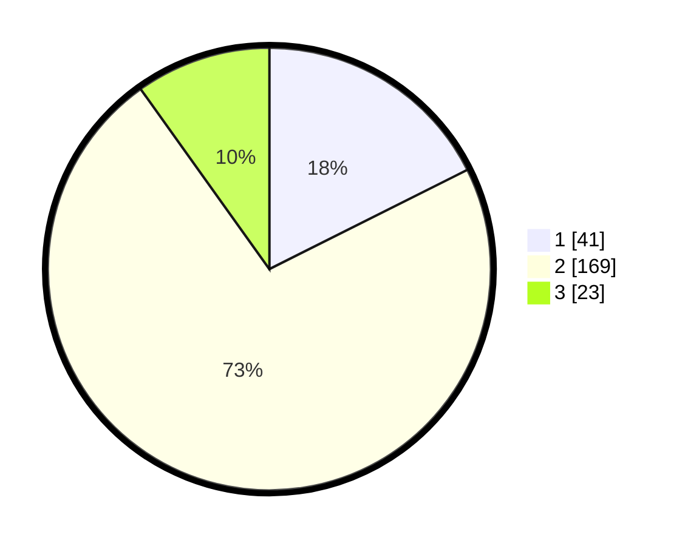

# Hasil

## Grafik

## Tabel

| No. | Nama Paslon    | Suara | Suara (raw) | Persentase |
|:--- |:-------------- | -----:| -----------:| ----------:|
| 1   | ANIES MUHAIMIN | 41    | [41][p-1]   | 17,60      |
| 2   | PRABOWO GIBRAN | 169   | [169][p-2]  | 72,53      |
| 3   | GANJAR MAHFUD  | 23    | [23][p-3]   | 9,87       |

[p-1]: https://github.com/gigit-pemilu/pemilu-2024/blob/main/pilpres/hitung-suara/sub/34-di-yogyakarta/sub/04-sleman/sub/15-turi/sub/2003-girikerto/sub/006-tps/sub/paslon-1.txt
[p-2]: https://github.com/gigit-pemilu/pemilu-2024/blob/main/pilpres/hitung-suara/sub/34-di-yogyakarta/sub/04-sleman/sub/15-turi/sub/2003-girikerto/sub/006-tps/sub/paslon-2.txt
[p-3]: https://github.com/gigit-pemilu/pemilu-2024/blob/main/pilpres/hitung-suara/sub/34-di-yogyakarta/sub/04-sleman/sub/15-turi/sub/2003-girikerto/sub/006-tps/sub/paslon-3.txt

## Foto C Plano

https://sirekap-obj-formc.kpu.go.id/07cf/pemilu/ppwp/34/04/15/20/03/3404152003006-20240214-211056--236b763d-edc8-417c-b851-0c983421ae03.jpg

https://sirekap-obj-formc.kpu.go.id/07cf/pemilu/ppwp/34/04/15/20/03/3404152003006-20240214-203815--8bf1b8fd-52d4-422d-a7f1-17425c7b9963.jpg

https://sirekap-obj-formc.kpu.go.id/07cf/pemilu/ppwp/34/04/15/20/03/3404152003006-20240214-211136--1d1e043f-a114-482a-afd2-bfc41511bc46.jpg

## Metadata

| Key        | Value               |
| ---------- | ------------------- |
| Time Stamp | 2024-02-15 20:00:44 |

