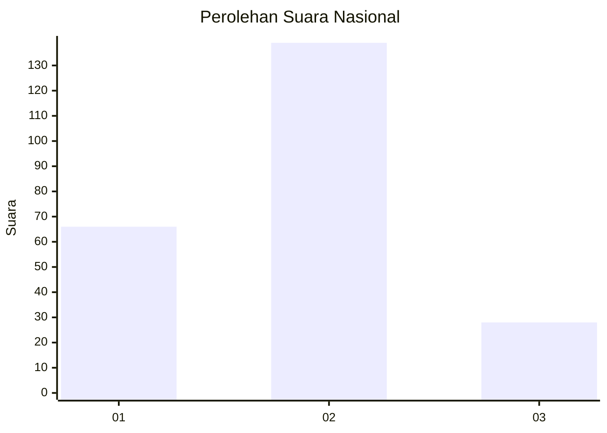
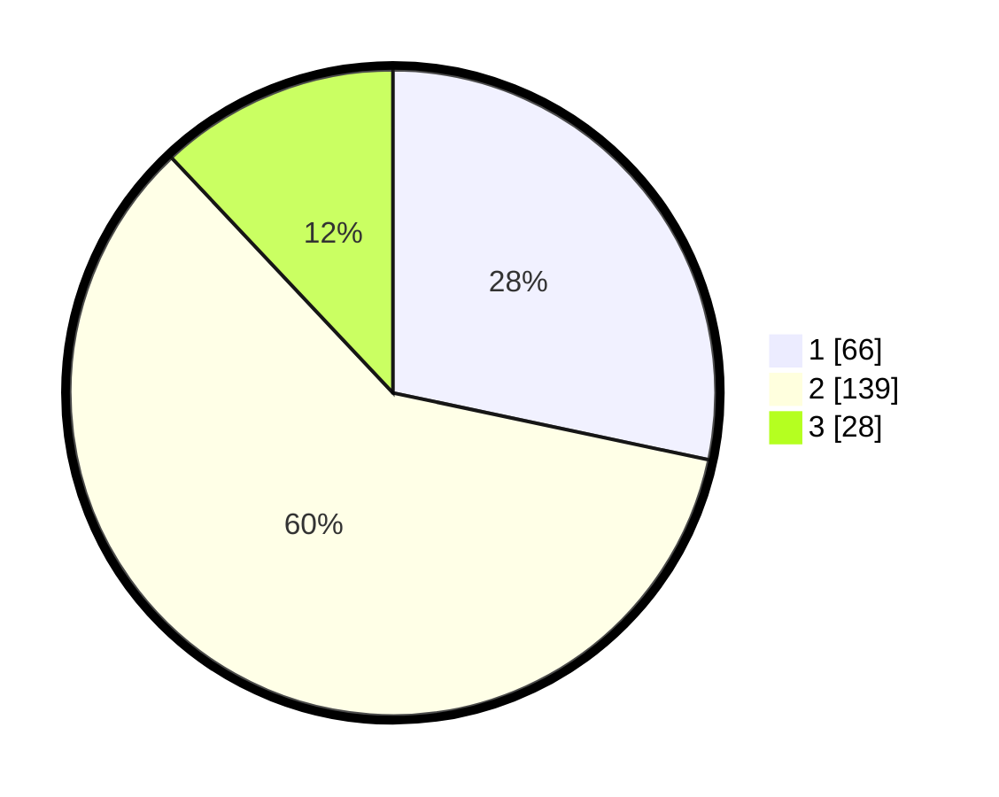

# Hasil

## Grafik

## Tabel

| No. | Nama Paslon    | Suara | Suara (raw) | Persentase |
|:--- |:-------------- | -----:| -----------:| ----------:|
| 1   | ANIES MUHAIMIN | 66    | [66][p-1]   | 28,33      |
| 2   | PRABOWO GIBRAN | 139   | [139][p-2]  | 59,66      |
| 3   | GANJAR MAHFUD  | 28    | [28][p-3]   | 12,02      |

[p-1]: https://github.com/gigit-pemilu/pemilu-2024/blob/main/pilpres/hitung-suara/sub/34-di-yogyakarta/sub/04-sleman/sub/15-turi/sub/2003-girikerto/sub/016-tps/sub/paslon-1.txt
[p-2]: https://github.com/gigit-pemilu/pemilu-2024/blob/main/pilpres/hitung-suara/sub/34-di-yogyakarta/sub/04-sleman/sub/15-turi/sub/2003-girikerto/sub/016-tps/sub/paslon-2.txt
[p-3]: https://github.com/gigit-pemilu/pemilu-2024/blob/main/pilpres/hitung-suara/sub/34-di-yogyakarta/sub/04-sleman/sub/15-turi/sub/2003-girikerto/sub/016-tps/sub/paslon-3.txt

## Foto C Plano

https://sirekap-obj-formc.kpu.go.id/c1b5/pemilu/ppwp/34/04/15/20/03/3404152003016-20240214-203946--719fdc40-6c9f-44cf-b7f5-7a2c5dccc9fa.jpg

https://sirekap-obj-formc.kpu.go.id/c1b5/pemilu/ppwp/34/04/15/20/03/3404152003016-20240214-203955--25a1543b-822c-4eb1-bf9b-327325bf8df6.jpg

https://sirekap-obj-formc.kpu.go.id/c1b5/pemilu/ppwp/34/04/15/20/03/3404152003016-20240214-203959--df9e55f2-0e14-490e-9cb3-749d676a8b7c.jpg

## Metadata

| Key        | Value               |
| ---------- | ------------------- |
| Time Stamp | 2024-02-15 12:00:28 |

