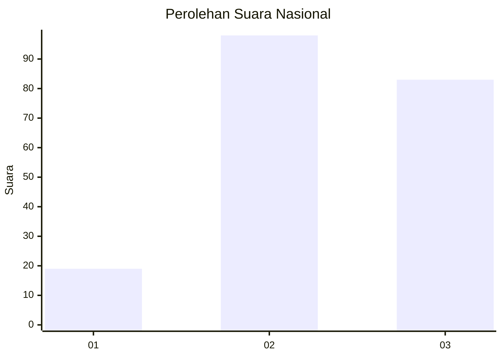
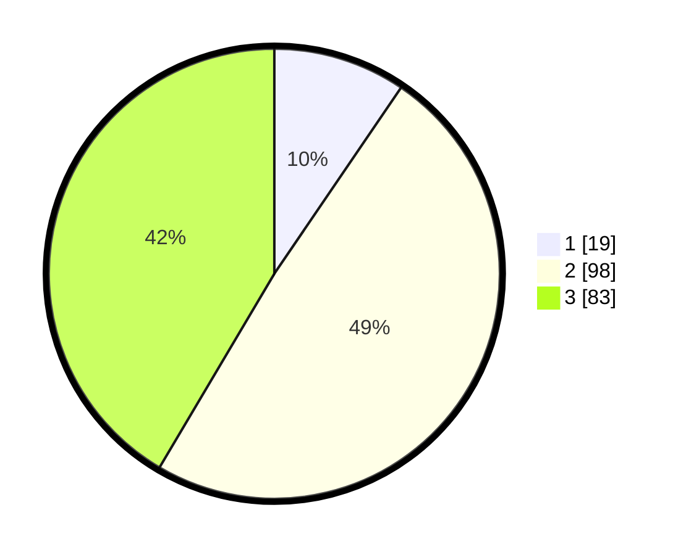

# Hasil

## Grafik

## Tabel

| No. | Nama Paslon    | Suara | Suara (raw) | Persentase |
|:--- |:-------------- | -----:| -----------:| ----------:|
| 1   | ANIES MUHAIMIN | 19    | [19][p-1]   | 9,50       |
| 2   | PRABOWO GIBRAN | 98    | [98][p-2]   | 49,00      |
| 3   | GANJAR MAHFUD  | 83    | [83][p-3]   | 41,50      |

[p-1]: https://github.com/gigit-pemilu/pemilu-2024/blob/main/pilpres/hitung-suara/sub/34-di-yogyakarta/sub/04-sleman/sub/15-turi/sub/2003-girikerto/sub/020-tps/sub/paslon-1.txt
[p-2]: https://github.com/gigit-pemilu/pemilu-2024/blob/main/pilpres/hitung-suara/sub/34-di-yogyakarta/sub/04-sleman/sub/15-turi/sub/2003-girikerto/sub/020-tps/sub/paslon-2.txt
[p-3]: https://github.com/gigit-pemilu/pemilu-2024/blob/main/pilpres/hitung-suara/sub/34-di-yogyakarta/sub/04-sleman/sub/15-turi/sub/2003-girikerto/sub/020-tps/sub/paslon-3.txt

## Foto C Plano

https://sirekap-obj-formc.kpu.go.id/0c56/pemilu/ppwp/34/04/15/20/03/3404152003020-20240214-223837--ef541940-6c1e-4990-be49-b1051d8b6911.jpg

https://sirekap-obj-formc.kpu.go.id/0c56/pemilu/ppwp/34/04/15/20/03/3404152003020-20240214-223859--631c8185-301a-4ea4-9137-01950dc427e0.jpg

https://sirekap-obj-formc.kpu.go.id/0c56/pemilu/ppwp/34/04/15/20/03/3404152003020-20240214-223919--822b63a2-7a10-4402-a18a-132533c689a9.jpg

## Metadata

| Key        | Value               |
| ---------- | ------------------- |
| Time Stamp | 2024-02-15 12:00:28 |

