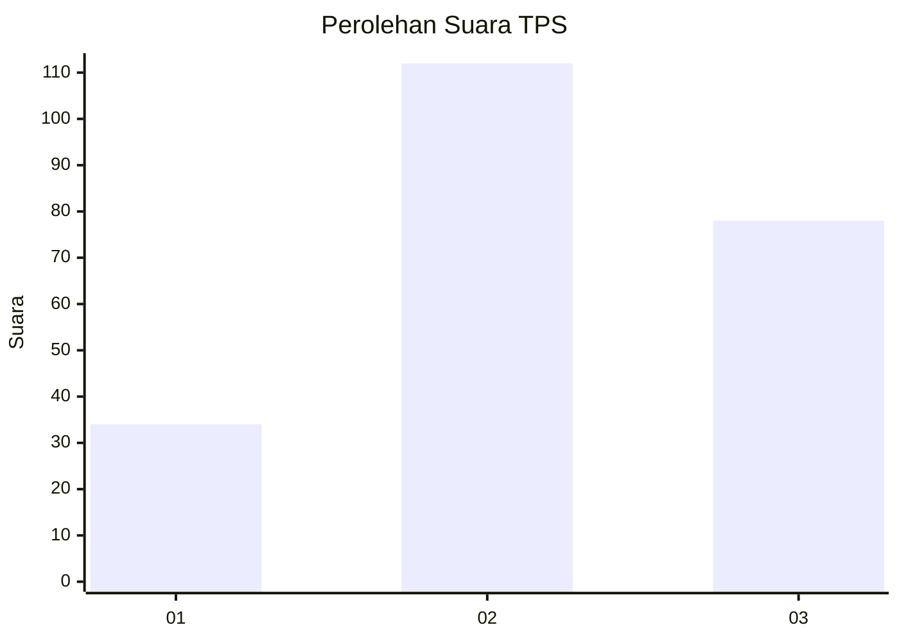
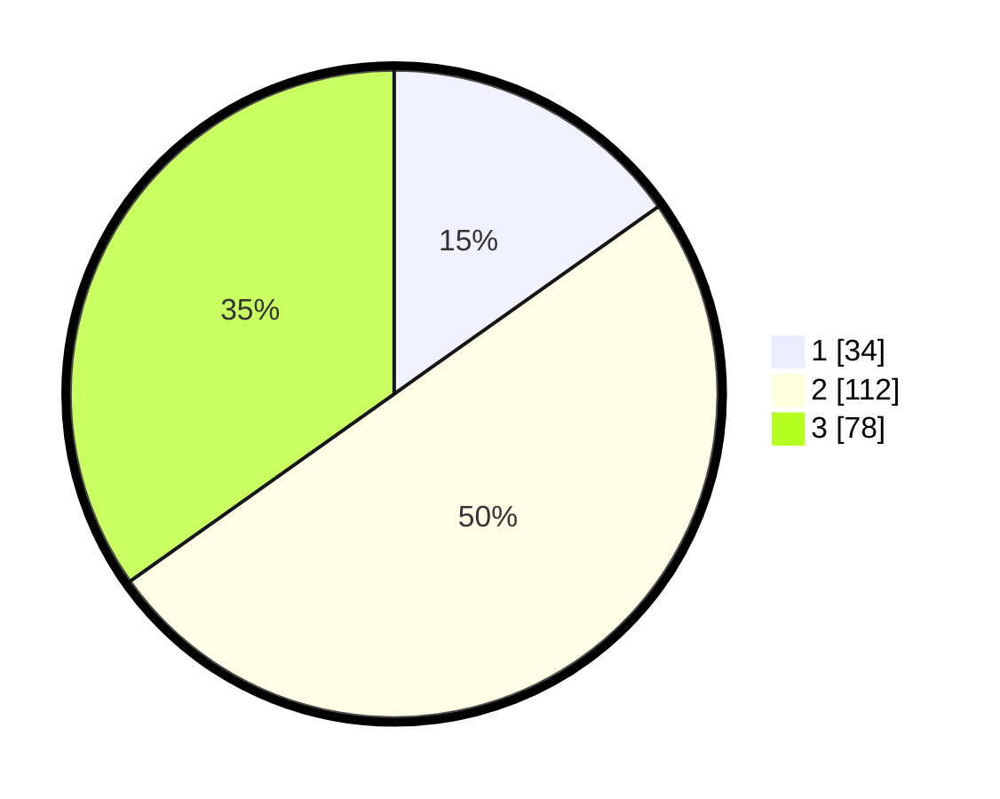

# Hasil

## Grafik

## Tabel

| No. | Nama Paslon    | Suara | Suara (raw) | Persentase |
|:--- |:-------------- | -----:| -----------:| ----------:|
| 1   | ANIES MUHAIMIN | 34    | [34][p-1]   | 15,18      |
| 2   | PRABOWO GIBRAN | 112   | [112][p-2]  | 50,00      |
| 3   | GANJAR MAHFUD  | 78    | [78][p-3]   | 34,82      |

[p-1]: https://github.com/gigit-pemilu/pemilu-2024-34-di-yogyakarta/blob/main/pilpres/hitung-suara/sub/34-di-yogyakarta/sub/04-sleman/sub/15-turi/sub/2003-girikerto/sub/025-tps/sub/paslon-1.txt
[p-2]: https://github.com/gigit-pemilu/pemilu-2024-34-di-yogyakarta/blob/main/pilpres/hitung-suara/sub/34-di-yogyakarta/sub/04-sleman/sub/15-turi/sub/2003-girikerto/sub/025-tps/sub/paslon-2.txt
[p-3]: https://github.com/gigit-pemilu/pemilu-2024-34-di-yogyakarta/blob/main/pilpres/hitung-suara/sub/34-di-yogyakarta/sub/04-sleman/sub/15-turi/sub/2003-girikerto/sub/025-tps/sub/paslon-3.txt

## Foto C Plano

https://sirekap-obj-formc.kpu.go.id/8668/pemilu/ppwp/34/04/15/20/03/3404152003025-20240214-213027--26be5fb4-b43a-48ee-9dfd-92f307af847e.jpg

https://sirekap-obj-formc.kpu.go.id/8668/pemilu/ppwp/34/04/15/20/03/3404152003025-20240215-024513--34ca5aa7-449e-4d64-b61d-b3c5e7803a74.jpg

https://sirekap-obj-formc.kpu.go.id/8668/pemilu/ppwp/34/04/15/20/03/3404152003025-20240215-024541--c79504b8-57e8-4ff7-a5b7-057fd0301033.jpg

## Metadata

| Key        | Value               |
| ---------- | ------------------- |
| Time Stamp | 2024-02-15 20:00:44 |

