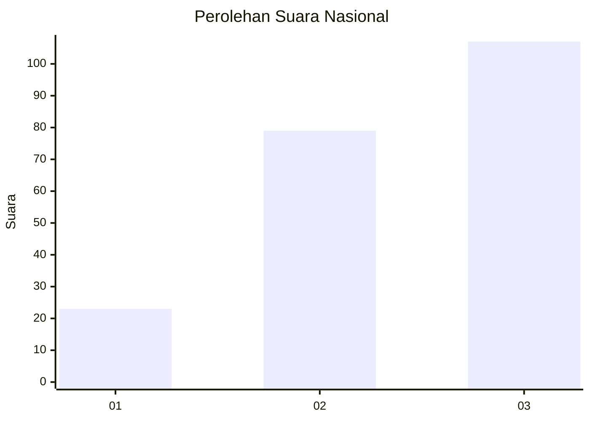
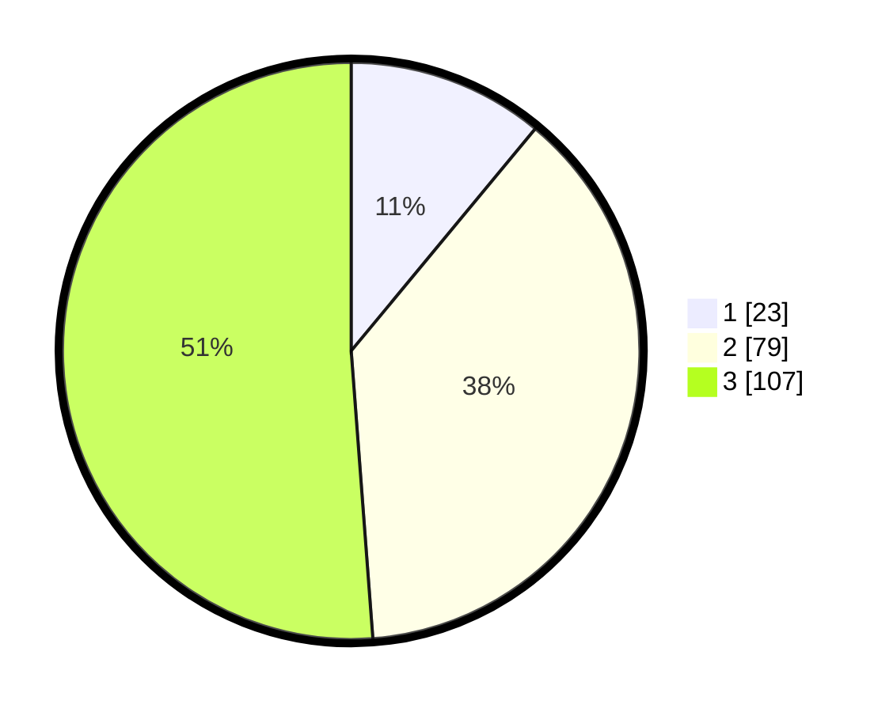

# Hasil

## Grafik

## Tabel

| No. | Nama Paslon    | Suara | Suara (raw) | Persentase |
|:--- |:-------------- | -----:| -----------:| ----------:|
| 1   | ANIES MUHAIMIN | 23    | [23][p-1]   | 11,00      |
| 2   | PRABOWO GIBRAN | 79    | [79][p-2]   | 37,80      |
| 3   | GANJAR MAHFUD  | 107   | [107][p-3]  | 51,20      |

[p-1]: https://github.com/gigit-pemilu/pemilu-2024/blob/main/pilpres/hitung-suara/sub/34-di-yogyakarta/sub/04-sleman/sub/15-turi/sub/2003-girikerto/sub/027-tps/sub/paslon-1.txt
[p-2]: https://github.com/gigit-pemilu/pemilu-2024/blob/main/pilpres/hitung-suara/sub/34-di-yogyakarta/sub/04-sleman/sub/15-turi/sub/2003-girikerto/sub/027-tps/sub/paslon-2.txt
[p-3]: https://github.com/gigit-pemilu/pemilu-2024/blob/main/pilpres/hitung-suara/sub/34-di-yogyakarta/sub/04-sleman/sub/15-turi/sub/2003-girikerto/sub/027-tps/sub/paslon-3.txt

## Foto C Plano

https://sirekap-obj-formc.kpu.go.id/f709/pemilu/ppwp/34/04/15/20/03/3404152003027-20240215-024148--db1b27e5-64d0-4f65-a086-9273e2f247fe.jpg

https://sirekap-obj-formc.kpu.go.id/f709/pemilu/ppwp/34/04/15/20/03/3404152003027-20240215-024307--3c9bf8ef-8598-43df-a4fb-80d32519d060.jpg

https://sirekap-obj-formc.kpu.go.id/f709/pemilu/ppwp/34/04/15/20/03/3404152003027-20240215-024524--e99232f6-53fc-488c-a2b3-dfc420018768.jpg

## Metadata

| Key        | Value               |
| ---------- | ------------------- |
| Time Stamp | 2024-02-15 12:00:28 |

