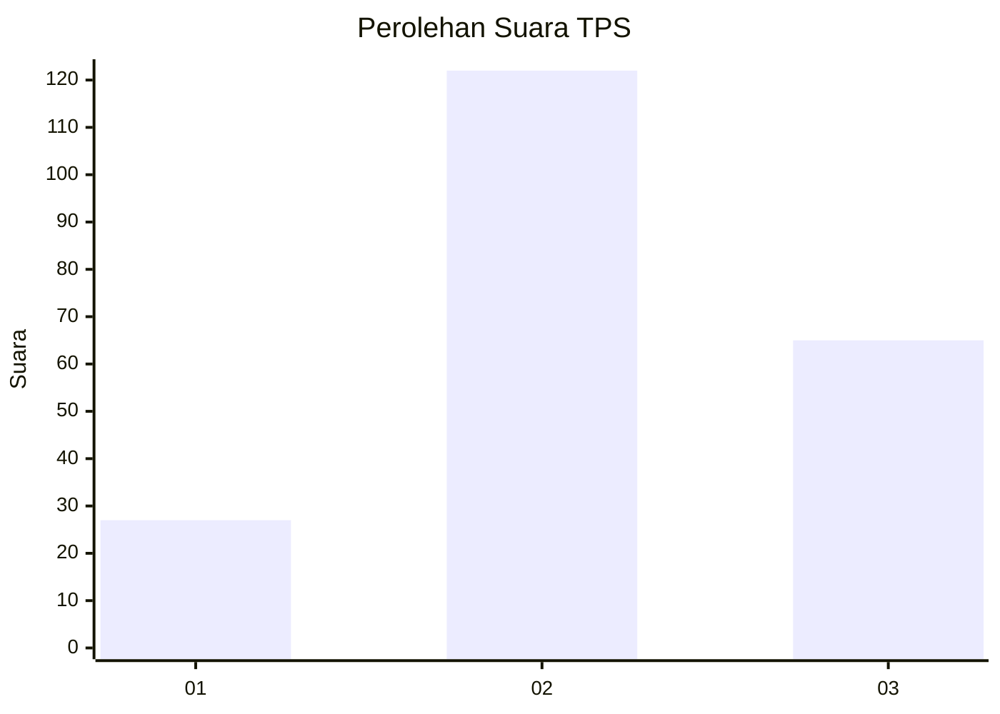
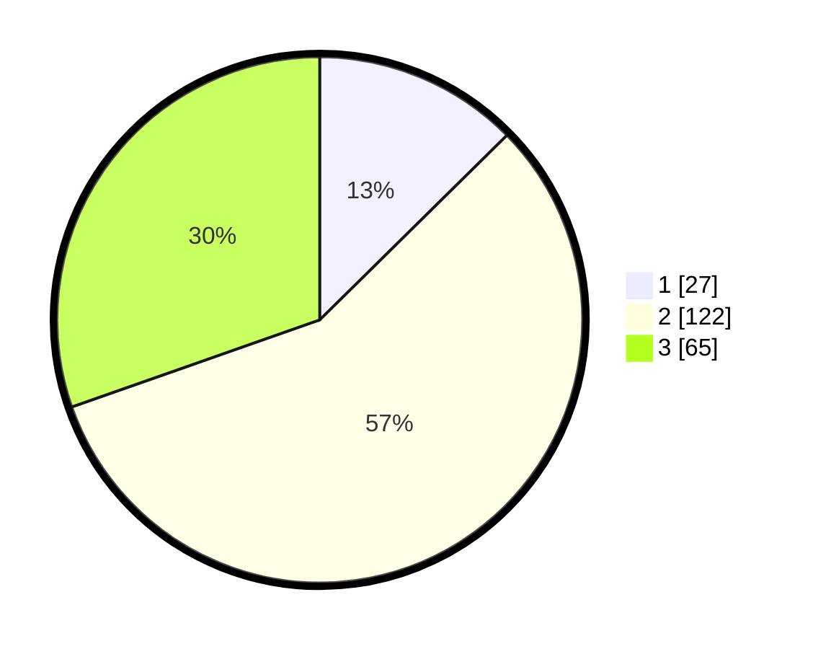

# Hasil

## Grafik

## Tabel

| No. | Nama Paslon    | Suara | Suara (raw) | Persentase |
|:--- |:-------------- | -----:| -----------:| ----------:|
| 1   | ANIES MUHAIMIN | 27    | [27][p-1]   | 12,62      |
| 2   | PRABOWO GIBRAN | 122   | [122][p-2]  | 57,01      |
| 3   | GANJAR MAHFUD  | 65    | [65][p-3]   | 30,37      |

[p-1]: https://github.com/gigit-pemilu/pemilu-2024-34-di-yogyakarta/blob/main/pilpres/hitung-suara/sub/34-di-yogyakarta/sub/04-sleman/sub/15-turi/sub/2003-girikerto/sub/028-tps/sub/paslon-1.txt
[p-2]: https://github.com/gigit-pemilu/pemilu-2024-34-di-yogyakarta/blob/main/pilpres/hitung-suara/sub/34-di-yogyakarta/sub/04-sleman/sub/15-turi/sub/2003-girikerto/sub/028-tps/sub/paslon-2.txt
[p-3]: https://github.com/gigit-pemilu/pemilu-2024-34-di-yogyakarta/blob/main/pilpres/hitung-suara/sub/34-di-yogyakarta/sub/04-sleman/sub/15-turi/sub/2003-girikerto/sub/028-tps/sub/paslon-3.txt

## Foto C Plano

https://sirekap-obj-formc.kpu.go.id/c7e5/pemilu/ppwp/34/04/15/20/03/3404152003028-20240214-215902--cfe932ee-27e6-4411-9dd4-33554f5ee4a4.jpg

https://sirekap-obj-formc.kpu.go.id/c7e5/pemilu/ppwp/34/04/15/20/03/3404152003028-20240214-193733--e422cc8c-0961-4cb9-9c59-d77fa8f1df16.jpg

https://sirekap-obj-formc.kpu.go.id/c7e5/pemilu/ppwp/34/04/15/20/03/3404152003028-20240214-220021--2ead90c1-1f80-49e1-bda0-d69e86632418.jpg

## Metadata

| Key        | Value               |
| ---------- | ------------------- |
| Time Stamp | 2024-02-15 15:00:29 |

