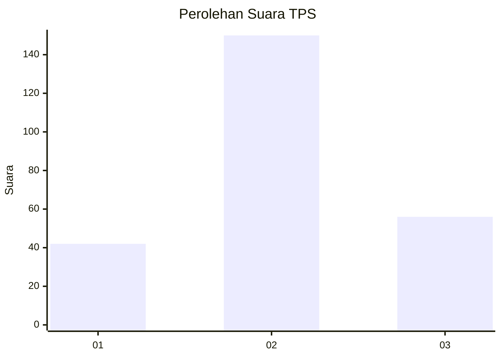
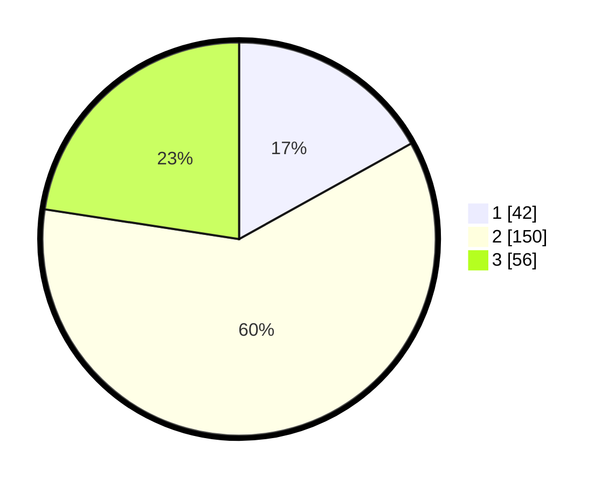

# Hasil

## Grafik

## Tabel

| No. | Nama Paslon    | Suara | Suara (raw) | Persentase |
|:--- |:-------------- | -----:| -----------:| ----------:|
| 1   | ANIES MUHAIMIN | 42    | [42][p-1]   | 16,94      |
| 2   | PRABOWO GIBRAN | 150   | [150][p-2]  | 60,48      |
| 3   | GANJAR MAHFUD  | 56    | [56][p-3]   | 22,58      |

[p-1]: https://github.com/gigit-pemilu/pemilu-2024-34-di-yogyakarta/blob/main/pilpres/hitung-suara/sub/34-di-yogyakarta/sub/04-sleman/sub/15-turi/sub/2004-wonokerto/sub/010-tps/sub/paslon-1.txt
[p-2]: https://github.com/gigit-pemilu/pemilu-2024-34-di-yogyakarta/blob/main/pilpres/hitung-suara/sub/34-di-yogyakarta/sub/04-sleman/sub/15-turi/sub/2004-wonokerto/sub/010-tps/sub/paslon-2.txt
[p-3]: https://github.com/gigit-pemilu/pemilu-2024-34-di-yogyakarta/blob/main/pilpres/hitung-suara/sub/34-di-yogyakarta/sub/04-sleman/sub/15-turi/sub/2004-wonokerto/sub/010-tps/sub/paslon-3.txt

## Foto C Plano

https://sirekap-obj-formc.kpu.go.id/e301/pemilu/ppwp/34/04/15/20/04/3404152004010-20240214-230529--bc48be2c-0238-4fb8-a403-e5c2937498f8.jpg

https://sirekap-obj-formc.kpu.go.id/e301/pemilu/ppwp/34/04/15/20/04/3404152004010-20240214-230625--f7f5510b-958b-49fa-befb-cfc3279bbcfb.jpg

https://sirekap-obj-formc.kpu.go.id/e301/pemilu/ppwp/34/04/15/20/04/3404152004010-20240214-230700--9d93c619-54c3-4524-8e62-3ff3e1e7048d.jpg

## Metadata

| Key        | Value               |
| ---------- | ------------------- |
| Time Stamp | 2024-02-15 12:00:28 |

