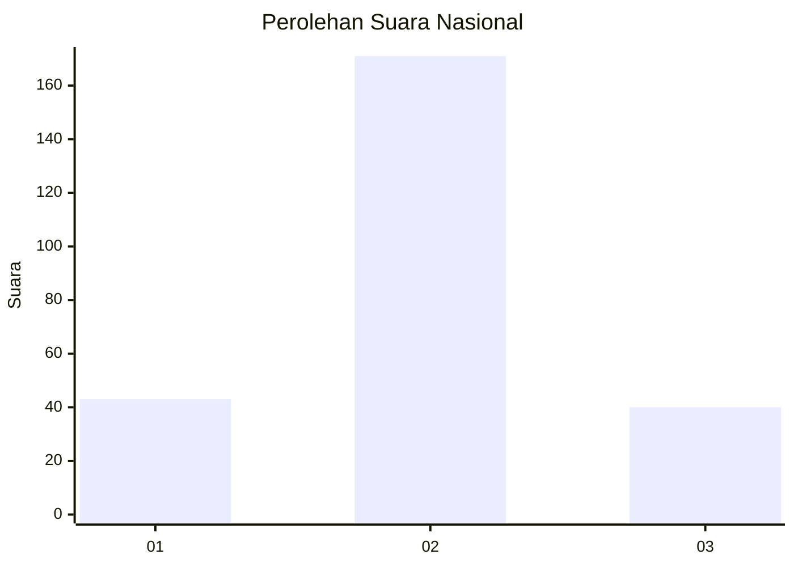
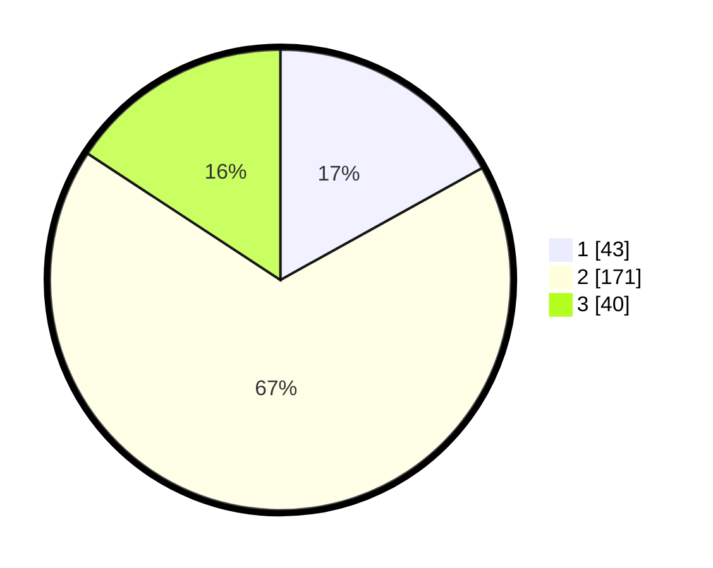

# Hasil

## Grafik

## Tabel

| No. | Nama Paslon    | Suara | Suara (raw) | Persentase |
|:--- |:-------------- | -----:| -----------:| ----------:|
| 1   | ANIES MUHAIMIN | 43    | [43][p-1]   | 16,93      |
| 2   | PRABOWO GIBRAN | 171   | [171][p-2]  | 67,32      |
| 3   | GANJAR MAHFUD  | 40    | [40][p-3]   | 15,75      |

[p-1]: https://github.com/gigit-pemilu/pemilu-2024/blob/main/pilpres/hitung-suara/sub/34-di-yogyakarta/sub/04-sleman/sub/15-turi/sub/2004-wonokerto/sub/018-tps/sub/paslon-1.txt
[p-2]: https://github.com/gigit-pemilu/pemilu-2024/blob/main/pilpres/hitung-suara/sub/34-di-yogyakarta/sub/04-sleman/sub/15-turi/sub/2004-wonokerto/sub/018-tps/sub/paslon-2.txt
[p-3]: https://github.com/gigit-pemilu/pemilu-2024/blob/main/pilpres/hitung-suara/sub/34-di-yogyakarta/sub/04-sleman/sub/15-turi/sub/2004-wonokerto/sub/018-tps/sub/paslon-3.txt

## Foto C Plano

https://sirekap-obj-formc.kpu.go.id/a221/pemilu/ppwp/34/04/15/20/04/3404152004018-20240215-011436--a7ea3cb5-ba92-4ff9-9a59-a371b2533136.jpg

https://sirekap-obj-formc.kpu.go.id/a221/pemilu/ppwp/34/04/15/20/04/3404152004018-20240215-011538--0956065d-68f0-4897-97ea-53b760903717.jpg

https://sirekap-obj-formc.kpu.go.id/a221/pemilu/ppwp/34/04/15/20/04/3404152004018-20240215-011623--449bcb0a-9838-4405-b37b-89ab8111b4d9.jpg

## Metadata

| Key        | Value               |
| ---------- | ------------------- |
| Time Stamp | 2024-02-15 17:00:25 |

