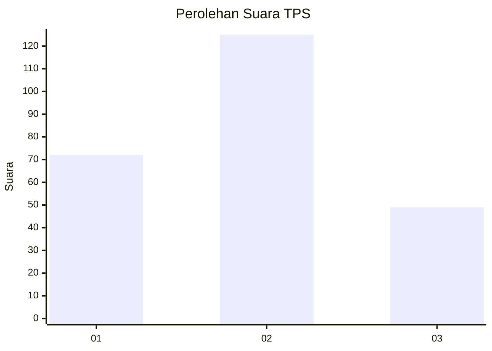
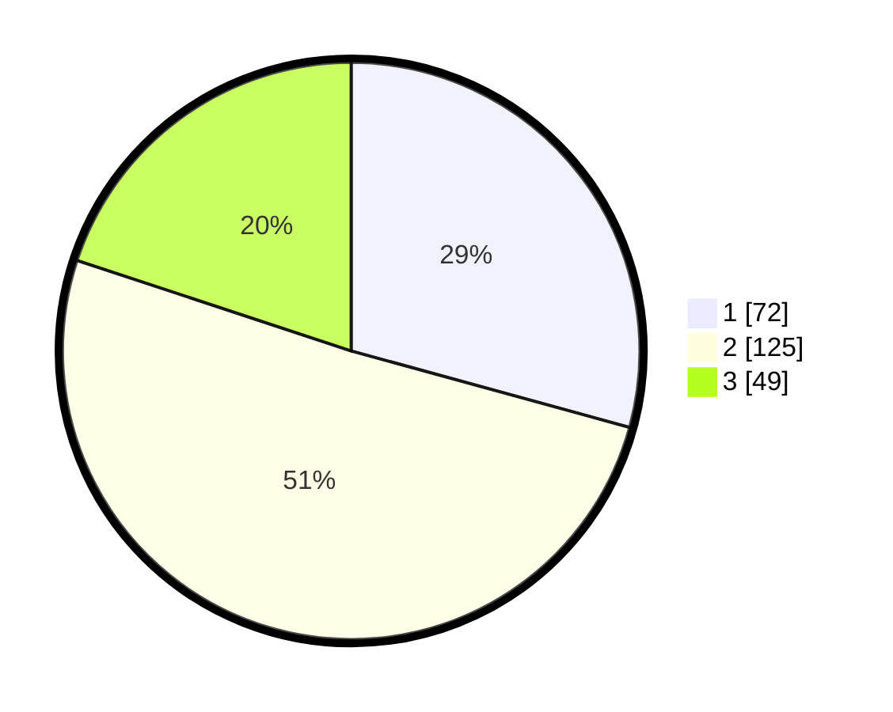

# Hasil

## Grafik

## Tabel

| No. | Nama Paslon    | Suara | Suara (raw) | Persentase |
|:--- |:-------------- | -----:| -----------:| ----------:|
| 1   | ANIES MUHAIMIN | 72    | [72][p-1]   | 29,27      |
| 2   | PRABOWO GIBRAN | 125   | [125][p-2]  | 50,81      |
| 3   | GANJAR MAHFUD  | 49    | [49][p-3]   | 19,92      |

[p-1]: https://github.com/gigit-pemilu/pemilu-2024-34-di-yogyakarta/blob/main/pilpres/hitung-suara/sub/34-di-yogyakarta/sub/04-sleman/sub/15-turi/sub/2004-wonokerto/sub/020-tps/sub/paslon-1.txt
[p-2]: https://github.com/gigit-pemilu/pemilu-2024-34-di-yogyakarta/blob/main/pilpres/hitung-suara/sub/34-di-yogyakarta/sub/04-sleman/sub/15-turi/sub/2004-wonokerto/sub/020-tps/sub/paslon-2.txt
[p-3]: https://github.com/gigit-pemilu/pemilu-2024-34-di-yogyakarta/blob/main/pilpres/hitung-suara/sub/34-di-yogyakarta/sub/04-sleman/sub/15-turi/sub/2004-wonokerto/sub/020-tps/sub/paslon-3.txt

## Foto C Plano

https://sirekap-obj-formc.kpu.go.id/54a2/pemilu/ppwp/34/04/15/20/04/3404152004020-20240216-082341--2d63abf2-b737-4448-bd08-dd57dc9ca32c.jpg

https://sirekap-obj-formc.kpu.go.id/54a2/pemilu/ppwp/34/04/15/20/04/3404152004020-20240216-085724--81ba5bb4-af90-4eb6-99c8-32d0bf3f23a3.jpg

https://sirekap-obj-formc.kpu.go.id/54a2/pemilu/ppwp/34/04/15/20/04/3404152004020-20240216-082342--e02dd3d5-962e-4670-afaf-8c3d4d30f5fe.jpg

## Metadata

| Key        | Value               |
| ---------- | ------------------- |
| Time Stamp | 2024-02-16 12:51:22 |

## DATA PEMILIH TETAP

Jumlah pemilih dalam DPT: **267**.
 * L: **132**.
 * P: **135**.

## DATA PENGGUNA HAK PILIH

Jumlah pengguna hak pilih dalam DPT: **241**.
 * L: **112**.
 * P: **129**.

Jumlah pengguna hak pilih dalam DPTb: **12**.
 * L: **2**.
 * P: **10**.

Jumlah pengguna hak pilih dalam DPK: **1**.
 * L: **1**.
 * P: **0**.

Jumlah pengguna hak pilih: **254**.
 * L: **115**.
 * P: **139**.

## JUMLAH SUARA SAH DAN TIDAK SAH

JUMLAH SELURUH SUARA SAH: **246**.

JUMLAH SUARA TIDAK SAH: **8**.

JUMLAH SELURUH SUARA SAH DAN SUARA TIDAK SAH: **254**.

