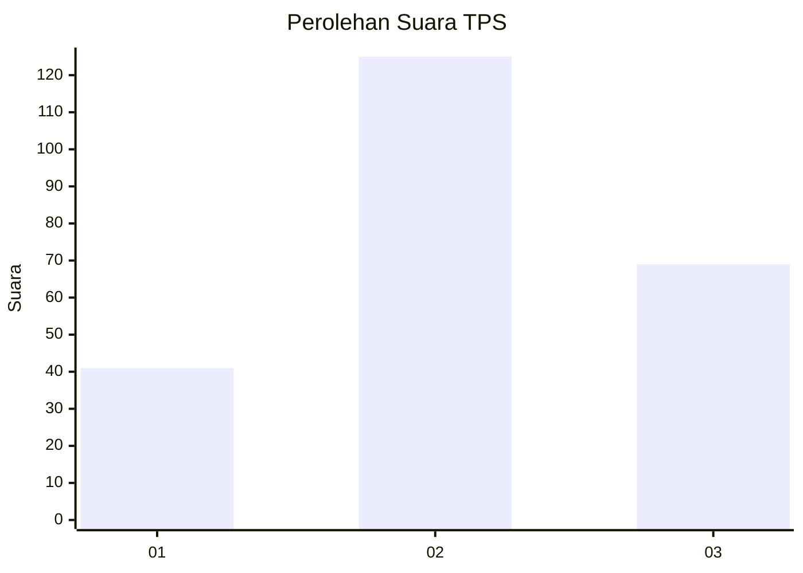
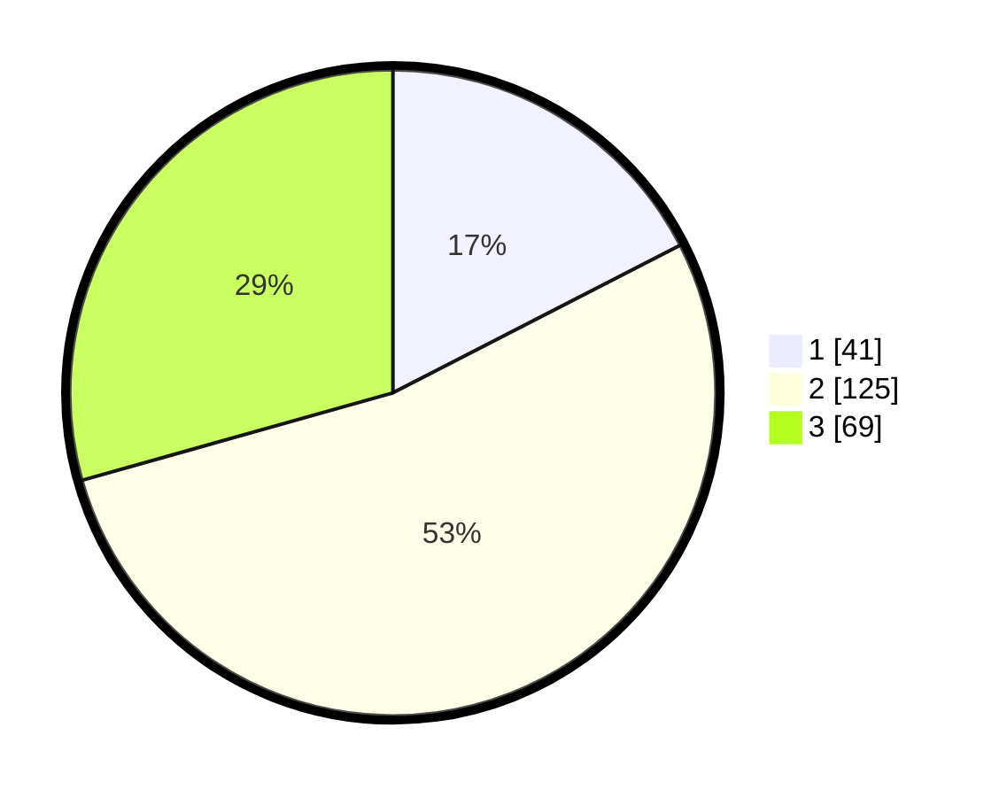

# Hasil

## Grafik

## Tabel

| No. | Nama Paslon    | Suara | Suara (raw) | Persentase |
|:--- |:-------------- | -----:| -----------:| ----------:|
| 1   | ANIES MUHAIMIN | 41    | [41][p-1]   | 17,45      |
| 2   | PRABOWO GIBRAN | 125   | [125][p-2]  | 53,19      |
| 3   | GANJAR MAHFUD  | 69    | [69][p-3]   | 29,36      |

[p-1]: https://github.com/gigit-pemilu/pemilu-2024-34-di-yogyakarta/blob/main/pilpres/hitung-suara/sub/34-di-yogyakarta/sub/04-sleman/sub/15-turi/sub/2004-wonokerto/sub/022-tps/sub/paslon-1.txt
[p-2]: https://github.com/gigit-pemilu/pemilu-2024-34-di-yogyakarta/blob/main/pilpres/hitung-suara/sub/34-di-yogyakarta/sub/04-sleman/sub/15-turi/sub/2004-wonokerto/sub/022-tps/sub/paslon-2.txt
[p-3]: https://github.com/gigit-pemilu/pemilu-2024-34-di-yogyakarta/blob/main/pilpres/hitung-suara/sub/34-di-yogyakarta/sub/04-sleman/sub/15-turi/sub/2004-wonokerto/sub/022-tps/sub/paslon-3.txt

## Foto C Plano

https://sirekap-obj-formc.kpu.go.id/703c/pemilu/ppwp/34/04/15/20/04/3404152004022-20240215-024658--a56ee594-ddca-4a67-b8a8-ada23726429f.jpg

https://sirekap-obj-formc.kpu.go.id/703c/pemilu/ppwp/34/04/15/20/04/3404152004022-20240215-024751--32ca530a-14a6-47d1-991d-3bb501c5e091.jpg

https://sirekap-obj-formc.kpu.go.id/703c/pemilu/ppwp/34/04/15/20/04/3404152004022-20240215-024838--8363ea37-7498-4f54-bc6f-de2a0384b229.jpg

## Metadata

| Key        | Value               |
| ---------- | ------------------- |
| Time Stamp | 2024-02-15 12:00:28 |

