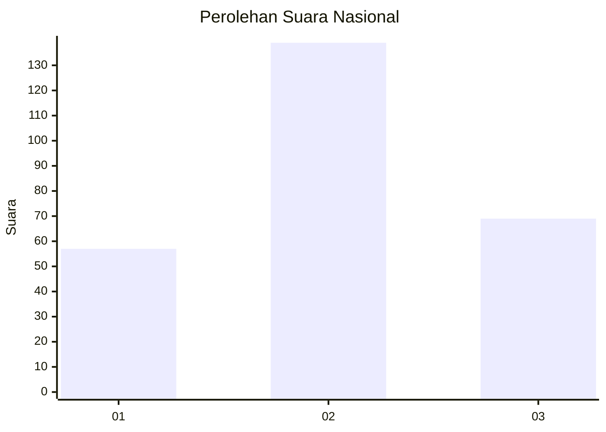
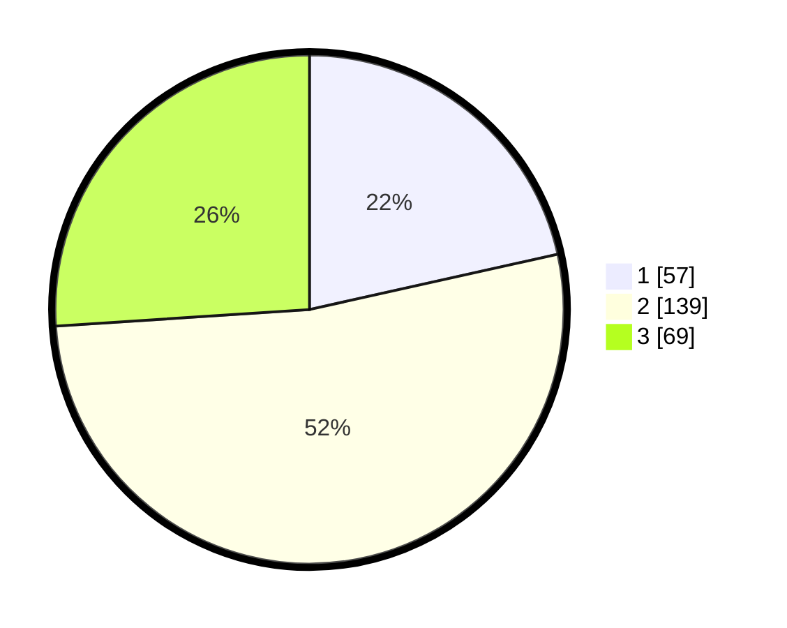

# Hasil

## Grafik

## Tabel

| No. | Nama Paslon    | Suara | Suara (raw) | Persentase |
|:--- |:-------------- | -----:| -----------:| ----------:|
| 1   | ANIES MUHAIMIN | 57    | [57][p-1]   | 21,51      |
| 2   | PRABOWO GIBRAN | 139   | [139][p-2]  | 52,45      |
| 3   | GANJAR MAHFUD  | 69    | [69][p-3]   | 26,04      |

[p-1]: https://github.com/gigit-pemilu/pemilu-2024/blob/main/pilpres/hitung-suara/sub/34-di-yogyakarta/sub/04-sleman/sub/15-turi/sub/2004-wonokerto/sub/029-tps/sub/paslon-1.txt
[p-2]: https://github.com/gigit-pemilu/pemilu-2024/blob/main/pilpres/hitung-suara/sub/34-di-yogyakarta/sub/04-sleman/sub/15-turi/sub/2004-wonokerto/sub/029-tps/sub/paslon-2.txt
[p-3]: https://github.com/gigit-pemilu/pemilu-2024/blob/main/pilpres/hitung-suara/sub/34-di-yogyakarta/sub/04-sleman/sub/15-turi/sub/2004-wonokerto/sub/029-tps/sub/paslon-3.txt

## Foto C Plano

https://sirekap-obj-formc.kpu.go.id/1e1b/pemilu/ppwp/34/04/15/20/04/3404152004029-20240215-034610--f411499c-708e-456d-839b-ffff82dea6c7.jpg

https://sirekap-obj-formc.kpu.go.id/1e1b/pemilu/ppwp/34/04/15/20/04/3404152004029-20240215-034618--80d67f7a-1058-4aae-9872-1448e60a4333.jpg

https://sirekap-obj-formc.kpu.go.id/1e1b/pemilu/ppwp/34/04/15/20/04/3404152004029-20240215-034630--e6c67607-4f32-4582-a7eb-eb4a1343dff5.jpg

## Metadata

| Key        | Value               |
| ---------- | ------------------- |
| Time Stamp | 2024-02-15 21:30:27 |

