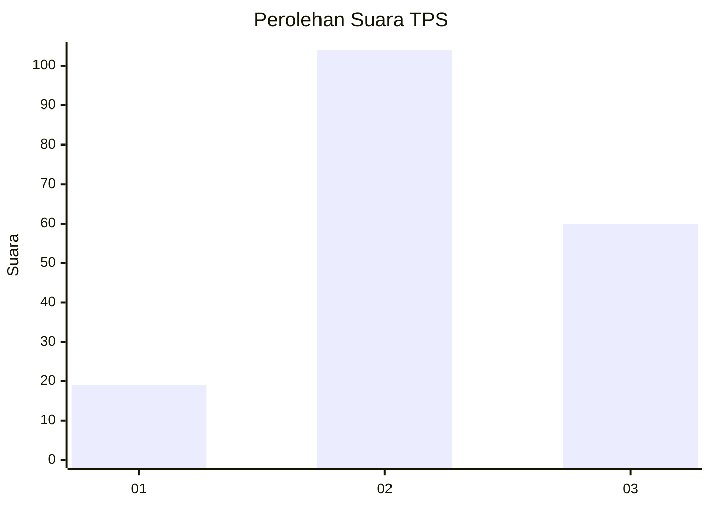
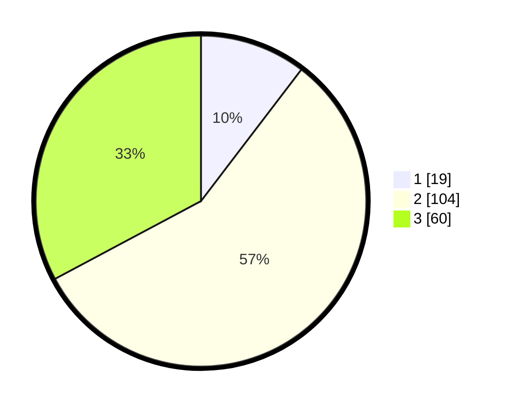

# Hasil

## Grafik

## Tabel

| No. | Nama Paslon    | Suara | Suara (raw) | Persentase |
|:--- |:-------------- | -----:| -----------:| ----------:|
| 1   | ANIES MUHAIMIN | 19    | [19][p-1]   | 10,38      |
| 2   | PRABOWO GIBRAN | 104   | [104][p-2]  | 56,83      |
| 3   | GANJAR MAHFUD  | 60    | [60][p-3]   | 32,79      |

[p-1]: https://github.com/gigit-pemilu/pemilu-2024-34-di-yogyakarta/blob/main/pilpres/hitung-suara/sub/34-di-yogyakarta/sub/04-sleman/sub/16-pakem/sub/2001-purwobinangun/sub/001-tps/sub/paslon-1.txt
[p-2]: https://github.com/gigit-pemilu/pemilu-2024-34-di-yogyakarta/blob/main/pilpres/hitung-suara/sub/34-di-yogyakarta/sub/04-sleman/sub/16-pakem/sub/2001-purwobinangun/sub/001-tps/sub/paslon-2.txt
[p-3]: https://github.com/gigit-pemilu/pemilu-2024-34-di-yogyakarta/blob/main/pilpres/hitung-suara/sub/34-di-yogyakarta/sub/04-sleman/sub/16-pakem/sub/2001-purwobinangun/sub/001-tps/sub/paslon-3.txt

## Foto C Plano

https://sirekap-obj-formc.kpu.go.id/db37/pemilu/ppwp/34/04/16/20/01/3404162001001-20240214-155757--153bbb4a-0d0b-4c08-b45e-52f55cc423b8.jpg

https://sirekap-obj-formc.kpu.go.id/db37/pemilu/ppwp/34/04/16/20/01/3404162001001-20240214-191800--ede64627-2a81-4fa7-868a-0fdc0e401cf0.jpg

## Metadata

| Key        | Value               |
| ---------- | ------------------- |
| Time Stamp | 2024-02-21 20:00:00 |

