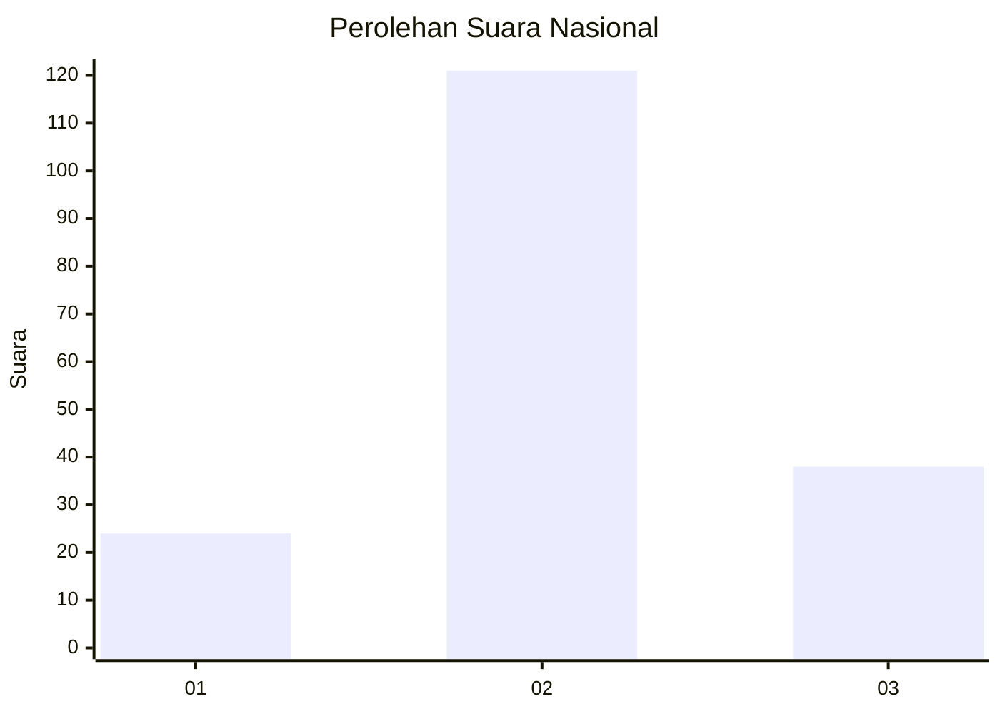
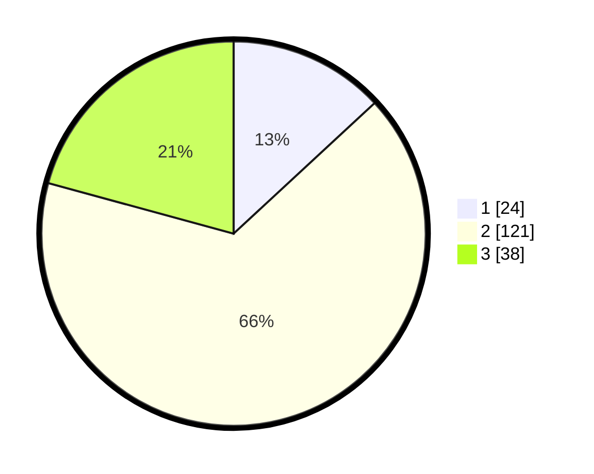

# Hasil

## Grafik

## Tabel

| No. | Nama Paslon    | Suara | Suara (raw) | Persentase |
|:--- |:-------------- | -----:| -----------:| ----------:|
| 1   | ANIES MUHAIMIN | 24    | [24][p-1]   | 13,11      |
| 2   | PRABOWO GIBRAN | 121   | [121][p-2]  | 66,12      |
| 3   | GANJAR MAHFUD  | 38    | [38][p-3]   | 20,77      |

[p-1]: https://github.com/gigit-pemilu/pemilu-2024/blob/main/pilpres/hitung-suara/sub/34-di-yogyakarta/sub/04-sleman/sub/16-pakem/sub/2001-purwobinangun/sub/004-tps/sub/paslon-1.txt
[p-2]: https://github.com/gigit-pemilu/pemilu-2024/blob/main/pilpres/hitung-suara/sub/34-di-yogyakarta/sub/04-sleman/sub/16-pakem/sub/2001-purwobinangun/sub/004-tps/sub/paslon-2.txt
[p-3]: https://github.com/gigit-pemilu/pemilu-2024/blob/main/pilpres/hitung-suara/sub/34-di-yogyakarta/sub/04-sleman/sub/16-pakem/sub/2001-purwobinangun/sub/004-tps/sub/paslon-3.txt

## Foto C Plano

https://sirekap-obj-formc.kpu.go.id/c90b/pemilu/ppwp/34/04/16/20/01/3404162001004-20240216-212807--e0016b0d-7b20-4176-afc7-f35e04266027.jpg

https://sirekap-obj-formc.kpu.go.id/c90b/pemilu/ppwp/34/04/16/20/01/3404162001004-20240216-212842--292d93b3-7526-4441-9350-00b611113fd5.jpg

https://sirekap-obj-formc.kpu.go.id/c90b/pemilu/ppwp/34/04/16/20/01/3404162001004-20240216-212928--18f4f5db-03aa-455c-bef4-eb3d758307d4.jpg

## Metadata

| Key        | Value               |
| ---------- | ------------------- |
| Time Stamp | 2024-02-16 22:01:00 |

## DATA PEMILIH TETAP

Jumlah pemilih dalam DPT: **191**.
 * L: **94**.
 * P: **97**.

## DATA PENGGUNA HAK PILIH

Jumlah pengguna hak pilih dalam DPT: **175**.
 * L: **93**.
 * P: **86**.

Jumlah pengguna hak pilih dalam DPTb: **7**.
 * L: **7**.
 * P: **8**.

Jumlah pengguna hak pilih dalam DPK: **22**.
 * L: **2**.
 * P: **1**.

Jumlah pengguna hak pilih: **187**.
 * L: **100**.
 * P: **87**.

## JUMLAH SUARA SAH DAN TIDAK SAH

JUMLAH SELURUH SUARA SAH: **183**.

JUMLAH SUARA TIDAK SAH: **4**.

JUMLAH SELURUH SUARA SAH DAN SUARA TIDAK SAH: **187**.

