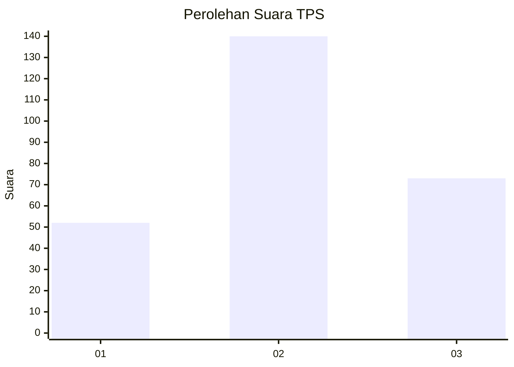
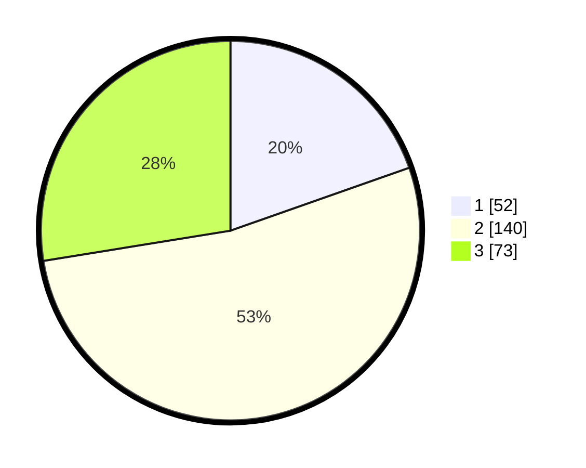

# Hasil

## Grafik

## Tabel

| No. | Nama Paslon    | Suara | Suara (raw) | Persentase |
|:--- |:-------------- | -----:| -----------:| ----------:|
| 1   | ANIES MUHAIMIN | 52    | [52][p-1]   | 19,62      |
| 2   | PRABOWO GIBRAN | 140   | [140][p-2]  | 52,83      |
| 3   | GANJAR MAHFUD  | 73    | [73][p-3]   | 27,55      |

[p-1]: https://github.com/gigit-pemilu/pemilu-2024-34-di-yogyakarta/blob/main/pilpres/hitung-suara/sub/34-di-yogyakarta/sub/04-sleman/sub/16-pakem/sub/2001-purwobinangun/sub/005-tps/sub/paslon-1.txt
[p-2]: https://github.com/gigit-pemilu/pemilu-2024-34-di-yogyakarta/blob/main/pilpres/hitung-suara/sub/34-di-yogyakarta/sub/04-sleman/sub/16-pakem/sub/2001-purwobinangun/sub/005-tps/sub/paslon-2.txt
[p-3]: https://github.com/gigit-pemilu/pemilu-2024-34-di-yogyakarta/blob/main/pilpres/hitung-suara/sub/34-di-yogyakarta/sub/04-sleman/sub/16-pakem/sub/2001-purwobinangun/sub/005-tps/sub/paslon-3.txt

## Foto C Plano

https://sirekap-obj-formc.kpu.go.id/48e1/pemilu/ppwp/34/04/16/20/01/3404162001005-20240216-214634--a61d3a7d-503c-40b7-86a4-9c1a85c09355.jpg

https://sirekap-obj-formc.kpu.go.id/48e1/pemilu/ppwp/34/04/16/20/01/3404162001005-20240216-214838--9d8fe002-a786-40ba-89c8-86a76644ee94.jpg

https://sirekap-obj-formc.kpu.go.id/48e1/pemilu/ppwp/34/04/16/20/01/3404162001005-20240216-214942--1583ae8e-dcaa-4bd3-bf0e-e0e45e51d553.jpg

## Metadata

| Key        | Value               |
| ---------- | ------------------- |
| Time Stamp | 2024-02-20 11:00:00 |

## DATA PEMILIH TETAP

Jumlah pemilih dalam DPT: **290**.
 * L: **138**.
 * P: **152**.

## DATA PENGGUNA HAK PILIH

Jumlah pengguna hak pilih dalam DPT: **271**.
 * L: **126**.
 * P: **145**.

Jumlah pengguna hak pilih dalam DPTb: **4**.
 * L: **3**.
 * P: **1**.

Jumlah pengguna hak pilih dalam DPK: **0**.
 * L: **0**.
 * P: **0**.

Jumlah pengguna hak pilih: **275**.
 * L: **129**.
 * P: **146**.

## JUMLAH SUARA SAH DAN TIDAK SAH

JUMLAH SELURUH SUARA SAH: **265**.

JUMLAH SUARA TIDAK SAH: **10**.

JUMLAH SELURUH SUARA SAH DAN SUARA TIDAK SAH: **275**.

