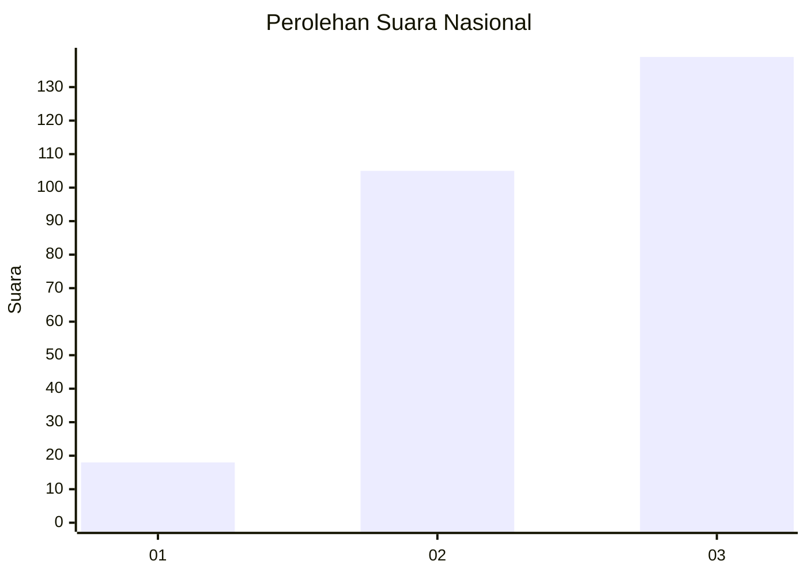
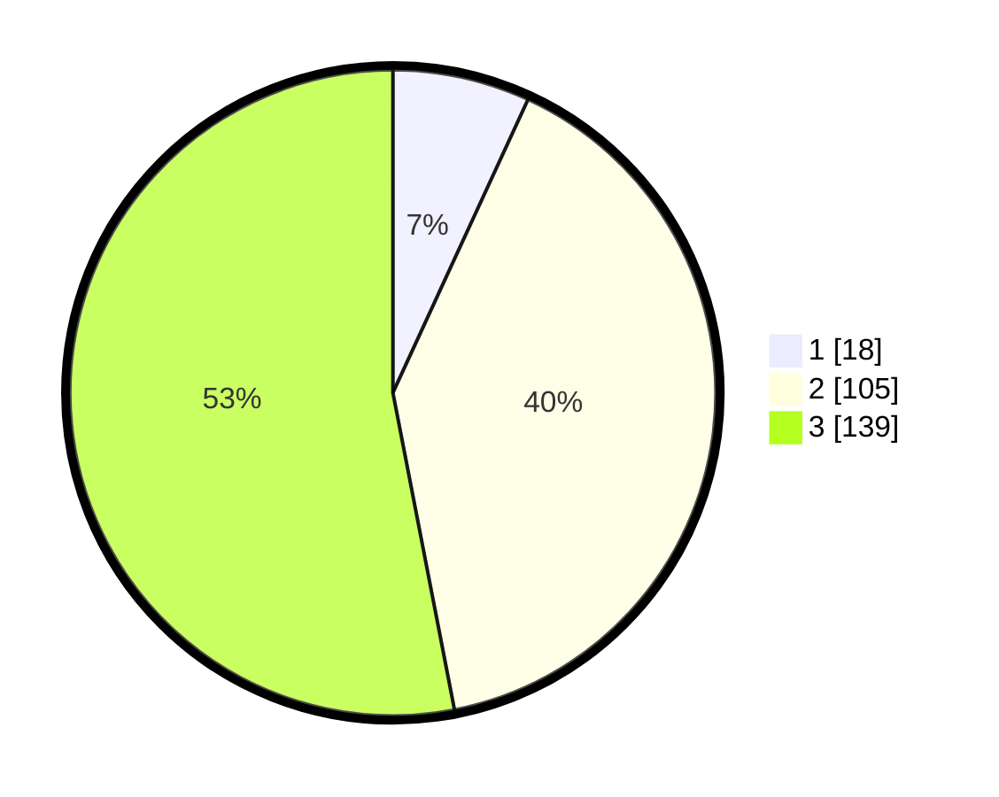

# Hasil

## Grafik

## Tabel

| No. | Nama Paslon    | Suara | Suara (raw) | Persentase |
|:--- |:-------------- | -----:| -----------:| ----------:|
| 1   | ANIES MUHAIMIN | 18    | [18][p-1]   | 6,87       |
| 2   | PRABOWO GIBRAN | 105   | [105][p-2]  | 40,08      |
| 3   | GANJAR MAHFUD  | 139   | [139][p-3]  | 53,05      |

[p-1]: https://github.com/gigit-pemilu/pemilu-2024/blob/main/pilpres/hitung-suara/sub/34-di-yogyakarta/sub/04-sleman/sub/16-pakem/sub/2001-purwobinangun/sub/009-tps/sub/paslon-1.txt
[p-2]: https://github.com/gigit-pemilu/pemilu-2024/blob/main/pilpres/hitung-suara/sub/34-di-yogyakarta/sub/04-sleman/sub/16-pakem/sub/2001-purwobinangun/sub/009-tps/sub/paslon-2.txt
[p-3]: https://github.com/gigit-pemilu/pemilu-2024/blob/main/pilpres/hitung-suara/sub/34-di-yogyakarta/sub/04-sleman/sub/16-pakem/sub/2001-purwobinangun/sub/009-tps/sub/paslon-3.txt

## Foto C Plano

https://sirekap-obj-formc.kpu.go.id/7b37/pemilu/ppwp/34/04/16/20/01/3404162001009-20240214-215530--f0ad3091-2f54-4a8b-88d7-bfd5dcb54dc5.jpg

https://sirekap-obj-formc.kpu.go.id/7b37/pemilu/ppwp/34/04/16/20/01/3404162001009-20240214-215712--36fcd429-495e-4eb8-bc6b-109855337433.jpg

https://sirekap-obj-formc.kpu.go.id/7b37/pemilu/ppwp/34/04/16/20/01/3404162001009-20240214-215942--1c076f16-6e76-4528-9d8a-831bbcc7c8b2.jpg

## Metadata

| Key        | Value               |
| ---------- | ------------------- |
| Time Stamp | 2024-02-16 22:01:00 |

