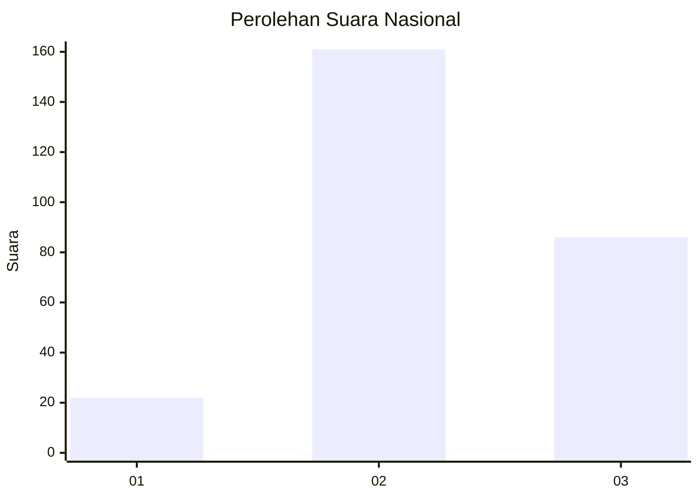
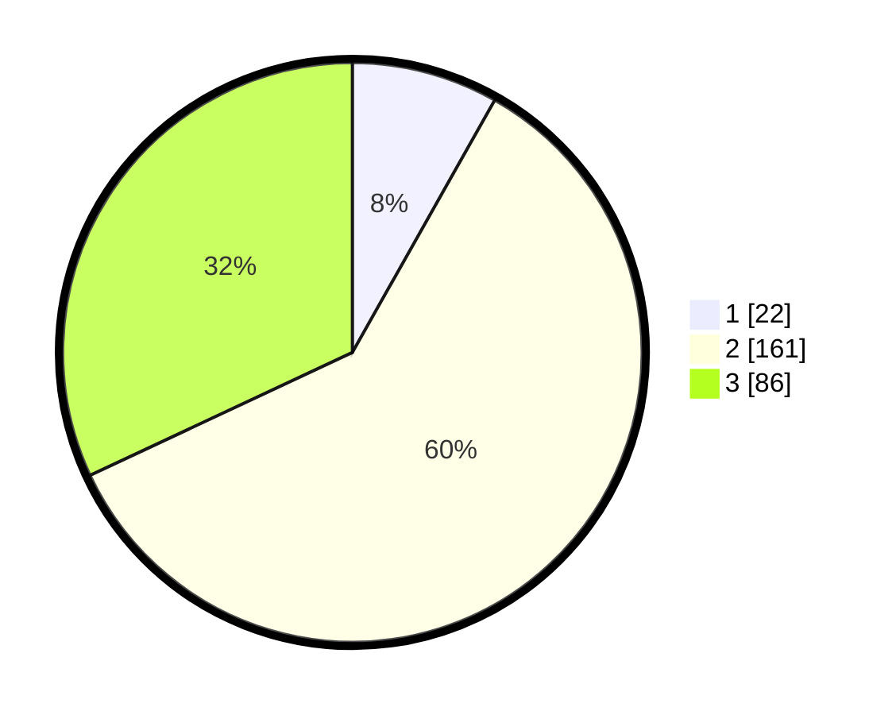

# Hasil

## Grafik

## Tabel

| No. | Nama Paslon    | Suara | Suara (raw) | Persentase |
|:--- |:-------------- | -----:| -----------:| ----------:|
| 1   | ANIES MUHAIMIN | 22    | [22][p-1]   | 8,18       |
| 2   | PRABOWO GIBRAN | 161   | [161][p-2]  | 59,85      |
| 3   | GANJAR MAHFUD  | 86    | [86][p-3]   | 31,97      |

[p-1]: https://github.com/gigit-pemilu/pemilu-2024/blob/main/pilpres/hitung-suara/sub/34-di-yogyakarta/sub/04-sleman/sub/16-pakem/sub/2001-purwobinangun/sub/011-tps/sub/paslon-1.txt
[p-2]: https://github.com/gigit-pemilu/pemilu-2024/blob/main/pilpres/hitung-suara/sub/34-di-yogyakarta/sub/04-sleman/sub/16-pakem/sub/2001-purwobinangun/sub/011-tps/sub/paslon-2.txt
[p-3]: https://github.com/gigit-pemilu/pemilu-2024/blob/main/pilpres/hitung-suara/sub/34-di-yogyakarta/sub/04-sleman/sub/16-pakem/sub/2001-purwobinangun/sub/011-tps/sub/paslon-3.txt

## Foto C Plano

https://sirekap-obj-formc.kpu.go.id/f310/pemilu/ppwp/34/04/16/20/01/3404162001011-20240214-193545--104b2907-0db5-4530-b780-662c82951d48.jpg

https://sirekap-obj-formc.kpu.go.id/f310/pemilu/ppwp/34/04/16/20/01/3404162001011-20240214-210555--f1fc95f8-c129-4eda-8b61-e670f1c8c630.jpg

https://sirekap-obj-formc.kpu.go.id/f310/pemilu/ppwp/34/04/16/20/01/3404162001011-20240215-015305--75581bbf-4352-4639-b894-983bd0cf389d.jpg

## Metadata

| Key        | Value               |
| ---------- | ------------------- |
| Time Stamp | 2024-02-15 15:00:29 |

