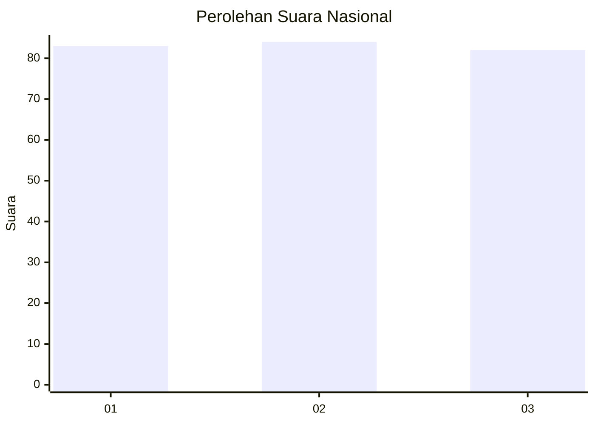
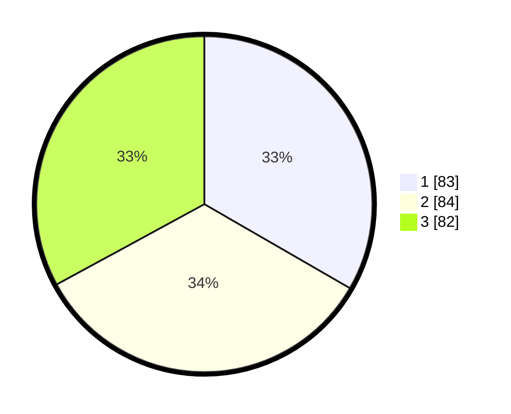

# Hasil

## Grafik

## Tabel

| No. | Nama Paslon    | Suara | Suara (raw) | Persentase |
|:--- |:-------------- | -----:| -----------:| ----------:|
| 1   | ANIES MUHAIMIN | 83    | [83][p-1]   | 33,33      |
| 2   | PRABOWO GIBRAN | 84    | [84][p-2]   | 33,73      |
| 3   | GANJAR MAHFUD  | 82    | [82][p-3]   | 32,93      |

[p-1]: https://github.com/gigit-pemilu/pemilu-2024/blob/main/pilpres/hitung-suara/sub/34-di-yogyakarta/sub/04-sleman/sub/16-pakem/sub/2001-purwobinangun/sub/012-tps/sub/paslon-1.txt
[p-2]: https://github.com/gigit-pemilu/pemilu-2024/blob/main/pilpres/hitung-suara/sub/34-di-yogyakarta/sub/04-sleman/sub/16-pakem/sub/2001-purwobinangun/sub/012-tps/sub/paslon-2.txt
[p-3]: https://github.com/gigit-pemilu/pemilu-2024/blob/main/pilpres/hitung-suara/sub/34-di-yogyakarta/sub/04-sleman/sub/16-pakem/sub/2001-purwobinangun/sub/012-tps/sub/paslon-3.txt

## Foto C Plano

https://sirekap-obj-formc.kpu.go.id/8595/pemilu/ppwp/34/04/16/20/01/3404162001012-20240214-205032--45491b61-802f-4213-87f7-a0d3385d2bcf.jpg

https://sirekap-obj-formc.kpu.go.id/8595/pemilu/ppwp/34/04/16/20/01/3404162001012-20240214-204937--516d55a3-518a-403a-b34a-39f4c90e2f4b.jpg

https://sirekap-obj-formc.kpu.go.id/8595/pemilu/ppwp/34/04/16/20/01/3404162001012-20240214-205114--3e6c5cf4-cf47-49fb-80cd-bcf571803b2e.jpg

## Metadata

| Key        | Value               |
| ---------- | ------------------- |
| Time Stamp | 2024-02-15 00:41:44 |

