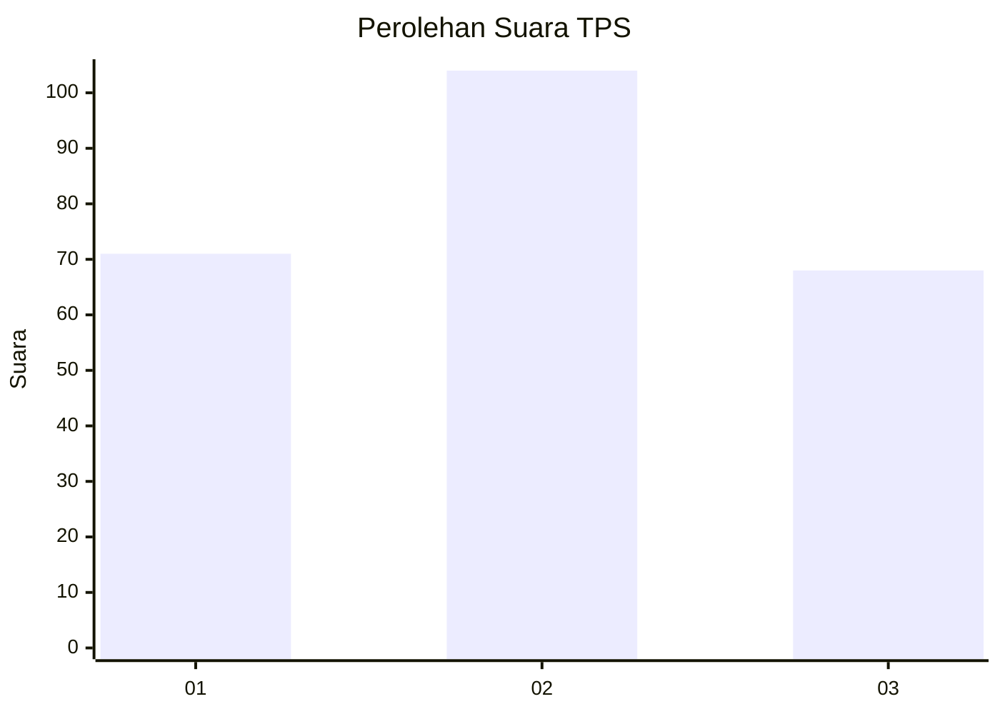
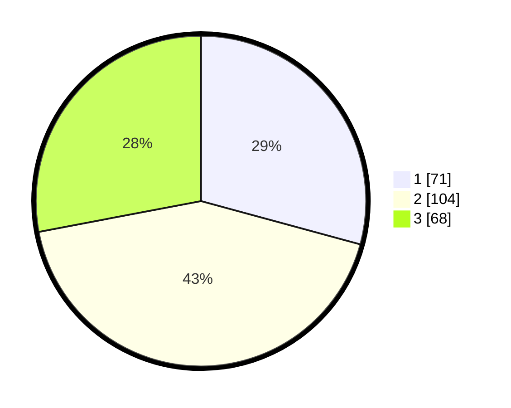

# Hasil

## Grafik

## Tabel

| No. | Nama Paslon    | Suara | Suara (raw) | Persentase |
|:--- |:-------------- | -----:| -----------:| ----------:|
| 1   | ANIES MUHAIMIN | 71    | [71][p-1]   | 29,22      |
| 2   | PRABOWO GIBRAN | 104   | [104][p-2]  | 42,80      |
| 3   | GANJAR MAHFUD  | 68    | [68][p-3]   | 27,98      |

[p-1]: https://github.com/gigit-pemilu/pemilu-2024-34-di-yogyakarta/blob/main/pilpres/hitung-suara/sub/34-di-yogyakarta/sub/04-sleman/sub/16-pakem/sub/2001-purwobinangun/sub/017-tps/sub/paslon-1.txt
[p-2]: https://github.com/gigit-pemilu/pemilu-2024-34-di-yogyakarta/blob/main/pilpres/hitung-suara/sub/34-di-yogyakarta/sub/04-sleman/sub/16-pakem/sub/2001-purwobinangun/sub/017-tps/sub/paslon-2.txt
[p-3]: https://github.com/gigit-pemilu/pemilu-2024-34-di-yogyakarta/blob/main/pilpres/hitung-suara/sub/34-di-yogyakarta/sub/04-sleman/sub/16-pakem/sub/2001-purwobinangun/sub/017-tps/sub/paslon-3.txt

## Foto C Plano

https://sirekap-obj-formc.kpu.go.id/0f8b/pemilu/ppwp/34/04/16/20/01/3404162001017-20240214-202636--7b46c102-ac75-4152-a513-2b278cee8d09.jpg

https://sirekap-obj-formc.kpu.go.id/0f8b/pemilu/ppwp/34/04/16/20/01/3404162001017-20240214-211208--19a05cef-5560-4028-900d-bd9906b4c957.jpg

https://sirekap-obj-formc.kpu.go.id/0f8b/pemilu/ppwp/34/04/16/20/01/3404162001017-20240214-211258--68e58ad4-f771-490a-b7c0-f44f3301fdb3.jpg

## Metadata

| Key        | Value               |
| ---------- | ------------------- |
| Time Stamp | 2024-02-16 22:01:00 |

