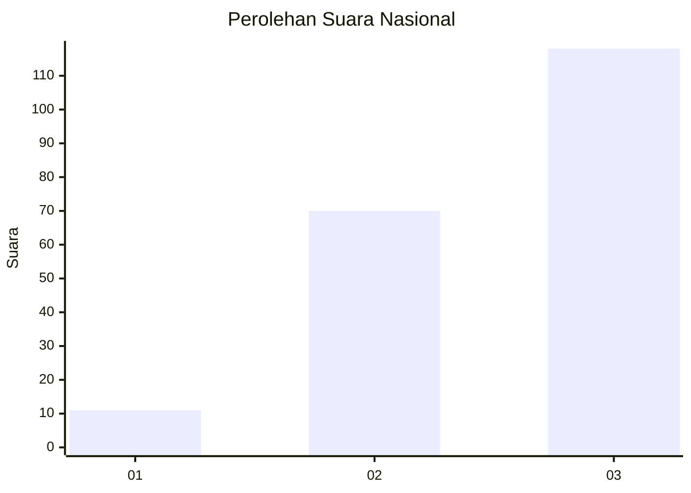
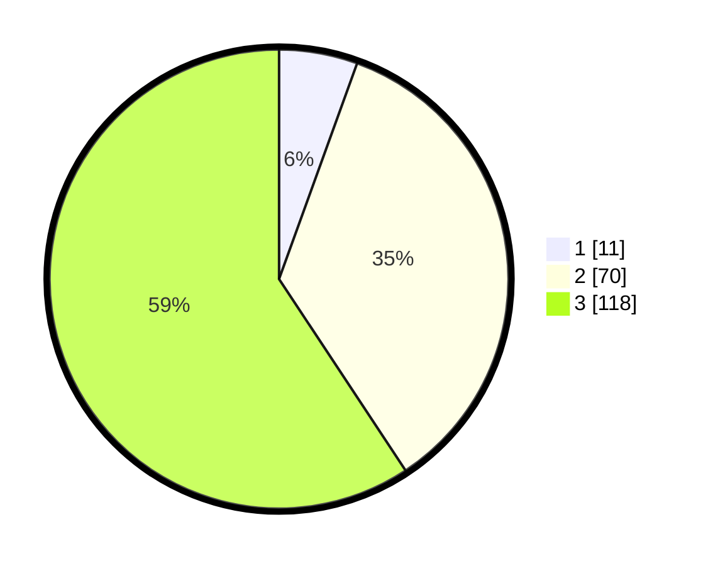

# Hasil

## Grafik

## Tabel

| No. | Nama Paslon    | Suara | Suara (raw) | Persentase |
|:--- |:-------------- | -----:| -----------:| ----------:|
| 1   | ANIES MUHAIMIN | 11    | [11][p-1]   | 5,53       |
| 2   | PRABOWO GIBRAN | 70    | [70][p-2]   | 35,18      |
| 3   | GANJAR MAHFUD  | 118   | [118][p-3]  | 59,30      |

[p-1]: https://github.com/gigit-pemilu/pemilu-2024/blob/main/pilpres/hitung-suara/sub/34-di-yogyakarta/sub/04-sleman/sub/16-pakem/sub/2001-purwobinangun/sub/018-tps/sub/paslon-1.txt
[p-2]: https://github.com/gigit-pemilu/pemilu-2024/blob/main/pilpres/hitung-suara/sub/34-di-yogyakarta/sub/04-sleman/sub/16-pakem/sub/2001-purwobinangun/sub/018-tps/sub/paslon-2.txt
[p-3]: https://github.com/gigit-pemilu/pemilu-2024/blob/main/pilpres/hitung-suara/sub/34-di-yogyakarta/sub/04-sleman/sub/16-pakem/sub/2001-purwobinangun/sub/018-tps/sub/paslon-3.txt

## Foto C Plano

https://sirekap-obj-formc.kpu.go.id/1353/pemilu/ppwp/34/04/16/20/01/3404162001018-20240215-042534--aff72a44-e6c5-424c-b50a-f268c7bddd40.jpg

https://sirekap-obj-formc.kpu.go.id/1353/pemilu/ppwp/34/04/16/20/01/3404162001018-20240215-042750--4f9827b8-aeb3-41cb-a641-e3d4149f5497.jpg

https://sirekap-obj-formc.kpu.go.id/1353/pemilu/ppwp/34/04/16/20/01/3404162001018-20240215-042905--309025a9-0e7a-48ac-9d72-eaa244f33080.jpg

## Metadata

| Key        | Value               |
| ---------- | ------------------- |
| Time Stamp | 2024-02-24 22:31:28 |

