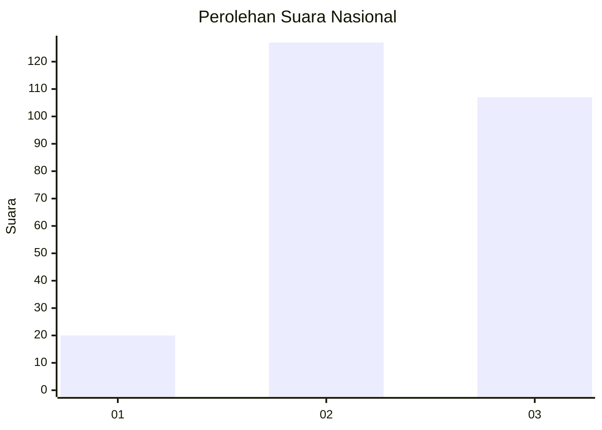
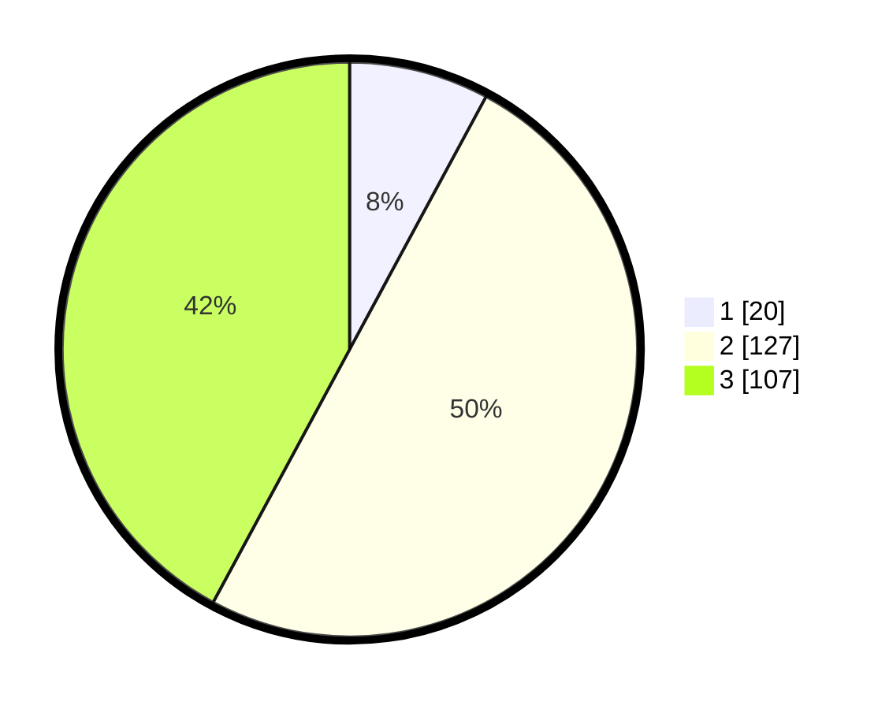

# Hasil

## Grafik

## Tabel

| No. | Nama Paslon    | Suara | Suara (raw) | Persentase |
|:--- |:-------------- | -----:| -----------:| ----------:|
| 1   | ANIES MUHAIMIN | 20    | [20][p-1]   | 7,87       |
| 2   | PRABOWO GIBRAN | 127   | [127][p-2]  | 50,00      |
| 3   | GANJAR MAHFUD  | 107   | [107][p-3]  | 42,13      |

[p-1]: https://github.com/gigit-pemilu/pemilu-2024/blob/main/pilpres/hitung-suara/sub/34-di-yogyakarta/sub/04-sleman/sub/16-pakem/sub/2001-purwobinangun/sub/020-tps/sub/paslon-1.txt
[p-2]: https://github.com/gigit-pemilu/pemilu-2024/blob/main/pilpres/hitung-suara/sub/34-di-yogyakarta/sub/04-sleman/sub/16-pakem/sub/2001-purwobinangun/sub/020-tps/sub/paslon-2.txt
[p-3]: https://github.com/gigit-pemilu/pemilu-2024/blob/main/pilpres/hitung-suara/sub/34-di-yogyakarta/sub/04-sleman/sub/16-pakem/sub/2001-purwobinangun/sub/020-tps/sub/paslon-3.txt

## Foto C Plano

https://sirekap-obj-formc.kpu.go.id/8ff1/pemilu/ppwp/34/04/16/20/01/3404162001020-20240214-221607--73cf1cb6-dc35-4c4d-8504-880415e0b4ad.jpg

https://sirekap-obj-formc.kpu.go.id/8ff1/pemilu/ppwp/34/04/16/20/01/3404162001020-20240214-221710--065174ed-f9f8-494d-91e9-e590b8157b0e.jpg

https://sirekap-obj-formc.kpu.go.id/8ff1/pemilu/ppwp/34/04/16/20/01/3404162001020-20240214-221749--0663da67-9497-4527-95c5-7a7728985b87.jpg

## Metadata

| Key        | Value               |
| ---------- | ------------------- |
| Time Stamp | 2024-02-15 20:30:46 |

