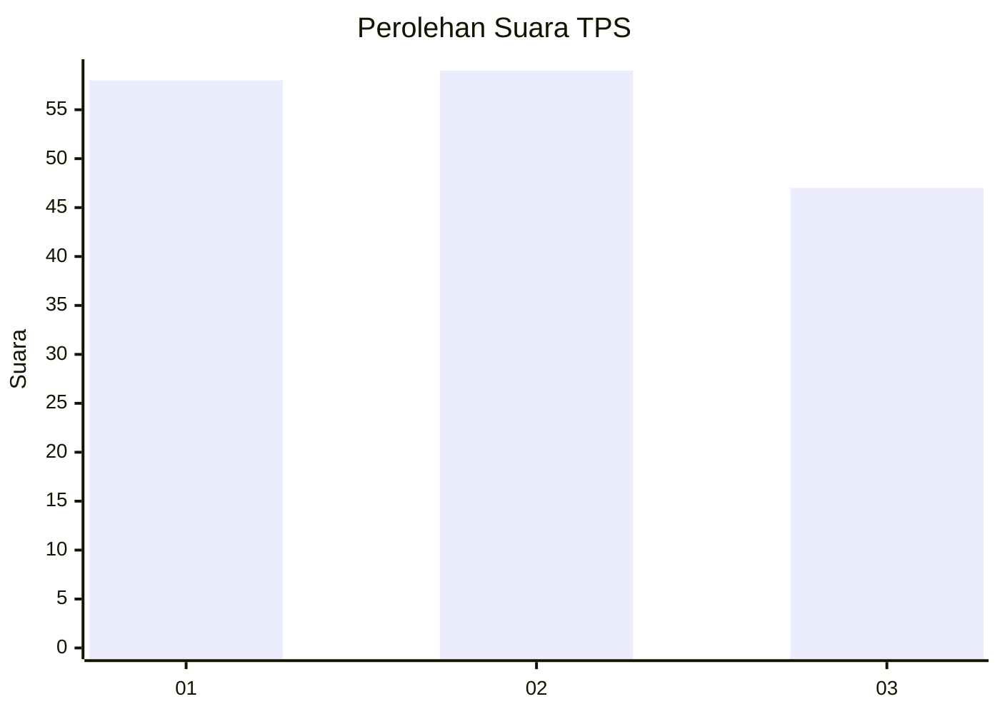
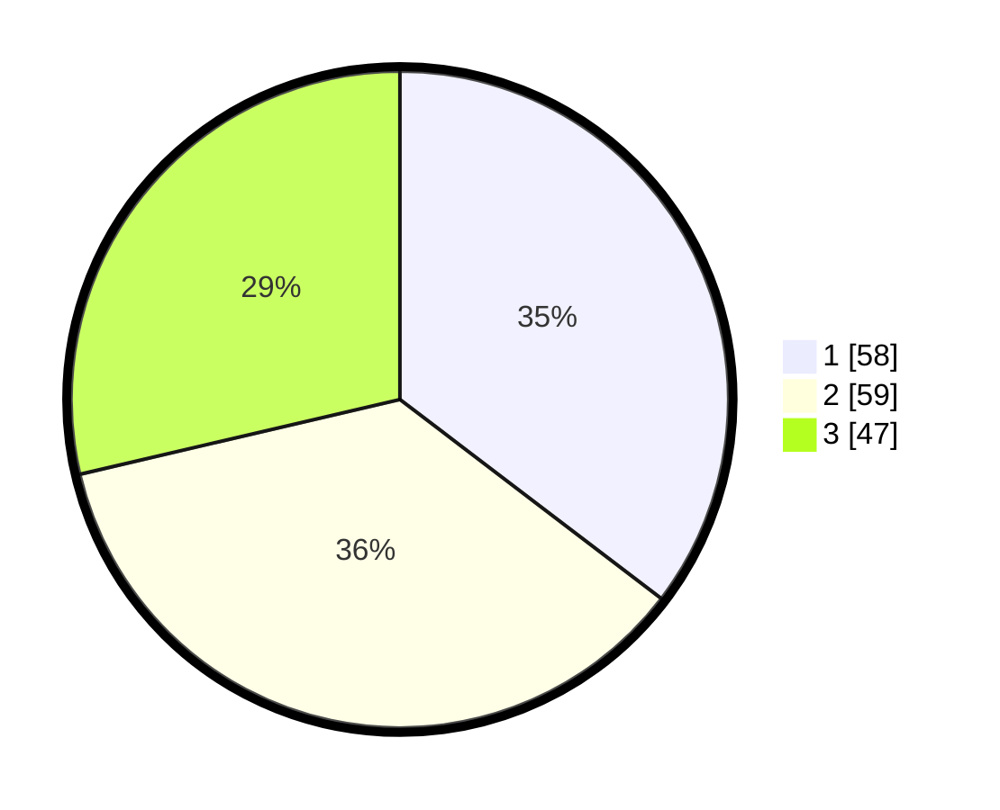

# Hasil

## Grafik

## Tabel

| No. | Nama Paslon    | Suara | Suara (raw) | Persentase |
|:--- |:-------------- | -----:| -----------:| ----------:|
| 1   | ANIES MUHAIMIN | 58    | [58][p-1]   | 35,37      |
| 2   | PRABOWO GIBRAN | 59    | [59][p-2]   | 35,98      |
| 3   | GANJAR MAHFUD  | 47    | [47][p-3]   | 28,66      |

[p-1]: https://github.com/gigit-pemilu/pemilu-2024-34-di-yogyakarta/blob/main/pilpres/hitung-suara/sub/34-di-yogyakarta/sub/04-sleman/sub/16-pakem/sub/2001-purwobinangun/sub/024-tps/sub/paslon-1.txt
[p-2]: https://github.com/gigit-pemilu/pemilu-2024-34-di-yogyakarta/blob/main/pilpres/hitung-suara/sub/34-di-yogyakarta/sub/04-sleman/sub/16-pakem/sub/2001-purwobinangun/sub/024-tps/sub/paslon-2.txt
[p-3]: https://github.com/gigit-pemilu/pemilu-2024-34-di-yogyakarta/blob/main/pilpres/hitung-suara/sub/34-di-yogyakarta/sub/04-sleman/sub/16-pakem/sub/2001-purwobinangun/sub/024-tps/sub/paslon-3.txt

## Foto C Plano

https://sirekap-obj-formc.kpu.go.id/1afb/pemilu/ppwp/34/04/16/20/01/3404162001024-20240214-210820--90d5501c-e082-47ad-871b-fce064652b71.jpg

https://sirekap-obj-formc.kpu.go.id/1afb/pemilu/ppwp/34/04/16/20/01/3404162001024-20240214-202017--bfc8041e-8dbe-435a-a4ab-3a8807acc467.jpg

https://sirekap-obj-formc.kpu.go.id/1afb/pemilu/ppwp/34/04/16/20/01/3404162001024-20240214-202314--cf90a2e0-17c4-40aa-aed1-1ad0a922d8f4.jpg

## Metadata

| Key        | Value               |
| ---------- | ------------------- |
| Time Stamp | 2024-02-14 21:46:01 |

