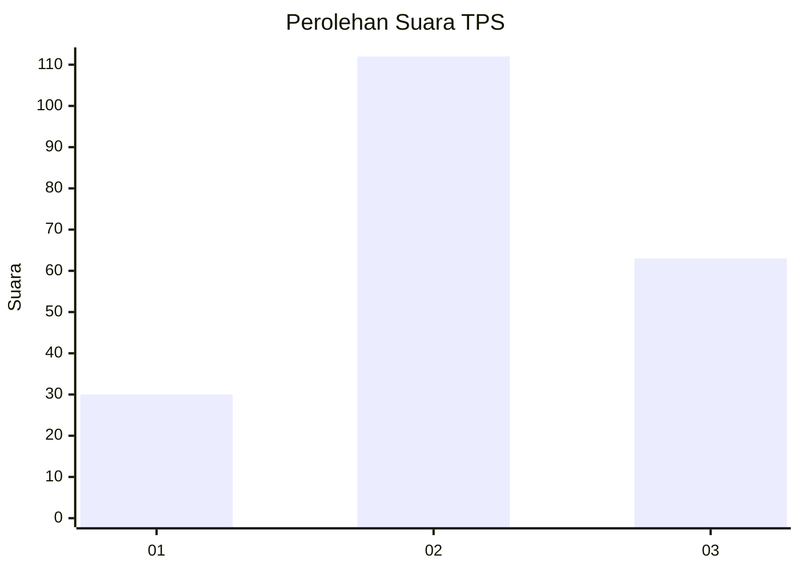
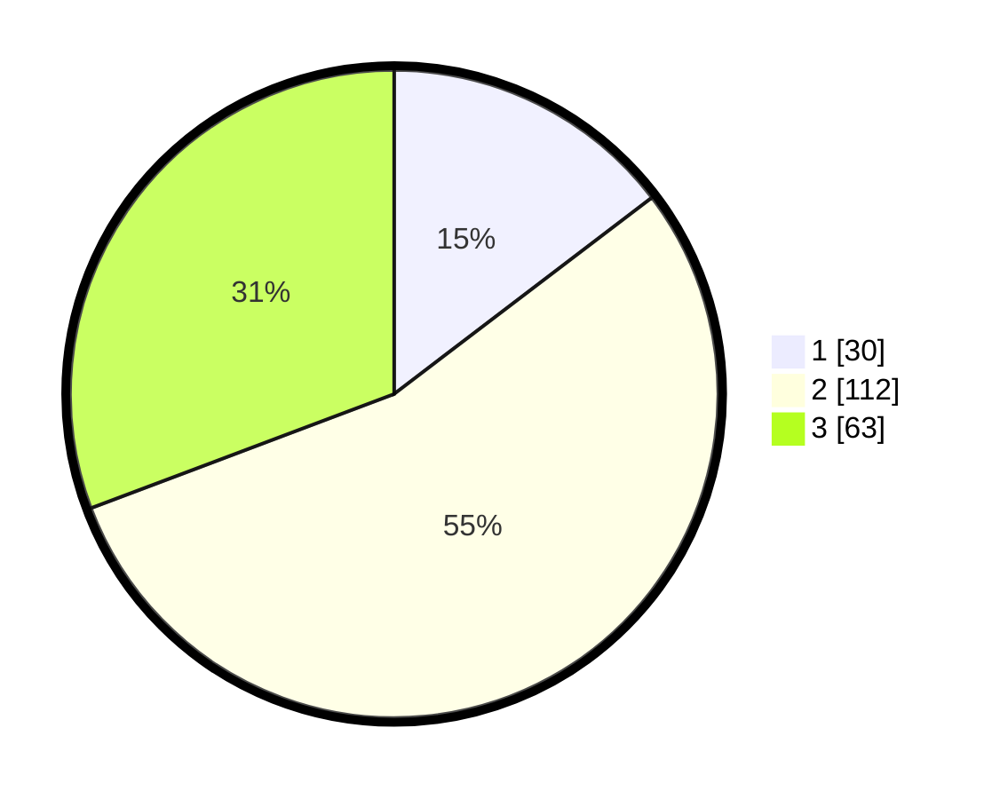

# Hasil

## Grafik

## Tabel

| No. | Nama Paslon    | Suara | Suara (raw) | Persentase |
|:--- |:-------------- | -----:| -----------:| ----------:|
| 1   | ANIES MUHAIMIN | 30    | [30][p-1]   | 14,63      |
| 2   | PRABOWO GIBRAN | 112   | [112][p-2]  | 54,63      |
| 3   | GANJAR MAHFUD  | 63    | [63][p-3]   | 30,73      |

[p-1]: https://github.com/gigit-pemilu/pemilu-2024-34-di-yogyakarta/blob/main/pilpres/hitung-suara/sub/34-di-yogyakarta/sub/04-sleman/sub/16-pakem/sub/2001-purwobinangun/sub/027-tps/sub/paslon-1.txt
[p-2]: https://github.com/gigit-pemilu/pemilu-2024-34-di-yogyakarta/blob/main/pilpres/hitung-suara/sub/34-di-yogyakarta/sub/04-sleman/sub/16-pakem/sub/2001-purwobinangun/sub/027-tps/sub/paslon-2.txt
[p-3]: https://github.com/gigit-pemilu/pemilu-2024-34-di-yogyakarta/blob/main/pilpres/hitung-suara/sub/34-di-yogyakarta/sub/04-sleman/sub/16-pakem/sub/2001-purwobinangun/sub/027-tps/sub/paslon-3.txt

## Foto C Plano

https://sirekap-obj-formc.kpu.go.id/5cc5/pemilu/ppwp/34/04/16/20/01/3404162001027-20240214-214947--eaab0beb-dc5c-43a7-9cf3-64a0b23217a7.jpg

https://sirekap-obj-formc.kpu.go.id/5cc5/pemilu/ppwp/34/04/16/20/01/3404162001027-20240214-215006--e7e09a9e-6b56-425a-a1da-b6e28592f812.jpg

https://sirekap-obj-formc.kpu.go.id/5cc5/pemilu/ppwp/34/04/16/20/01/3404162001027-20240214-215045--9c99f61b-5420-4acd-a66a-39a6e4fa7b71.jpg

## Metadata

| Key        | Value               |
| ---------- | ------------------- |
| Time Stamp | 2024-02-15 20:30:46 |

