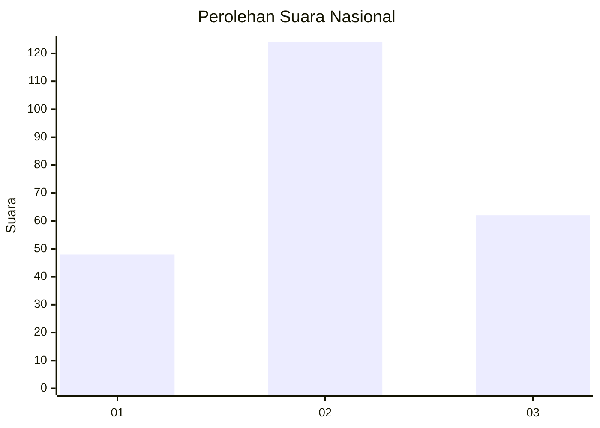
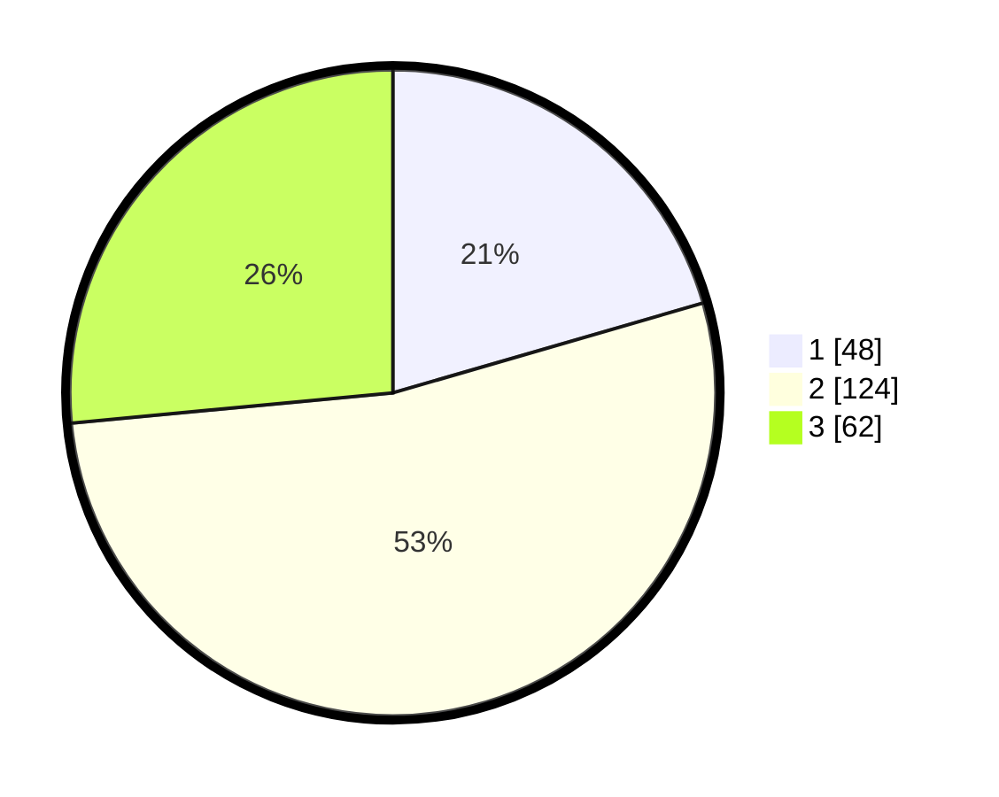

# Hasil

## Grafik

## Tabel

| No. | Nama Paslon    | Suara | Suara (raw) | Persentase |
|:--- |:-------------- | -----:| -----------:| ----------:|
| 1   | ANIES MUHAIMIN | 48    | [48][p-1]   | 20,51      |
| 2   | PRABOWO GIBRAN | 124   | [124][p-2]  | 52,99      |
| 3   | GANJAR MAHFUD  | 62    | [62][p-3]   | 26,50      |

[p-1]: https://github.com/gigit-pemilu/pemilu-2024/blob/main/pilpres/hitung-suara/sub/34-di-yogyakarta/sub/04-sleman/sub/16-pakem/sub/2002-candibinangun/sub/001-tps/sub/paslon-1.txt
[p-2]: https://github.com/gigit-pemilu/pemilu-2024/blob/main/pilpres/hitung-suara/sub/34-di-yogyakarta/sub/04-sleman/sub/16-pakem/sub/2002-candibinangun/sub/001-tps/sub/paslon-2.txt
[p-3]: https://github.com/gigit-pemilu/pemilu-2024/blob/main/pilpres/hitung-suara/sub/34-di-yogyakarta/sub/04-sleman/sub/16-pakem/sub/2002-candibinangun/sub/001-tps/sub/paslon-3.txt

## Foto C Plano

https://sirekap-obj-formc.kpu.go.id/031d/pemilu/ppwp/34/04/16/20/02/3404162002001-20240214-212251--e9e4a3fa-56c0-4cb8-b972-5be821ae9ad5.jpg

https://sirekap-obj-formc.kpu.go.id/031d/pemilu/ppwp/34/04/16/20/02/3404162002001-20240214-200716--ecef4e37-a6fe-4f84-a271-e936a75b63ab.jpg

https://sirekap-obj-formc.kpu.go.id/031d/pemilu/ppwp/34/04/16/20/02/3404162002001-20240216-062736--e04fa94c-73ee-40cc-a59b-6a2768962db7.jpg

## Metadata

| Key        | Value               |
| ---------- | ------------------- |
| Time Stamp | 2024-02-16 06:30:27 |

