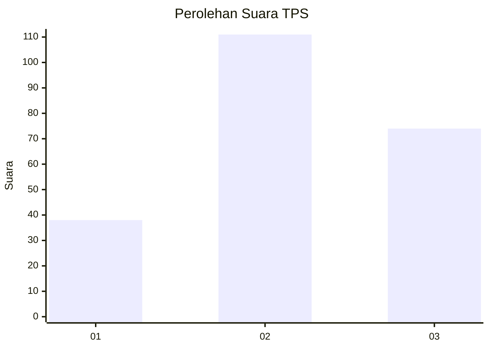
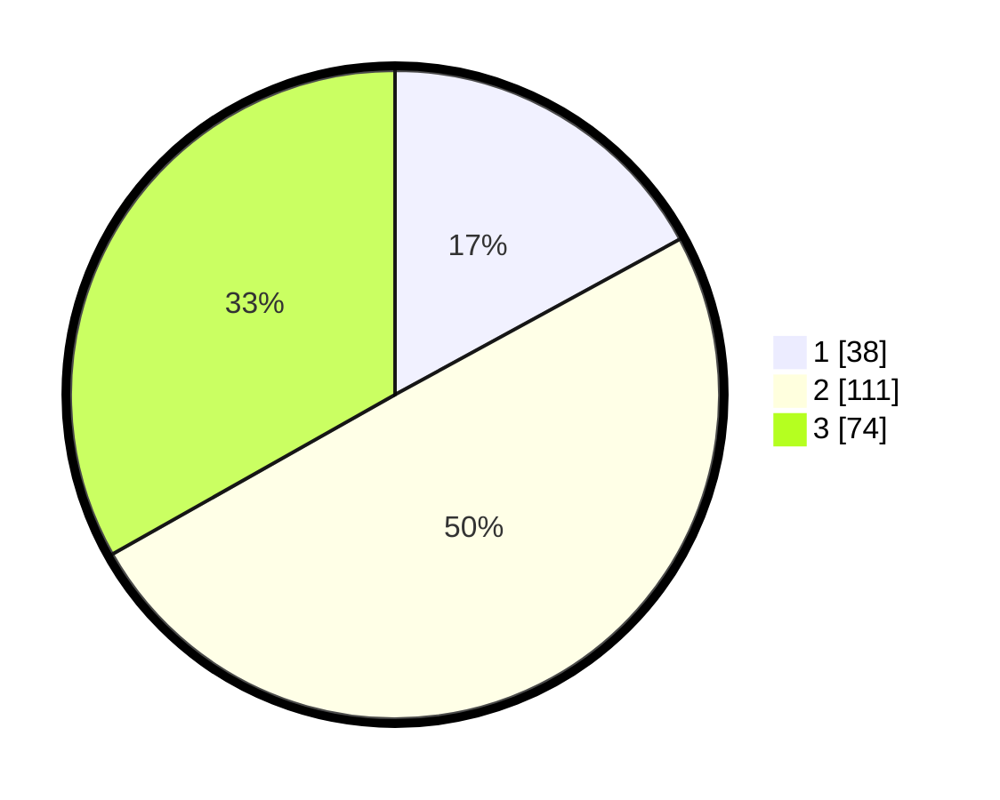

# Hasil

## Grafik

## Tabel

| No. | Nama Paslon    | Suara | Suara (raw) | Persentase |
|:--- |:-------------- | -----:| -----------:| ----------:|
| 1   | ANIES MUHAIMIN | 38    | [38][p-1]   | 17,04      |
| 2   | PRABOWO GIBRAN | 111   | [111][p-2]  | 49,78      |
| 3   | GANJAR MAHFUD  | 74    | [74][p-3]   | 33,18      |

[p-1]: https://github.com/gigit-pemilu/pemilu-2024-34-di-yogyakarta/blob/main/pilpres/hitung-suara/sub/34-di-yogyakarta/sub/04-sleman/sub/16-pakem/sub/2003-harjobinangun/sub/004-tps/sub/paslon-1.txt
[p-2]: https://github.com/gigit-pemilu/pemilu-2024-34-di-yogyakarta/blob/main/pilpres/hitung-suara/sub/34-di-yogyakarta/sub/04-sleman/sub/16-pakem/sub/2003-harjobinangun/sub/004-tps/sub/paslon-2.txt
[p-3]: https://github.com/gigit-pemilu/pemilu-2024-34-di-yogyakarta/blob/main/pilpres/hitung-suara/sub/34-di-yogyakarta/sub/04-sleman/sub/16-pakem/sub/2003-harjobinangun/sub/004-tps/sub/paslon-3.txt

## Foto C Plano

https://sirekap-obj-formc.kpu.go.id/f08e/pemilu/ppwp/34/04/16/20/03/3404162003004-20240215-014940--14c2c295-854d-46da-8d5a-e89b375b88de.jpg

https://sirekap-obj-formc.kpu.go.id/f08e/pemilu/ppwp/34/04/16/20/03/3404162003004-20240215-014854--e8359871-98ac-4c8c-b78d-26e9c9e79b87.jpg

## Metadata

| Key        | Value               |
| ---------- | ------------------- |
| Time Stamp | 2024-02-16 22:01:00 |

