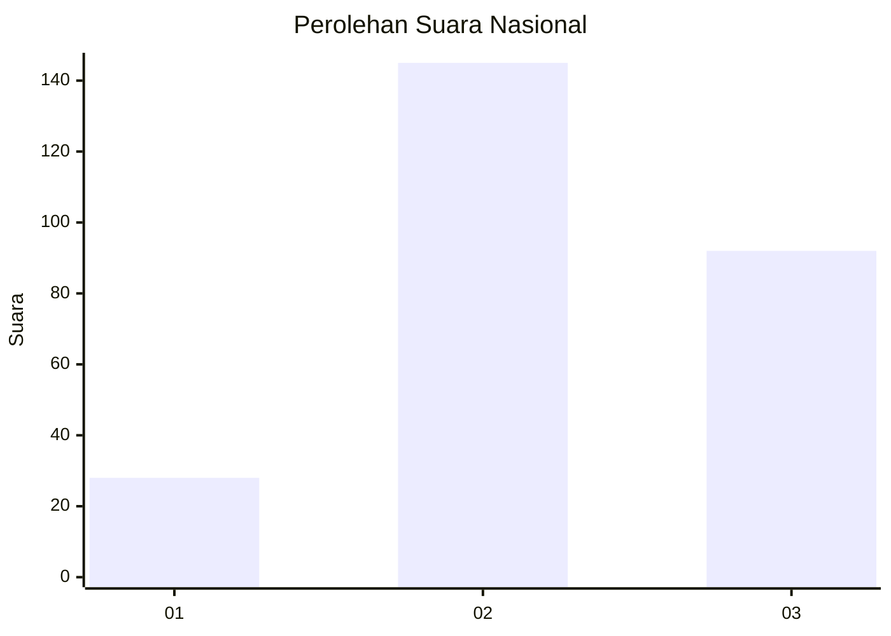
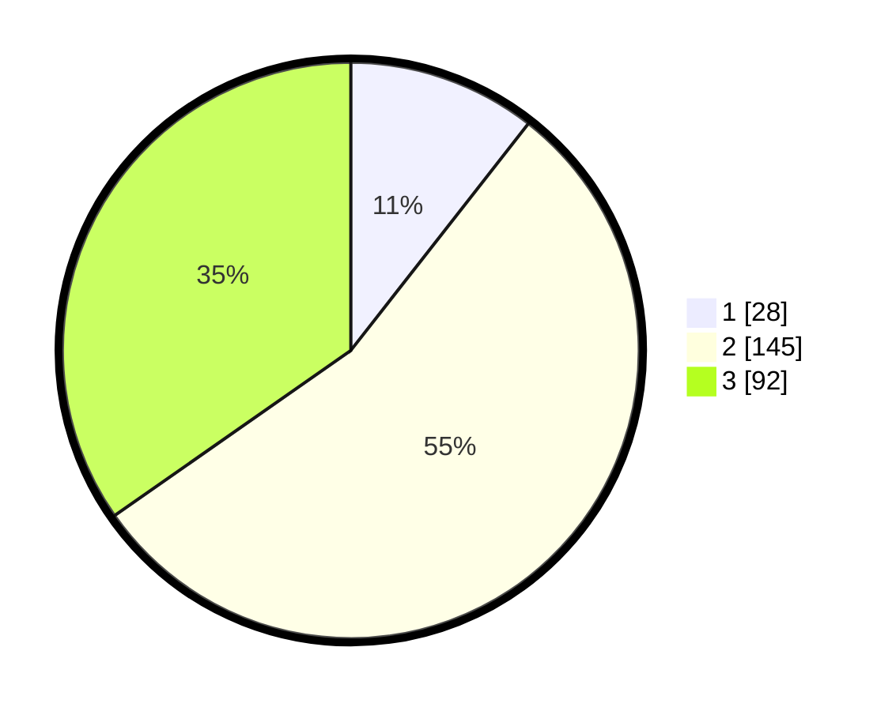

# Hasil

## Grafik

## Tabel

| No. | Nama Paslon    | Suara | Suara (raw) | Persentase |
|:--- |:-------------- | -----:| -----------:| ----------:|
| 1   | ANIES MUHAIMIN | 28    | [28][p-1]   | 10,57      |
| 2   | PRABOWO GIBRAN | 145   | [145][p-2]  | 54,72      |
| 3   | GANJAR MAHFUD  | 92    | [92][p-3]   | 34,72      |

[p-1]: https://github.com/gigit-pemilu/pemilu-2024/blob/main/pilpres/hitung-suara/sub/34-di-yogyakarta/sub/04-sleman/sub/16-pakem/sub/2003-harjobinangun/sub/012-tps/sub/paslon-1.txt
[p-2]: https://github.com/gigit-pemilu/pemilu-2024/blob/main/pilpres/hitung-suara/sub/34-di-yogyakarta/sub/04-sleman/sub/16-pakem/sub/2003-harjobinangun/sub/012-tps/sub/paslon-2.txt
[p-3]: https://github.com/gigit-pemilu/pemilu-2024/blob/main/pilpres/hitung-suara/sub/34-di-yogyakarta/sub/04-sleman/sub/16-pakem/sub/2003-harjobinangun/sub/012-tps/sub/paslon-3.txt

## Foto C Plano

https://sirekap-obj-formc.kpu.go.id/4025/pemilu/ppwp/34/04/16/20/03/3404162003012-20240216-154702--50fc99a6-5e41-495c-8f0d-80ced908c2ad.jpg

https://sirekap-obj-formc.kpu.go.id/4025/pemilu/ppwp/34/04/16/20/03/3404162003012-20240216-154703--fc24ca14-20c5-47a6-8408-1700cb6595fe.jpg

https://sirekap-obj-formc.kpu.go.id/4025/pemilu/ppwp/34/04/16/20/03/3404162003012-20240216-154703--fb7ef5c1-c01a-4eda-ac99-4dda0f61b28b.jpg

## Metadata

| Key        | Value               |
| ---------- | ------------------- |
| Time Stamp | 2024-02-16 21:01:00 |

## DATA PEMILIH TETAP

Jumlah pemilih dalam DPT: **293**.
 * L: **146**.
 * P: **147**.

## DATA PENGGUNA HAK PILIH

Jumlah pengguna hak pilih dalam DPT: **249**.
 * L: **119**.
 * P: **130**.

Jumlah pengguna hak pilih dalam DPTb: **13**.
 * L: **7**.
 * P: **6**.

Jumlah pengguna hak pilih dalam DPK: **10**.
 * L: **4**.
 * P: **6**.

Jumlah pengguna hak pilih: **272**.
 * L: **130**.
 * P: **142**.

## JUMLAH SUARA SAH DAN TIDAK SAH

JUMLAH SELURUH SUARA SAH: **265**.

JUMLAH SUARA TIDAK SAH: **7**.

JUMLAH SELURUH SUARA SAH DAN SUARA TIDAK SAH: **272**.

