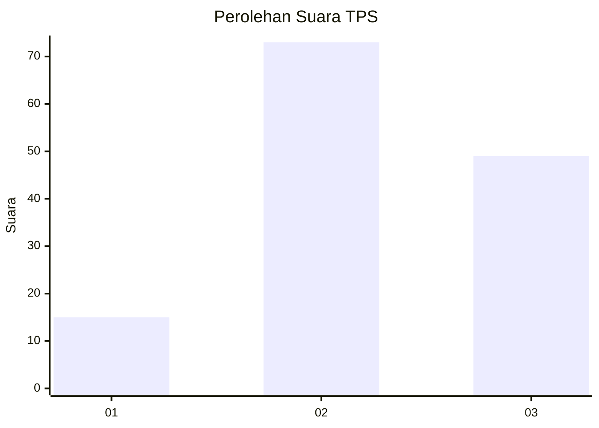
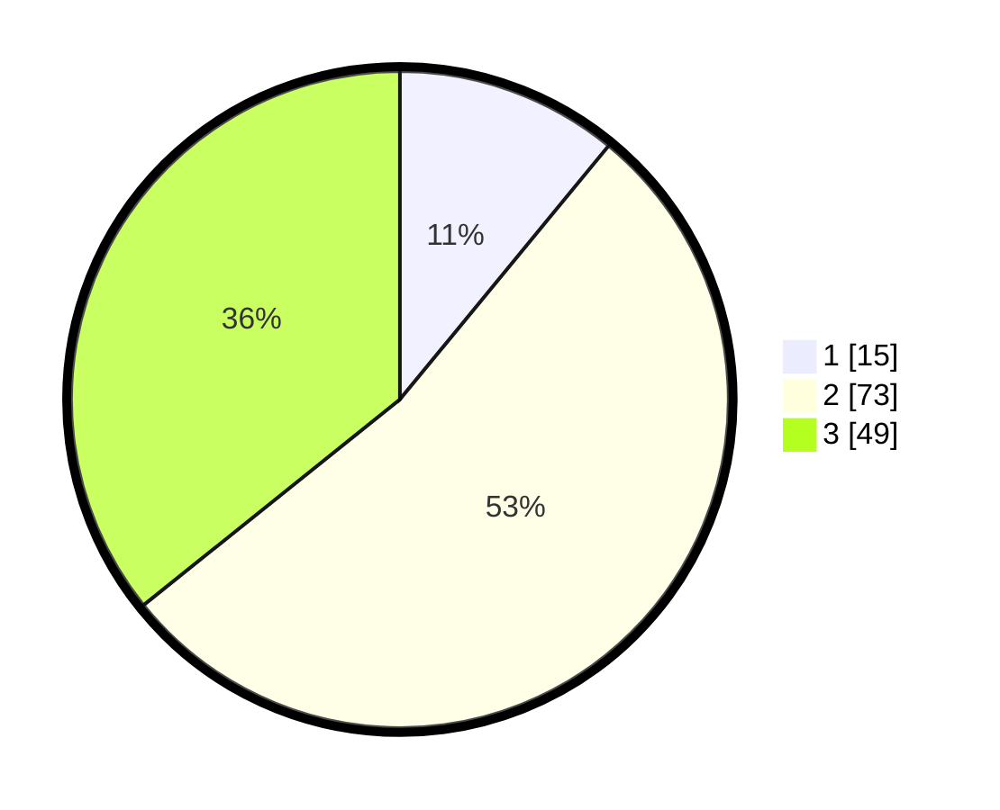

# Hasil

## Grafik

## Tabel

| No. | Nama Paslon    | Suara | Suara (raw) | Persentase |
|:--- |:-------------- | -----:| -----------:| ----------:|
| 1   | ANIES MUHAIMIN | 15    | [15][p-1]   | 10,95      |
| 2   | PRABOWO GIBRAN | 73    | [73][p-2]   | 53,28      |
| 3   | GANJAR MAHFUD  | 49    | [49][p-3]   | 35,77      |

[p-1]: https://github.com/gigit-pemilu/pemilu-2024-34-di-yogyakarta/blob/main/pilpres/hitung-suara/sub/34-di-yogyakarta/sub/04-sleman/sub/16-pakem/sub/2003-harjobinangun/sub/016-tps/sub/paslon-1.txt
[p-2]: https://github.com/gigit-pemilu/pemilu-2024-34-di-yogyakarta/blob/main/pilpres/hitung-suara/sub/34-di-yogyakarta/sub/04-sleman/sub/16-pakem/sub/2003-harjobinangun/sub/016-tps/sub/paslon-2.txt
[p-3]: https://github.com/gigit-pemilu/pemilu-2024-34-di-yogyakarta/blob/main/pilpres/hitung-suara/sub/34-di-yogyakarta/sub/04-sleman/sub/16-pakem/sub/2003-harjobinangun/sub/016-tps/sub/paslon-3.txt

## Foto C Plano

https://sirekap-obj-formc.kpu.go.id/0337/pemilu/ppwp/34/04/16/20/03/3404162003016-20240214-231904--75f100bc-e61d-453c-a7e1-3b13aee4cfd0.jpg

https://sirekap-obj-formc.kpu.go.id/0337/pemilu/ppwp/34/04/16/20/03/3404162003016-20240214-232028--3dcf5034-1d14-4d4e-873b-bff7f99bff73.jpg

https://sirekap-obj-formc.kpu.go.id/0337/pemilu/ppwp/34/04/16/20/03/3404162003016-20240214-232126--55be2543-0304-4541-a602-299354d1f41c.jpg

## Metadata

| Key        | Value               |
| ---------- | ------------------- |
| Time Stamp | 2024-02-16 09:00:28 |

