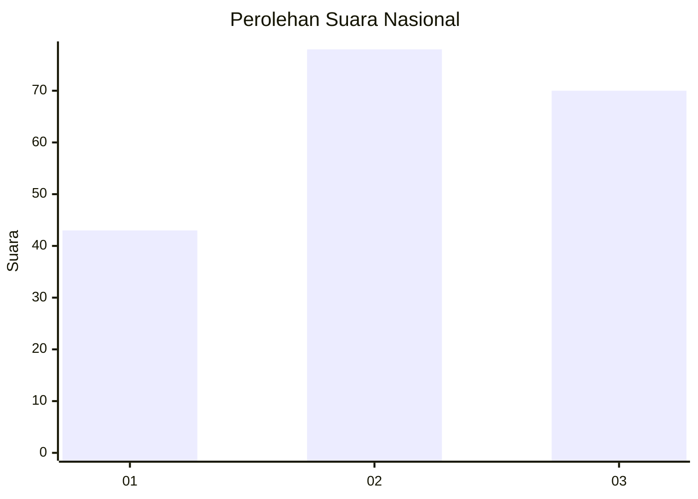
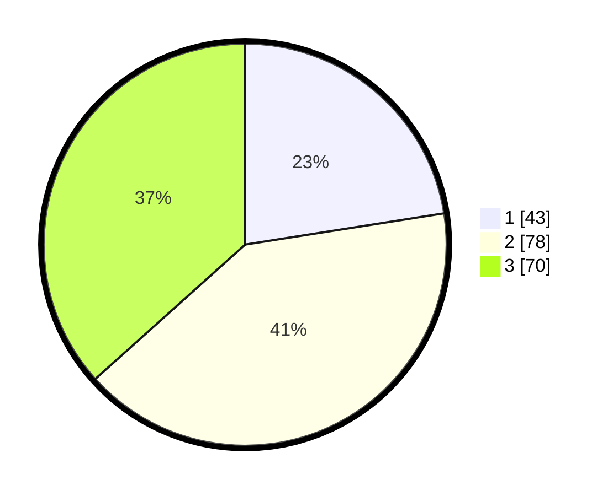

# Hasil

## Grafik

## Tabel

| No. | Nama Paslon    | Suara | Suara (raw) | Persentase |
|:--- |:-------------- | -----:| -----------:| ----------:|
| 1   | ANIES MUHAIMIN | 43    | [43][p-1]   | 22,51      |
| 2   | PRABOWO GIBRAN | 78    | [78][p-2]   | 40,84      |
| 3   | GANJAR MAHFUD  | 70    | [70][p-3]   | 36,65      |

[p-1]: https://github.com/gigit-pemilu/pemilu-2024/blob/main/pilpres/hitung-suara/sub/34-di-yogyakarta/sub/04-sleman/sub/16-pakem/sub/2004-pakembinangun/sub/002-tps/sub/paslon-1.txt
[p-2]: https://github.com/gigit-pemilu/pemilu-2024/blob/main/pilpres/hitung-suara/sub/34-di-yogyakarta/sub/04-sleman/sub/16-pakem/sub/2004-pakembinangun/sub/002-tps/sub/paslon-2.txt
[p-3]: https://github.com/gigit-pemilu/pemilu-2024/blob/main/pilpres/hitung-suara/sub/34-di-yogyakarta/sub/04-sleman/sub/16-pakem/sub/2004-pakembinangun/sub/002-tps/sub/paslon-3.txt

## Foto C Plano

https://sirekap-obj-formc.kpu.go.id/ab1e/pemilu/ppwp/34/04/16/20/04/3404162004002-20240216-191925--09acfc64-080f-441d-967f-bf5b8df91685.jpg

https://sirekap-obj-formc.kpu.go.id/ab1e/pemilu/ppwp/34/04/16/20/04/3404162004002-20240216-192025--0f287802-1078-4f65-b48d-7d34358d454e.jpg

https://sirekap-obj-formc.kpu.go.id/ab1e/pemilu/ppwp/34/04/16/20/04/3404162004002-20240216-192127--507ee42d-e039-4f27-ad76-49720f89b170.jpg

## Metadata

| Key        | Value               |
| ---------- | ------------------- |
| Time Stamp | 2024-02-24 22:31:28 |

