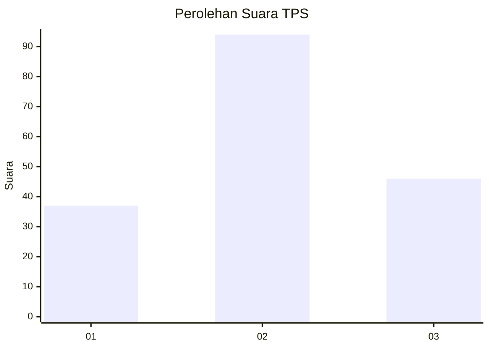
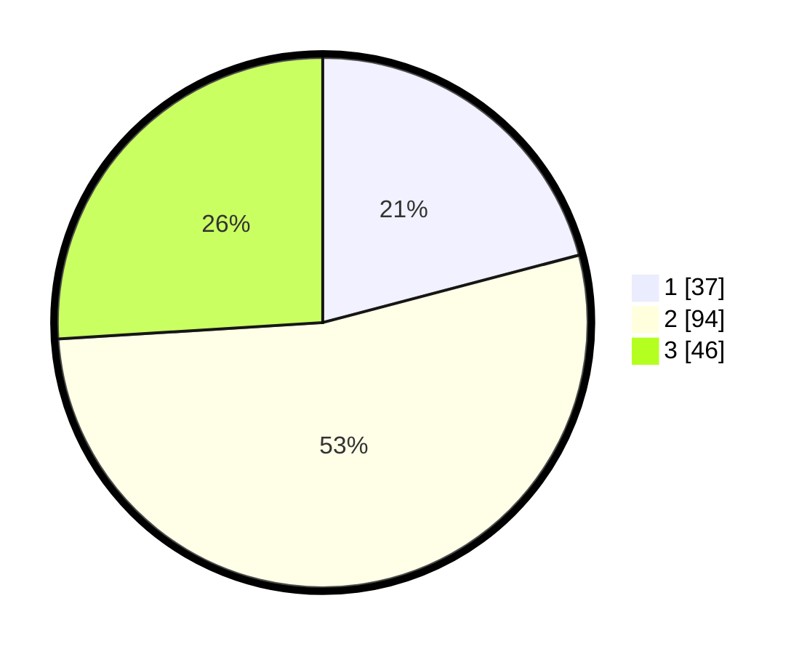

# Hasil

## Grafik

## Tabel

| No. | Nama Paslon    | Suara | Suara (raw) | Persentase |
|:--- |:-------------- | -----:| -----------:| ----------:|
| 1   | ANIES MUHAIMIN | 37    | [37][p-1]   | 20,90      |
| 2   | PRABOWO GIBRAN | 94    | [94][p-2]   | 53,11      |
| 3   | GANJAR MAHFUD  | 46    | [46][p-3]   | 25,99      |

[p-1]: https://github.com/gigit-pemilu/pemilu-2024-34-di-yogyakarta/blob/main/pilpres/hitung-suara/sub/34-di-yogyakarta/sub/04-sleman/sub/16-pakem/sub/2004-pakembinangun/sub/006-tps/sub/paslon-1.txt
[p-2]: https://github.com/gigit-pemilu/pemilu-2024-34-di-yogyakarta/blob/main/pilpres/hitung-suara/sub/34-di-yogyakarta/sub/04-sleman/sub/16-pakem/sub/2004-pakembinangun/sub/006-tps/sub/paslon-2.txt
[p-3]: https://github.com/gigit-pemilu/pemilu-2024-34-di-yogyakarta/blob/main/pilpres/hitung-suara/sub/34-di-yogyakarta/sub/04-sleman/sub/16-pakem/sub/2004-pakembinangun/sub/006-tps/sub/paslon-3.txt

## Foto C Plano

https://sirekap-obj-formc.kpu.go.id/6611/pemilu/ppwp/34/04/16/20/04/3404162004006-20240217-094527--ca3b1762-2a13-4687-b050-8dacc4226500.jpg

https://sirekap-obj-formc.kpu.go.id/6611/pemilu/ppwp/34/04/16/20/04/3404162004006-20240217-094635--5d5427f9-ca87-4ca5-8d80-cbac5509f1bf.jpg

https://sirekap-obj-formc.kpu.go.id/6611/pemilu/ppwp/34/04/16/20/04/3404162004006-20240217-094742--e399ef62-c675-48e1-b92a-fb3be9d5548a.jpg

## Metadata

| Key        | Value               |
| ---------- | ------------------- |
| Time Stamp | 2024-02-24 22:31:28 |

