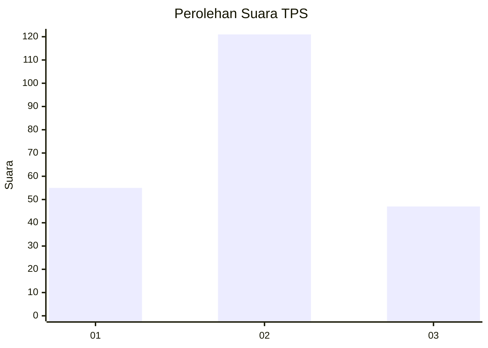
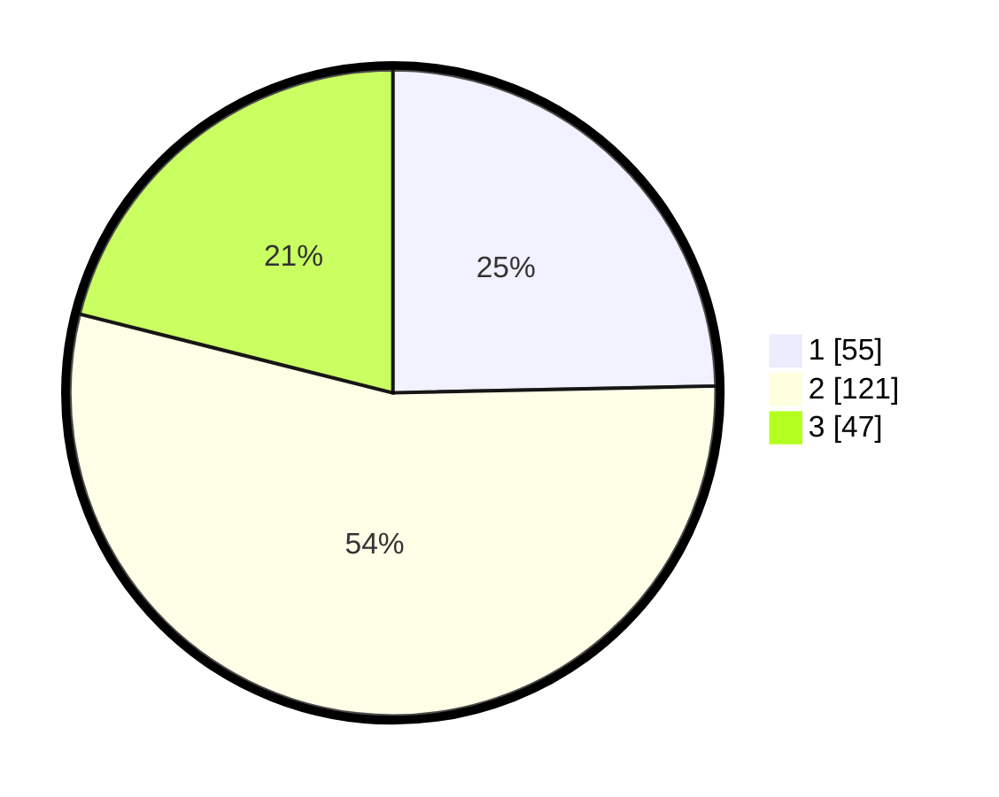

# Hasil

## Grafik

## Tabel

| No. | Nama Paslon    | Suara | Suara (raw) | Persentase |
|:--- |:-------------- | -----:| -----------:| ----------:|
| 1   | ANIES MUHAIMIN | 55    | [55][p-1]   | 24,66      |
| 2   | PRABOWO GIBRAN | 121   | [121][p-2]  | 54,26      |
| 3   | GANJAR MAHFUD  | 47    | [47][p-3]   | 21,08      |

[p-1]: https://github.com/gigit-pemilu/pemilu-2024-34-di-yogyakarta/blob/main/pilpres/hitung-suara/sub/34-di-yogyakarta/sub/04-sleman/sub/16-pakem/sub/2004-pakembinangun/sub/012-tps/sub/paslon-1.txt
[p-2]: https://github.com/gigit-pemilu/pemilu-2024-34-di-yogyakarta/blob/main/pilpres/hitung-suara/sub/34-di-yogyakarta/sub/04-sleman/sub/16-pakem/sub/2004-pakembinangun/sub/012-tps/sub/paslon-2.txt
[p-3]: https://github.com/gigit-pemilu/pemilu-2024-34-di-yogyakarta/blob/main/pilpres/hitung-suara/sub/34-di-yogyakarta/sub/04-sleman/sub/16-pakem/sub/2004-pakembinangun/sub/012-tps/sub/paslon-3.txt

## Foto C Plano

https://sirekap-obj-formc.kpu.go.id/fcb2/pemilu/ppwp/34/04/16/20/04/3404162004012-20240214-220624--06109d0e-4fd3-4cc0-8cc2-3a46ff0d08e4.jpg

https://sirekap-obj-formc.kpu.go.id/fcb2/pemilu/ppwp/34/04/16/20/04/3404162004012-20240214-220646--acce9889-3d3c-4025-a223-a61a23d4ffd8.jpg

https://sirekap-obj-formc.kpu.go.id/fcb2/pemilu/ppwp/34/04/16/20/04/3404162004012-20240214-220755--5b4c56f2-6d7f-4ba7-80e3-d7a31a83c95f.jpg

## Metadata

| Key        | Value               |
| ---------- | ------------------- |
| Time Stamp | 2024-02-15 20:30:46 |

