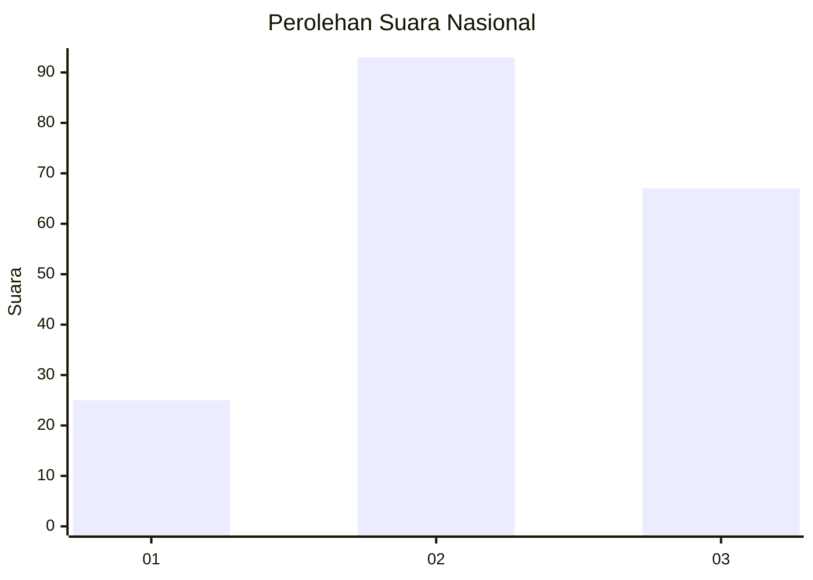
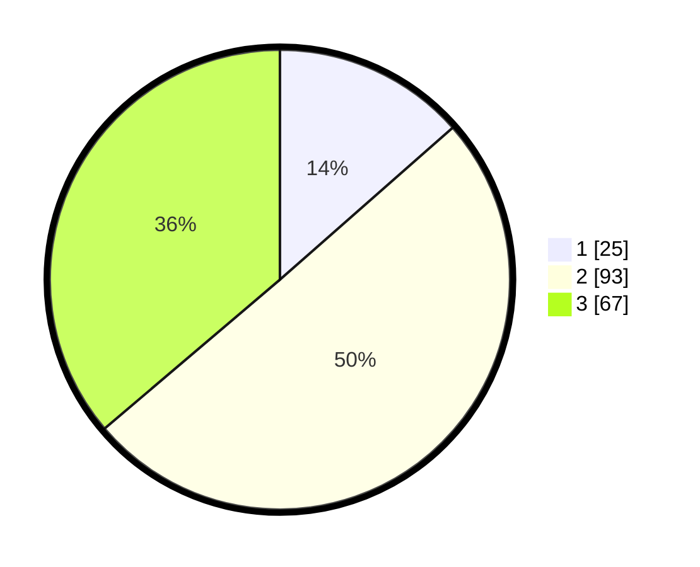

# Hasil

## Grafik

## Tabel

| No. | Nama Paslon    | Suara | Suara (raw) | Persentase |
|:--- |:-------------- | -----:| -----------:| ----------:|
| 1   | ANIES MUHAIMIN | 25    | [25][p-1]   | 13,51      |
| 2   | PRABOWO GIBRAN | 93    | [93][p-2]   | 50,27      |
| 3   | GANJAR MAHFUD  | 67    | [67][p-3]   | 36,22      |

[p-1]: https://github.com/gigit-pemilu/pemilu-2024/blob/main/pilpres/hitung-suara/sub/34-di-yogyakarta/sub/04-sleman/sub/16-pakem/sub/2004-pakembinangun/sub/013-tps/sub/paslon-1.txt
[p-2]: https://github.com/gigit-pemilu/pemilu-2024/blob/main/pilpres/hitung-suara/sub/34-di-yogyakarta/sub/04-sleman/sub/16-pakem/sub/2004-pakembinangun/sub/013-tps/sub/paslon-2.txt
[p-3]: https://github.com/gigit-pemilu/pemilu-2024/blob/main/pilpres/hitung-suara/sub/34-di-yogyakarta/sub/04-sleman/sub/16-pakem/sub/2004-pakembinangun/sub/013-tps/sub/paslon-3.txt

## Foto C Plano

https://sirekap-obj-formc.kpu.go.id/3fdf/pemilu/ppwp/34/04/16/20/04/3404162004013-20240214-235153--ce764c12-630b-4c37-aa8f-a662be31fcc7.jpg

https://sirekap-obj-formc.kpu.go.id/3fdf/pemilu/ppwp/34/04/16/20/04/3404162004013-20240214-235515--0c1d8e3b-97dd-4f07-ac94-640378a94ef2.jpg

https://sirekap-obj-formc.kpu.go.id/3fdf/pemilu/ppwp/34/04/16/20/04/3404162004013-20240215-001242--0e6f76db-6d9f-43c1-b842-bd1dc4ce0ac1.jpg

## Metadata

| Key        | Value               |
| ---------- | ------------------- |
| Time Stamp | 2024-02-15 17:30:25 |

## DATA PEMILIH TETAP

Jumlah pemilih dalam DPT: **199**.
 * L: **92**.
 * P: **107**.

## DATA PENGGUNA HAK PILIH

Jumlah pengguna hak pilih dalam DPT: **174**.
 * L: **77**.
 * P: **97**.

Jumlah pengguna hak pilih dalam DPTb: **14**.
 * L: **14**.
 * P: **0**.

Jumlah pengguna hak pilih dalam DPK: **2**.
 * L: **1**.
 * P: **1**.

Jumlah pengguna hak pilih: **190**.
 * L: **92**.
 * P: **98**.

## JUMLAH SUARA SAH DAN TIDAK SAH

JUMLAH SELURUH SUARA SAH: **185**.

JUMLAH SUARA TIDAK SAH: **5**.

JUMLAH SELURUH SUARA SAH DAN SUARA TIDAK SAH: **190**.

