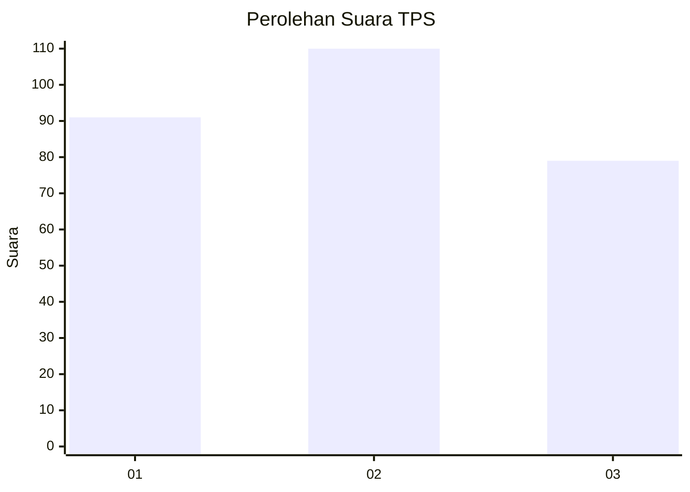
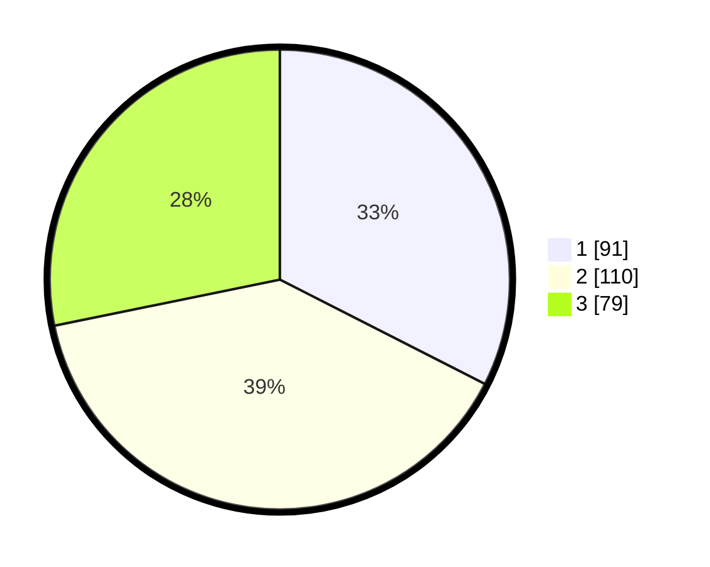

# Hasil

## Grafik

## Tabel

| No. | Nama Paslon    | Suara | Suara (raw) | Persentase |
|:--- |:-------------- | -----:| -----------:| ----------:|
| 1   | ANIES MUHAIMIN | 91    | [91][p-1]   | 32,50      |
| 2   | PRABOWO GIBRAN | 110   | [110][p-2]  | 39,29      |
| 3   | GANJAR MAHFUD  | 79    | [79][p-3]   | 28,21      |

[p-1]: https://github.com/gigit-pemilu/pemilu-2024-34-di-yogyakarta/blob/main/pilpres/hitung-suara/sub/34-di-yogyakarta/sub/04-sleman/sub/16-pakem/sub/2004-pakembinangun/sub/014-tps/sub/paslon-1.txt
[p-2]: https://github.com/gigit-pemilu/pemilu-2024-34-di-yogyakarta/blob/main/pilpres/hitung-suara/sub/34-di-yogyakarta/sub/04-sleman/sub/16-pakem/sub/2004-pakembinangun/sub/014-tps/sub/paslon-2.txt
[p-3]: https://github.com/gigit-pemilu/pemilu-2024-34-di-yogyakarta/blob/main/pilpres/hitung-suara/sub/34-di-yogyakarta/sub/04-sleman/sub/16-pakem/sub/2004-pakembinangun/sub/014-tps/sub/paslon-3.txt

## Foto C Plano

https://sirekap-obj-formc.kpu.go.id/6541/pemilu/ppwp/34/04/16/20/04/3404162004014-20240214-192111--e7e5fd80-8b11-4e97-8bc1-139dc6724fee.jpg

https://sirekap-obj-formc.kpu.go.id/6541/pemilu/ppwp/34/04/16/20/04/3404162004014-20240214-192735--5d53b43e-de41-4e91-8214-f79d7aae088f.jpg

https://sirekap-obj-formc.kpu.go.id/6541/pemilu/ppwp/34/04/16/20/04/3404162004014-20240214-192811--340350f3-81cd-48c1-b6b0-a6e423f18880.jpg

## Metadata

| Key        | Value               |
| ---------- | ------------------- |
| Time Stamp | 2024-02-14 21:46:01 |

## DATA PEMILIH TETAP

Jumlah pemilih dalam DPT: **294**.
 * L: **141**.
 * P: **153**.

## DATA PENGGUNA HAK PILIH

Jumlah pengguna hak pilih dalam DPT: **268**.
 * L: **130**.
 * P: **138**.

Jumlah pengguna hak pilih dalam DPTb: **17**.
 * L: **11**.
 * P: **6**.

Jumlah pengguna hak pilih dalam DPK: **1**.
 * L: **1**.
 * P: **0**.

Jumlah pengguna hak pilih: **286**.
 * L: **142**.
 * P: **144**.

## JUMLAH SUARA SAH DAN TIDAK SAH

JUMLAH SELURUH SUARA SAH: **280**.

JUMLAH SUARA TIDAK SAH: **6**.

JUMLAH SELURUH SUARA SAH DAN SUARA TIDAK SAH: **286**.

