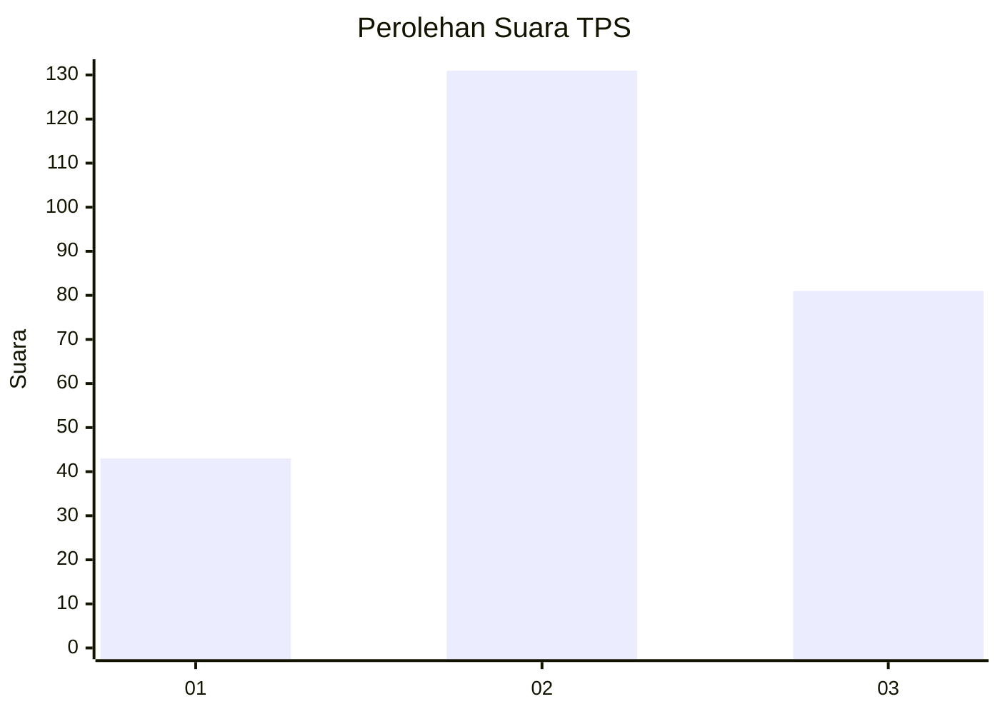
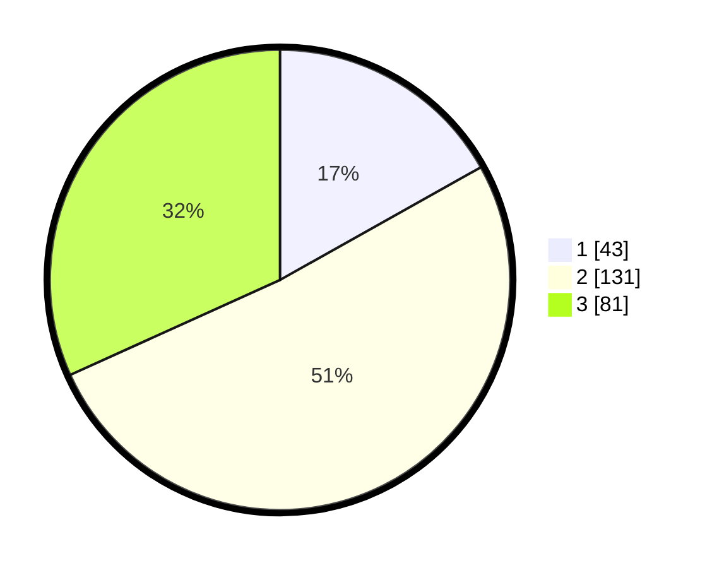

# Hasil

## Grafik

## Tabel

| No. | Nama Paslon    | Suara | Suara (raw) | Persentase |
|:--- |:-------------- | -----:| -----------:| ----------:|
| 1   | ANIES MUHAIMIN | 43    | [43][p-1]   | 16,86      |
| 2   | PRABOWO GIBRAN | 131   | [131][p-2]  | 51,37      |
| 3   | GANJAR MAHFUD  | 81    | [81][p-3]   | 31,76      |

[p-1]: https://github.com/gigit-pemilu/pemilu-2024-34-di-yogyakarta/blob/main/pilpres/hitung-suara/sub/34-di-yogyakarta/sub/04-sleman/sub/16-pakem/sub/2004-pakembinangun/sub/016-tps/sub/paslon-1.txt
[p-2]: https://github.com/gigit-pemilu/pemilu-2024-34-di-yogyakarta/blob/main/pilpres/hitung-suara/sub/34-di-yogyakarta/sub/04-sleman/sub/16-pakem/sub/2004-pakembinangun/sub/016-tps/sub/paslon-2.txt
[p-3]: https://github.com/gigit-pemilu/pemilu-2024-34-di-yogyakarta/blob/main/pilpres/hitung-suara/sub/34-di-yogyakarta/sub/04-sleman/sub/16-pakem/sub/2004-pakembinangun/sub/016-tps/sub/paslon-3.txt

## Foto C Plano

https://sirekap-obj-formc.kpu.go.id/894c/pemilu/ppwp/34/04/16/20/04/3404162004016-20240214-231447--d05dd197-cdd4-4ba3-8b25-071d80e9e906.jpg

https://sirekap-obj-formc.kpu.go.id/894c/pemilu/ppwp/34/04/16/20/04/3404162004016-20240214-231548--9b169656-a51c-45b0-9473-36eadbc52e8c.jpg

https://sirekap-obj-formc.kpu.go.id/894c/pemilu/ppwp/34/04/16/20/04/3404162004016-20240214-231606--5342acae-d92b-4f6d-aabb-4397de635ba4.jpg

## Metadata

| Key        | Value               |
| ---------- | ------------------- |
| Time Stamp | 2024-02-15 20:30:46 |

