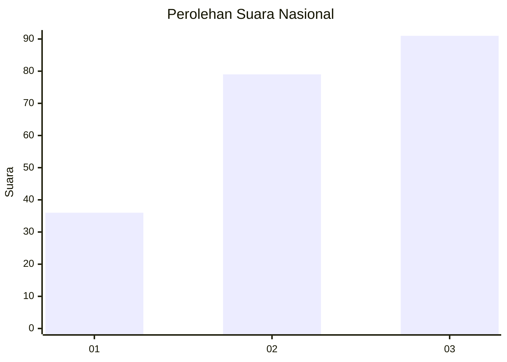
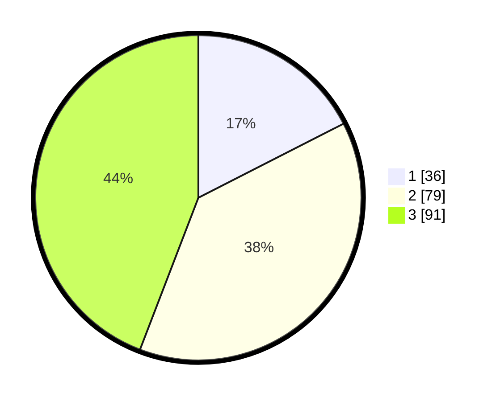

# Hasil

## Grafik

## Tabel

| No. | Nama Paslon    | Suara | Suara (raw) | Persentase |
|:--- |:-------------- | -----:| -----------:| ----------:|
| 1   | ANIES MUHAIMIN | 36    | [36][p-1]   | 17,48      |
| 2   | PRABOWO GIBRAN | 79    | [79][p-2]   | 38,35      |
| 3   | GANJAR MAHFUD  | 91    | [91][p-3]   | 44,17      |

[p-1]: https://github.com/gigit-pemilu/pemilu-2024/blob/main/pilpres/hitung-suara/sub/34-di-yogyakarta/sub/04-sleman/sub/16-pakem/sub/2004-pakembinangun/sub/017-tps/sub/paslon-1.txt
[p-2]: https://github.com/gigit-pemilu/pemilu-2024/blob/main/pilpres/hitung-suara/sub/34-di-yogyakarta/sub/04-sleman/sub/16-pakem/sub/2004-pakembinangun/sub/017-tps/sub/paslon-2.txt
[p-3]: https://github.com/gigit-pemilu/pemilu-2024/blob/main/pilpres/hitung-suara/sub/34-di-yogyakarta/sub/04-sleman/sub/16-pakem/sub/2004-pakembinangun/sub/017-tps/sub/paslon-3.txt

## Foto C Plano

https://sirekap-obj-formc.kpu.go.id/6b28/pemilu/ppwp/34/04/16/20/04/3404162004017-20240215-003438--78901898-a4e5-4dd6-9c01-9a16d82a2d47.jpg

https://sirekap-obj-formc.kpu.go.id/6b28/pemilu/ppwp/34/04/16/20/04/3404162004017-20240215-003511--5b1c9788-31e9-40f7-a845-a59d6f037c91.jpg

https://sirekap-obj-formc.kpu.go.id/6b28/pemilu/ppwp/34/04/16/20/04/3404162004017-20240215-003550--d95bf068-3f37-4ec9-8618-c97feb143232.jpg

## Metadata

| Key        | Value               |
| ---------- | ------------------- |
| Time Stamp | 2024-02-15 20:30:46 |

