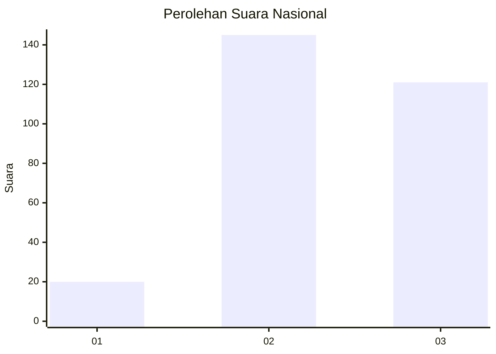
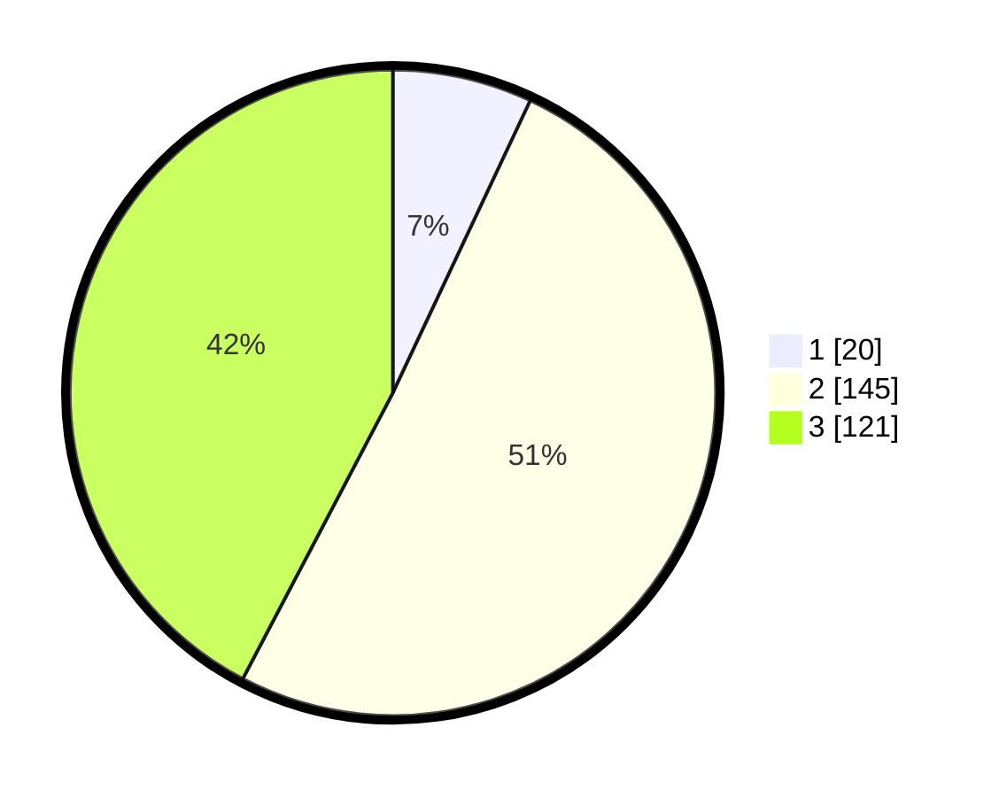

# Hasil

## Grafik

## Tabel

| No. | Nama Paslon    | Suara | Suara (raw) | Persentase |
|:--- |:-------------- | -----:| -----------:| ----------:|
| 1   | ANIES MUHAIMIN | 20    | [20][p-1]   | 6,99       |
| 2   | PRABOWO GIBRAN | 145   | [145][p-2]  | 50,70      |
| 3   | GANJAR MAHFUD  | 121   | [121][p-3]  | 42,31      |

[p-1]: https://github.com/gigit-pemilu/pemilu-2024/blob/main/pilpres/hitung-suara/sub/34-di-yogyakarta/sub/04-sleman/sub/16-pakem/sub/2004-pakembinangun/sub/901-tps/sub/paslon-1.txt
[p-2]: https://github.com/gigit-pemilu/pemilu-2024/blob/main/pilpres/hitung-suara/sub/34-di-yogyakarta/sub/04-sleman/sub/16-pakem/sub/2004-pakembinangun/sub/901-tps/sub/paslon-2.txt
[p-3]: https://github.com/gigit-pemilu/pemilu-2024/blob/main/pilpres/hitung-suara/sub/34-di-yogyakarta/sub/04-sleman/sub/16-pakem/sub/2004-pakembinangun/sub/901-tps/sub/paslon-3.txt

## Foto C Plano

https://sirekap-obj-formc.kpu.go.id/0537/pemilu/ppwp/34/04/16/20/04/3404162004901-20240214-231418--565effef-6cc2-4e67-a58a-a63b52c66c94.jpg

https://sirekap-obj-formc.kpu.go.id/0537/pemilu/ppwp/34/04/16/20/04/3404162004901-20240214-231644--9e87c40c-a447-4454-9766-f9fbf67bb617.jpg

https://sirekap-obj-formc.kpu.go.id/0537/pemilu/ppwp/34/04/16/20/04/3404162004901-20240214-231837--701e178f-dfa2-4afe-8cd0-a6139d4fb213.jpg

## Metadata

| Key        | Value               |
| ---------- | ------------------- |
| Time Stamp | 2024-02-15 20:30:46 |

