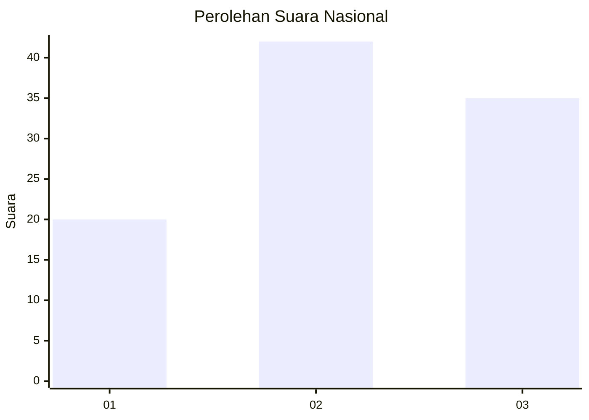
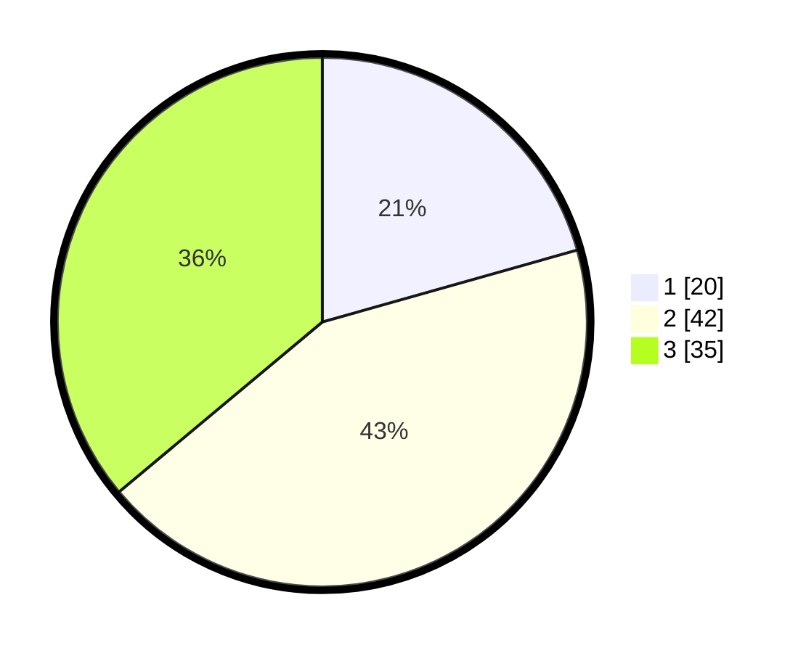

# Hasil

## Grafik

## Tabel

| No. | Nama Paslon    | Suara | Suara (raw) | Persentase |
|:--- |:-------------- | -----:| -----------:| ----------:|
| 1   | ANIES MUHAIMIN | 20    | [20][p-1]   | 20,62      |
| 2   | PRABOWO GIBRAN | 42    | [42][p-2]   | 43,30      |
| 3   | GANJAR MAHFUD  | 35    | [35][p-3]   | 36,08      |

[p-1]: https://github.com/gigit-pemilu/pemilu-2024/blob/main/pilpres/hitung-suara/sub/34-di-yogyakarta/sub/04-sleman/sub/16-pakem/sub/2004-pakembinangun/sub/903-tps/sub/paslon-1.txt
[p-2]: https://github.com/gigit-pemilu/pemilu-2024/blob/main/pilpres/hitung-suara/sub/34-di-yogyakarta/sub/04-sleman/sub/16-pakem/sub/2004-pakembinangun/sub/903-tps/sub/paslon-2.txt
[p-3]: https://github.com/gigit-pemilu/pemilu-2024/blob/main/pilpres/hitung-suara/sub/34-di-yogyakarta/sub/04-sleman/sub/16-pakem/sub/2004-pakembinangun/sub/903-tps/sub/paslon-3.txt

## Foto C Plano

https://sirekap-obj-formc.kpu.go.id/6851/pemilu/ppwp/34/04/16/20/04/3404162004903-20240214-222531--ca238b0a-9e86-4046-b479-cf02e066bb16.jpg

https://sirekap-obj-formc.kpu.go.id/6851/pemilu/ppwp/34/04/16/20/04/3404162004903-20240214-222541--d4d2e3ce-c184-4106-a2db-5302e493c815.jpg

https://sirekap-obj-formc.kpu.go.id/6851/pemilu/ppwp/34/04/16/20/04/3404162004903-20240214-222549--1c57b378-ac69-47f6-98d0-8addf915ee46.jpg

## Metadata

| Key        | Value               |
| ---------- | ------------------- |
| Time Stamp | 2024-02-15 21:01:18 |

