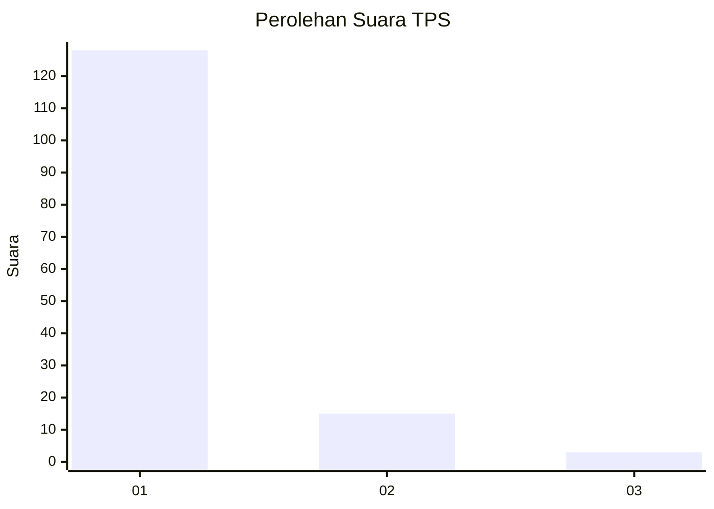
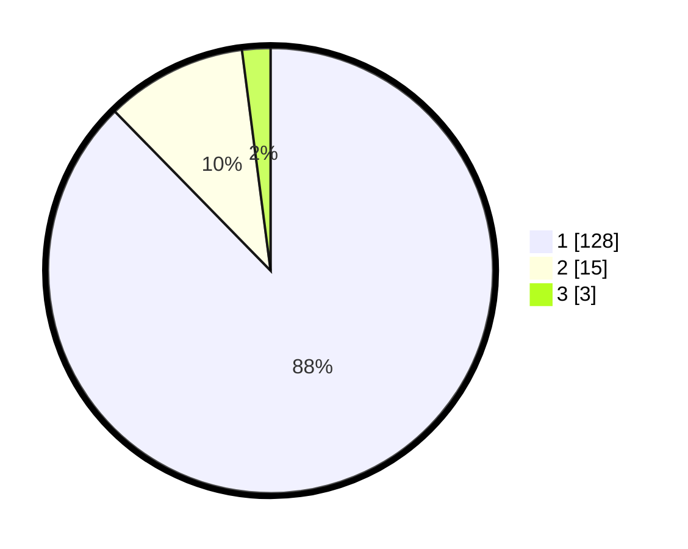

# Hasil

## Grafik

## Tabel

| No. | Nama Paslon    | Suara | Suara (raw) | Persentase |
|:--- |:-------------- | -----:| -----------:| ----------:|
| 1   | ANIES MUHAIMIN | 128   | [128][p-1]  | 87,67      |
| 2   | PRABOWO GIBRAN | 15    | [15][p-2]   | 10,27      |
| 3   | GANJAR MAHFUD  | 3     | [3][p-3]    | 2,05       |

[p-1]: https://github.com/gigit-pemilu/pemilu-2024-34-di-yogyakarta/blob/main/pilpres/hitung-suara/sub/34-di-yogyakarta/sub/04-sleman/sub/16-pakem/sub/2004-pakembinangun/sub/904-tps/sub/paslon-1.txt
[p-2]: https://github.com/gigit-pemilu/pemilu-2024-34-di-yogyakarta/blob/main/pilpres/hitung-suara/sub/34-di-yogyakarta/sub/04-sleman/sub/16-pakem/sub/2004-pakembinangun/sub/904-tps/sub/paslon-2.txt
[p-3]: https://github.com/gigit-pemilu/pemilu-2024-34-di-yogyakarta/blob/main/pilpres/hitung-suara/sub/34-di-yogyakarta/sub/04-sleman/sub/16-pakem/sub/2004-pakembinangun/sub/904-tps/sub/paslon-3.txt

## Foto C Plano

https://sirekap-obj-formc.kpu.go.id/2055/pemilu/ppwp/34/04/16/20/04/3404162004904-20240214-201737--7086cc91-f73b-406b-84b7-4d326ee9e668.jpg

https://sirekap-obj-formc.kpu.go.id/2055/pemilu/ppwp/34/04/16/20/04/3404162004904-20240214-202001--39619387-2ba5-4cb2-be9c-6e9c78d652ea.jpg

https://sirekap-obj-formc.kpu.go.id/2055/pemilu/ppwp/34/04/16/20/04/3404162004904-20240214-202109--a6ddca39-f9c3-4f09-a7b7-c4e9da312e8a.jpg

## Metadata

| Key        | Value               |
| ---------- | ------------------- |
| Time Stamp | 2024-02-15 00:41:44 |

