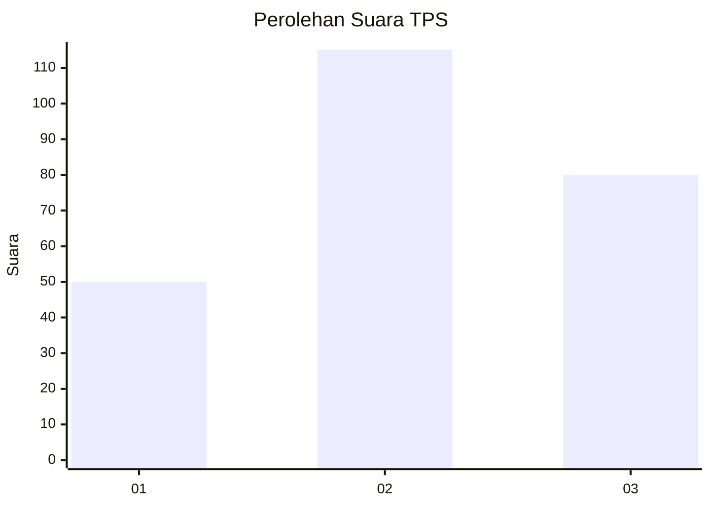
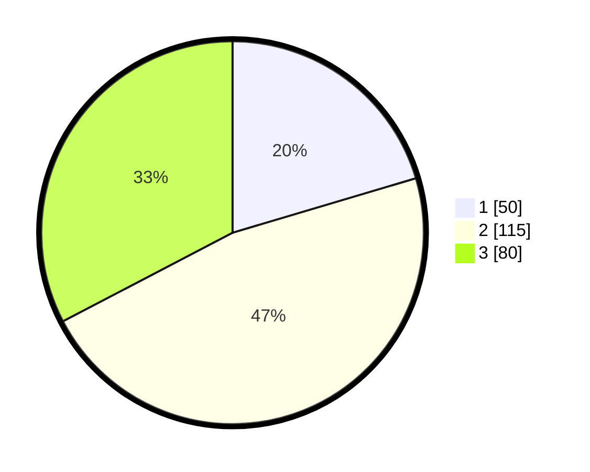

# Hasil

## Grafik

## Tabel

| No. | Nama Paslon    | Suara | Suara (raw) | Persentase |
|:--- |:-------------- | -----:| -----------:| ----------:|
| 1   | ANIES MUHAIMIN | 50    | [50][p-1]   | 20,41      |
| 2   | PRABOWO GIBRAN | 115   | [115][p-2]  | 46,94      |
| 3   | GANJAR MAHFUD  | 80    | [80][p-3]   | 32,65      |

[p-1]: https://github.com/gigit-pemilu/pemilu-2024-34-di-yogyakarta/blob/main/pilpres/hitung-suara/sub/34-di-yogyakarta/sub/04-sleman/sub/16-pakem/sub/2005-hargobinangun/sub/001-tps/sub/paslon-1.txt
[p-2]: https://github.com/gigit-pemilu/pemilu-2024-34-di-yogyakarta/blob/main/pilpres/hitung-suara/sub/34-di-yogyakarta/sub/04-sleman/sub/16-pakem/sub/2005-hargobinangun/sub/001-tps/sub/paslon-2.txt
[p-3]: https://github.com/gigit-pemilu/pemilu-2024-34-di-yogyakarta/blob/main/pilpres/hitung-suara/sub/34-di-yogyakarta/sub/04-sleman/sub/16-pakem/sub/2005-hargobinangun/sub/001-tps/sub/paslon-3.txt

## Foto C Plano

https://sirekap-obj-formc.kpu.go.id/5f8e/pemilu/ppwp/34/04/16/20/05/3404162005001-20240214-231525--75461f29-b9d4-485f-adbd-e8d6fc30261b.jpg

https://sirekap-obj-formc.kpu.go.id/5f8e/pemilu/ppwp/34/04/16/20/05/3404162005001-20240214-231758--d61e4763-2cf1-4e6f-be0f-a0524f57f2b4.jpg

https://sirekap-obj-formc.kpu.go.id/5f8e/pemilu/ppwp/34/04/16/20/05/3404162005001-20240215-000444--5cc04b32-6f22-43ae-92f2-5f20738103a5.jpg

## Metadata

| Key        | Value               |
| ---------- | ------------------- |
| Time Stamp | 2024-02-15 21:01:18 |

