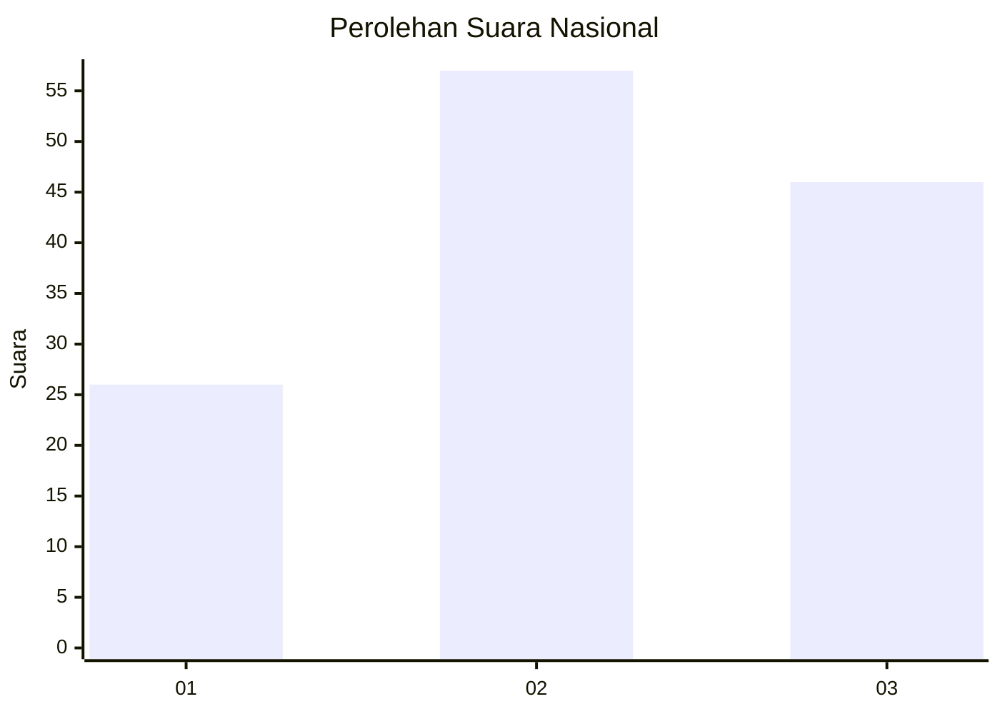
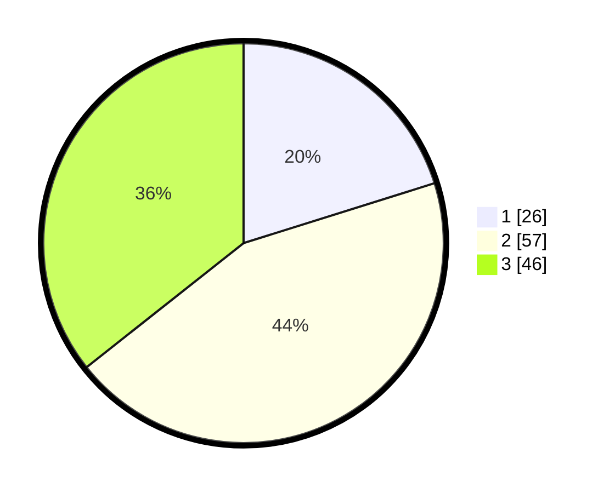

# Hasil

## Grafik

## Tabel

| No. | Nama Paslon    | Suara | Suara (raw) | Persentase |
|:--- |:-------------- | -----:| -----------:| ----------:|
| 1   | ANIES MUHAIMIN | 26    | [26][p-1]   | 20,16      |
| 2   | PRABOWO GIBRAN | 57    | [57][p-2]   | 44,19      |
| 3   | GANJAR MAHFUD  | 46    | [46][p-3]   | 35,66      |

[p-1]: https://github.com/gigit-pemilu/pemilu-2024/blob/main/pilpres/hitung-suara/sub/34-di-yogyakarta/sub/04-sleman/sub/16-pakem/sub/2005-hargobinangun/sub/004-tps/sub/paslon-1.txt
[p-2]: https://github.com/gigit-pemilu/pemilu-2024/blob/main/pilpres/hitung-suara/sub/34-di-yogyakarta/sub/04-sleman/sub/16-pakem/sub/2005-hargobinangun/sub/004-tps/sub/paslon-2.txt
[p-3]: https://github.com/gigit-pemilu/pemilu-2024/blob/main/pilpres/hitung-suara/sub/34-di-yogyakarta/sub/04-sleman/sub/16-pakem/sub/2005-hargobinangun/sub/004-tps/sub/paslon-3.txt

## Foto C Plano

https://sirekap-obj-formc.kpu.go.id/f50d/pemilu/ppwp/34/04/16/20/05/3404162005004-20240214-141027--d95c65e1-c47f-415f-8872-3219b97cb0a6.jpg

https://sirekap-obj-formc.kpu.go.id/f50d/pemilu/ppwp/34/04/16/20/05/3404162005004-20240214-141806--184fb71c-5378-456a-8045-bb50c05779ae.jpg

https://sirekap-obj-formc.kpu.go.id/f50d/pemilu/ppwp/34/04/16/20/05/3404162005004-20240214-234414--d5eb75c4-c83c-458c-85bc-598837a50bde.jpg

## Metadata

| Key        | Value               |
| ---------- | ------------------- |
| Time Stamp | 2024-02-16 22:01:00 |

## DATA PEMILIH TETAP

Jumlah pemilih dalam DPT: **138**.
 * L: **69**.
 * P: **69**.

## DATA PENGGUNA HAK PILIH

Jumlah pengguna hak pilih dalam DPT: **125**.
 * L: **61**.
 * P: **64**.

Jumlah pengguna hak pilih dalam DPTb: **6**.
 * L: **4**.
 * P: **2**.

Jumlah pengguna hak pilih dalam DPK: **1**.
 * L: **1**.
 * P: **0**.

Jumlah pengguna hak pilih: **132**.
 * L: **66**.
 * P: **66**.

## JUMLAH SUARA SAH DAN TIDAK SAH

JUMLAH SELURUH SUARA SAH: **129**.

JUMLAH SUARA TIDAK SAH: **3**.

JUMLAH SELURUH SUARA SAH DAN SUARA TIDAK SAH: **132**.

