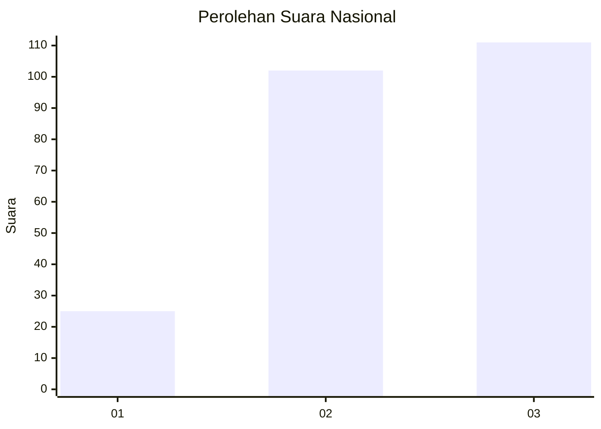
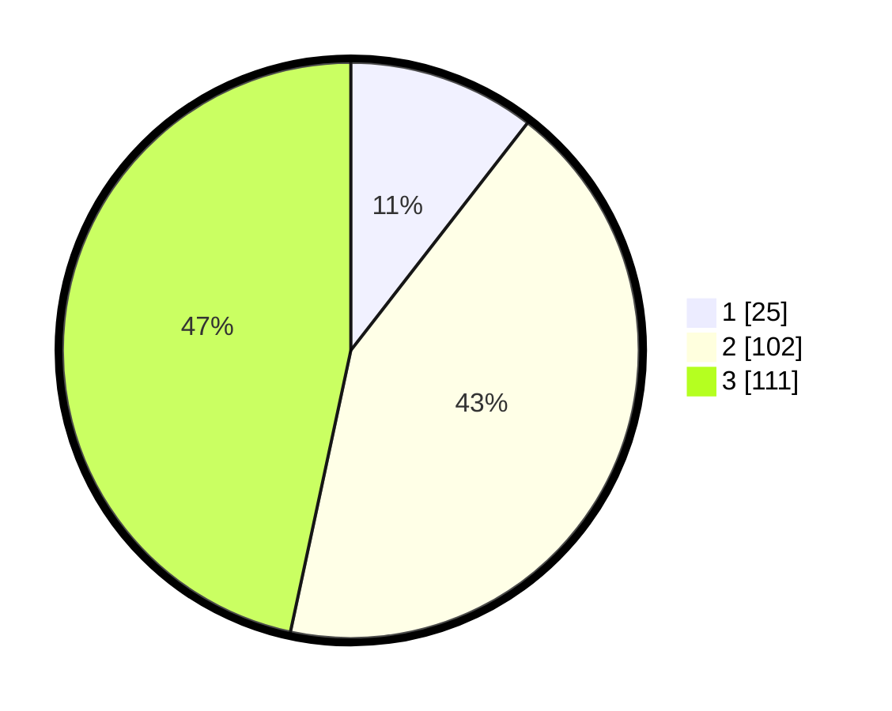

# Hasil

## Grafik

## Tabel

| No. | Nama Paslon    | Suara | Suara (raw) | Persentase |
|:--- |:-------------- | -----:| -----------:| ----------:|
| 1   | ANIES MUHAIMIN | 25    | [25][p-1]   | 10,50      |
| 2   | PRABOWO GIBRAN | 102   | [102][p-2]  | 42,86      |
| 3   | GANJAR MAHFUD  | 111   | [111][p-3]  | 46,64      |

[p-1]: https://github.com/gigit-pemilu/pemilu-2024/blob/main/pilpres/hitung-suara/sub/34-di-yogyakarta/sub/04-sleman/sub/16-pakem/sub/2005-hargobinangun/sub/006-tps/sub/paslon-1.txt
[p-2]: https://github.com/gigit-pemilu/pemilu-2024/blob/main/pilpres/hitung-suara/sub/34-di-yogyakarta/sub/04-sleman/sub/16-pakem/sub/2005-hargobinangun/sub/006-tps/sub/paslon-2.txt
[p-3]: https://github.com/gigit-pemilu/pemilu-2024/blob/main/pilpres/hitung-suara/sub/34-di-yogyakarta/sub/04-sleman/sub/16-pakem/sub/2005-hargobinangun/sub/006-tps/sub/paslon-3.txt

## Foto C Plano

https://sirekap-obj-formc.kpu.go.id/9f7d/pemilu/ppwp/34/04/16/20/05/3404162005006-20240215-004740--987198b8-ad22-4c86-9b08-e73fa92654c5.jpg

https://sirekap-obj-formc.kpu.go.id/9f7d/pemilu/ppwp/34/04/16/20/05/3404162005006-20240215-003815--328de772-862d-4891-b535-df41a557db66.jpg

https://sirekap-obj-formc.kpu.go.id/9f7d/pemilu/ppwp/34/04/16/20/05/3404162005006-20240215-004525--ed0c35e8-d854-426b-ad2a-13140c8c4ce7.jpg

## Metadata

| Key        | Value               |
| ---------- | ------------------- |
| Time Stamp | 2024-02-15 21:01:18 |

