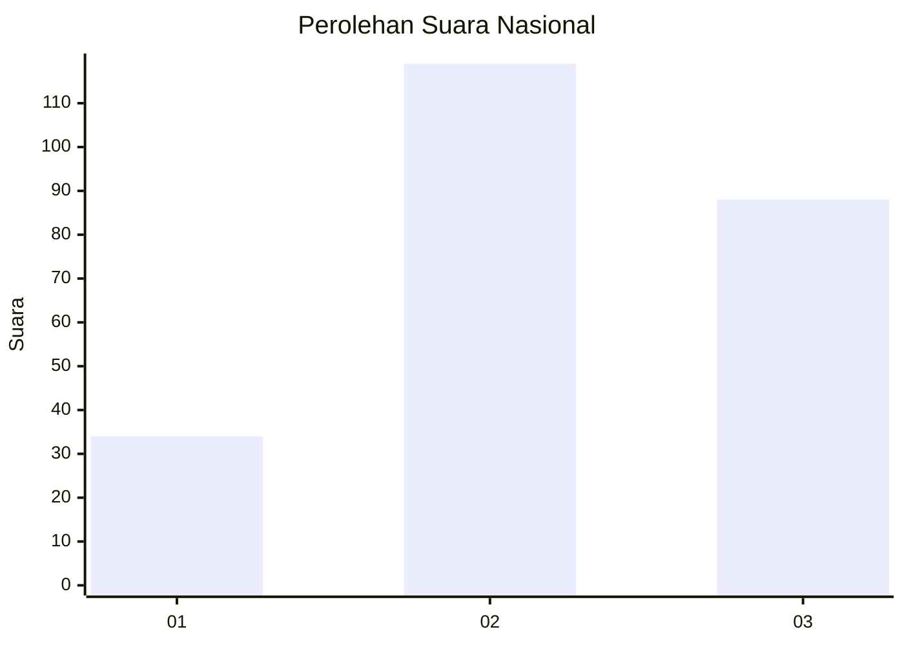
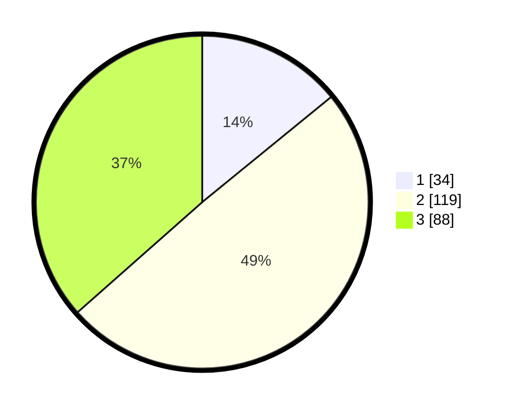

# Hasil

## Grafik

## Tabel

| No. | Nama Paslon    | Suara | Suara (raw) | Persentase |
|:--- |:-------------- | -----:| -----------:| ----------:|
| 1   | ANIES MUHAIMIN | 34    | [34][p-1]   | 14,11      |
| 2   | PRABOWO GIBRAN | 119   | [119][p-2]  | 49,38      |
| 3   | GANJAR MAHFUD  | 88    | [88][p-3]   | 36,51      |

[p-1]: https://github.com/gigit-pemilu/pemilu-2024/blob/main/pilpres/hitung-suara/sub/34-di-yogyakarta/sub/04-sleman/sub/16-pakem/sub/2005-hargobinangun/sub/011-tps/sub/paslon-1.txt
[p-2]: https://github.com/gigit-pemilu/pemilu-2024/blob/main/pilpres/hitung-suara/sub/34-di-yogyakarta/sub/04-sleman/sub/16-pakem/sub/2005-hargobinangun/sub/011-tps/sub/paslon-2.txt
[p-3]: https://github.com/gigit-pemilu/pemilu-2024/blob/main/pilpres/hitung-suara/sub/34-di-yogyakarta/sub/04-sleman/sub/16-pakem/sub/2005-hargobinangun/sub/011-tps/sub/paslon-3.txt

## Foto C Plano

https://sirekap-obj-formc.kpu.go.id/4771/pemilu/ppwp/34/04/16/20/05/3404162005011-20240215-131423--507ad7c7-e88b-4018-8ccd-5ffed1cb9279.jpg

https://sirekap-obj-formc.kpu.go.id/4771/pemilu/ppwp/34/04/16/20/05/3404162005011-20240215-131551--e49ca166-04b9-4042-8394-c349b72f99d4.jpg

https://sirekap-obj-formc.kpu.go.id/4771/pemilu/ppwp/34/04/16/20/05/3404162005011-20240215-131705--c284ae1b-33e5-44b7-843d-140abe11729a.jpg

## Metadata

| Key        | Value               |
| ---------- | ------------------- |
| Time Stamp | 2024-02-16 22:01:00 |

