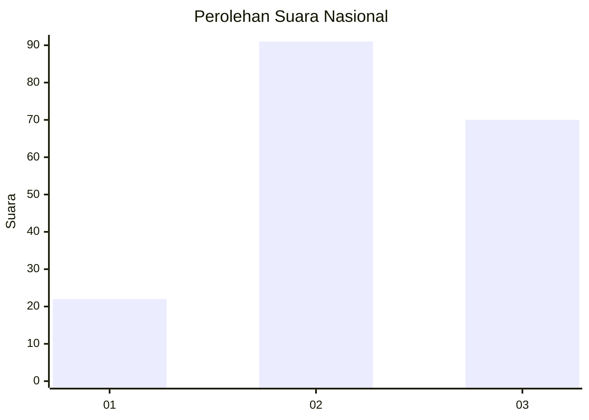
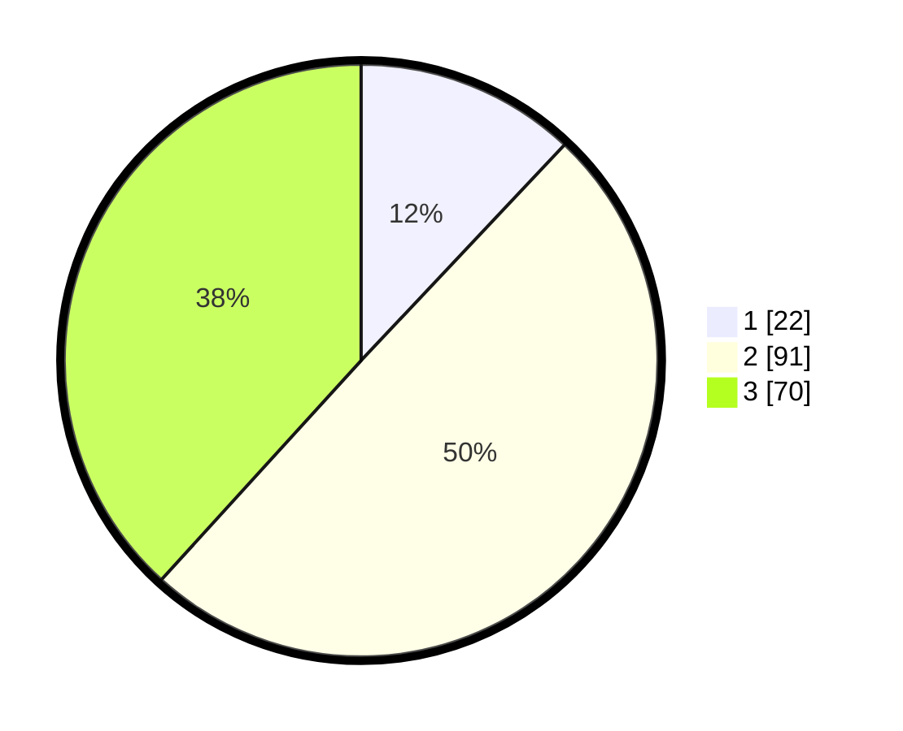

# Hasil

## Grafik

## Tabel

| No. | Nama Paslon    | Suara | Suara (raw) | Persentase |
|:--- |:-------------- | -----:| -----------:| ----------:|
| 1   | ANIES MUHAIMIN | 22    | [22][p-1]   | 12,02      |
| 2   | PRABOWO GIBRAN | 91    | [91][p-2]   | 49,73      |
| 3   | GANJAR MAHFUD  | 70    | [70][p-3]   | 38,25      |

[p-1]: https://github.com/gigit-pemilu/pemilu-2024/blob/main/pilpres/hitung-suara/sub/34-di-yogyakarta/sub/04-sleman/sub/16-pakem/sub/2005-hargobinangun/sub/015-tps/sub/paslon-1.txt
[p-2]: https://github.com/gigit-pemilu/pemilu-2024/blob/main/pilpres/hitung-suara/sub/34-di-yogyakarta/sub/04-sleman/sub/16-pakem/sub/2005-hargobinangun/sub/015-tps/sub/paslon-2.txt
[p-3]: https://github.com/gigit-pemilu/pemilu-2024/blob/main/pilpres/hitung-suara/sub/34-di-yogyakarta/sub/04-sleman/sub/16-pakem/sub/2005-hargobinangun/sub/015-tps/sub/paslon-3.txt

## Foto C Plano

https://sirekap-obj-formc.kpu.go.id/f8ad/pemilu/ppwp/34/04/16/20/05/3404162005015-20240214-201319--969002af-1b3e-42fa-ab40-2fc934430a59.jpg

https://sirekap-obj-formc.kpu.go.id/f8ad/pemilu/ppwp/34/04/16/20/05/3404162005015-20240214-201635--6f41b752-101c-4644-9ee9-9dd9d88dfaf2.jpg

https://sirekap-obj-formc.kpu.go.id/f8ad/pemilu/ppwp/34/04/16/20/05/3404162005015-20240214-233942--27eb47be-0b29-4de5-997a-5dac86ef17de.jpg

## Metadata

| Key        | Value               |
| ---------- | ------------------- |
| Time Stamp | 2024-02-15 12:00:28 |

