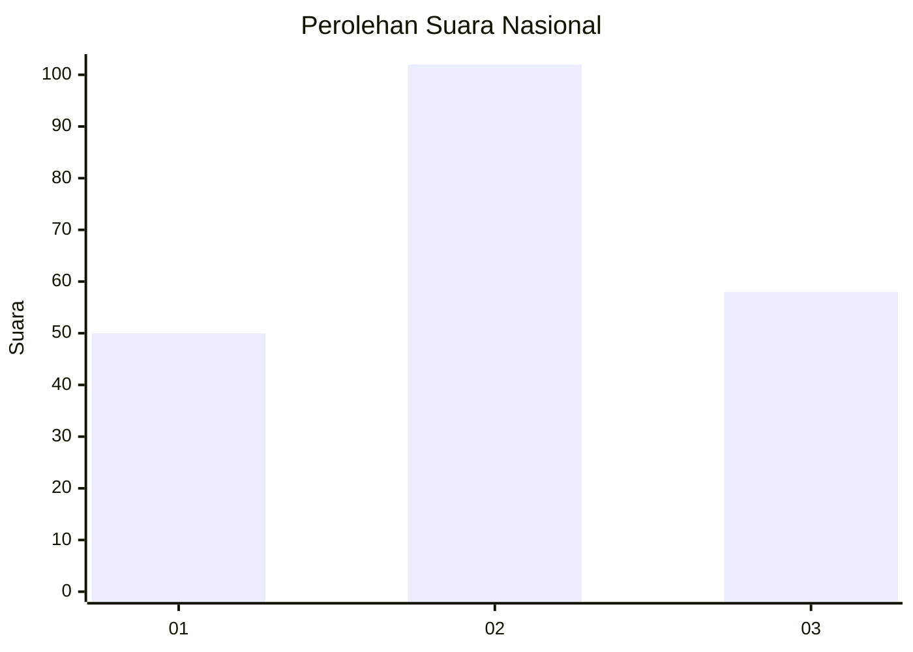
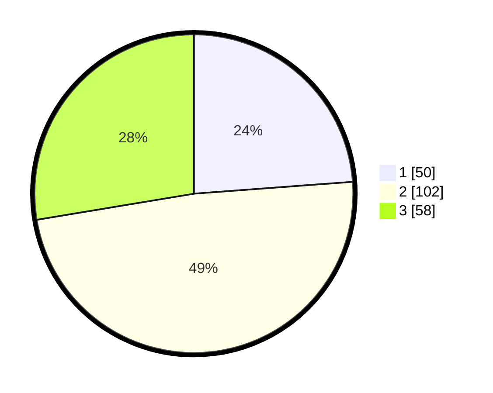

# Hasil

## Grafik

## Tabel

| No. | Nama Paslon    | Suara | Suara (raw) | Persentase |
|:--- |:-------------- | -----:| -----------:| ----------:|
| 1   | ANIES MUHAIMIN | 50    | [50][p-1]   | 23,81      |
| 2   | PRABOWO GIBRAN | 102   | [102][p-2]  | 48,57      |
| 3   | GANJAR MAHFUD  | 58    | [58][p-3]   | 27,62      |

[p-1]: https://github.com/gigit-pemilu/pemilu-2024/blob/main/pilpres/hitung-suara/sub/34-di-yogyakarta/sub/04-sleman/sub/16-pakem/sub/2005-hargobinangun/sub/016-tps/sub/paslon-1.txt
[p-2]: https://github.com/gigit-pemilu/pemilu-2024/blob/main/pilpres/hitung-suara/sub/34-di-yogyakarta/sub/04-sleman/sub/16-pakem/sub/2005-hargobinangun/sub/016-tps/sub/paslon-2.txt
[p-3]: https://github.com/gigit-pemilu/pemilu-2024/blob/main/pilpres/hitung-suara/sub/34-di-yogyakarta/sub/04-sleman/sub/16-pakem/sub/2005-hargobinangun/sub/016-tps/sub/paslon-3.txt

## Foto C Plano

https://sirekap-obj-formc.kpu.go.id/7b6e/pemilu/ppwp/34/04/16/20/05/3404162005016-20240214-212717--e9855af5-d7c4-4885-9f4a-91337958659a.jpg

https://sirekap-obj-formc.kpu.go.id/7b6e/pemilu/ppwp/34/04/16/20/05/3404162005016-20240214-213055--b0dd39f0-b3d5-4e49-9b58-4da1c263d6ae.jpg

https://sirekap-obj-formc.kpu.go.id/7b6e/pemilu/ppwp/34/04/16/20/05/3404162005016-20240214-213529--81ad84cf-7d9a-432a-93d1-d56fb1dec9af.jpg

## Metadata

| Key        | Value               |
| ---------- | ------------------- |
| Time Stamp | 2024-02-15 21:01:18 |

