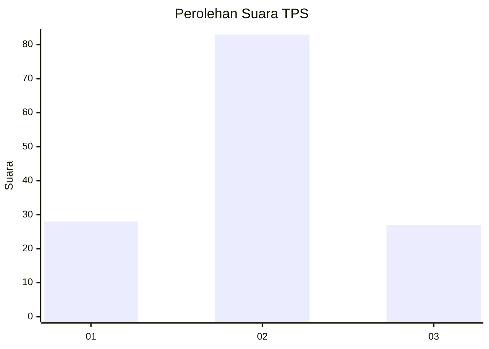
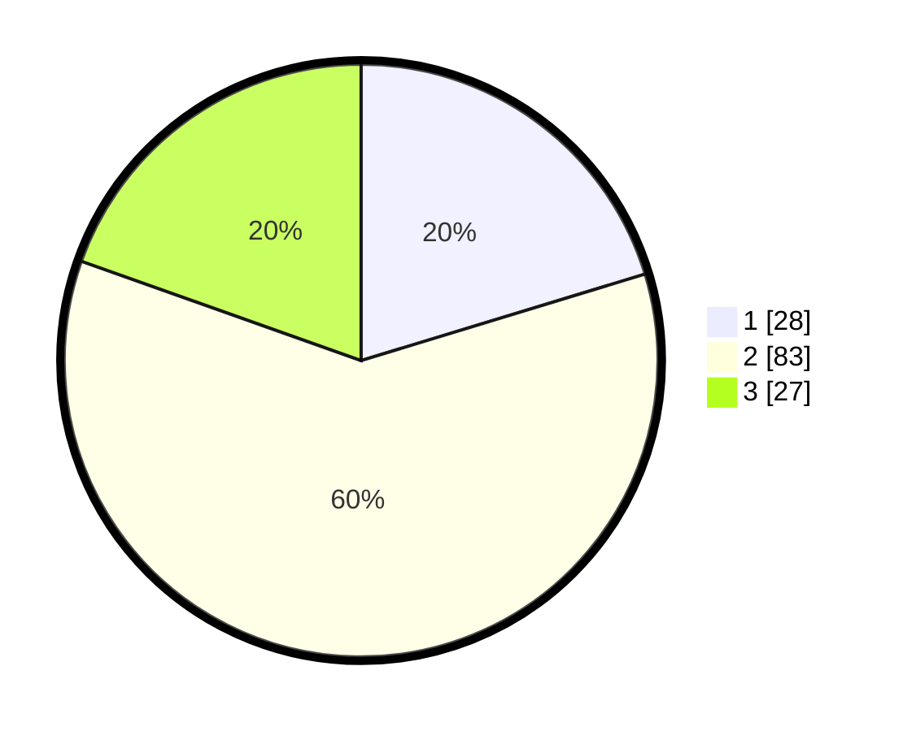

# Hasil

## Grafik

## Tabel

| No. | Nama Paslon    | Suara | Suara (raw) | Persentase |
|:--- |:-------------- | -----:| -----------:| ----------:|
| 1   | ANIES MUHAIMIN | 28    | [28][p-1]   | 20,29      |
| 2   | PRABOWO GIBRAN | 83    | [83][p-2]   | 60,14      |
| 3   | GANJAR MAHFUD  | 27    | [27][p-3]   | 19,57      |

[p-1]: https://github.com/gigit-pemilu/pemilu-2024-34-di-yogyakarta/blob/main/pilpres/hitung-suara/sub/34-di-yogyakarta/sub/04-sleman/sub/16-pakem/sub/2005-hargobinangun/sub/018-tps/sub/paslon-1.txt
[p-2]: https://github.com/gigit-pemilu/pemilu-2024-34-di-yogyakarta/blob/main/pilpres/hitung-suara/sub/34-di-yogyakarta/sub/04-sleman/sub/16-pakem/sub/2005-hargobinangun/sub/018-tps/sub/paslon-2.txt
[p-3]: https://github.com/gigit-pemilu/pemilu-2024-34-di-yogyakarta/blob/main/pilpres/hitung-suara/sub/34-di-yogyakarta/sub/04-sleman/sub/16-pakem/sub/2005-hargobinangun/sub/018-tps/sub/paslon-3.txt

## Foto C Plano

https://sirekap-obj-formc.kpu.go.id/33b8/pemilu/ppwp/34/04/16/20/05/3404162005018-20240215-000631--1a51aa9e-fa84-4e61-abbc-17087609ba0f.jpg

https://sirekap-obj-formc.kpu.go.id/33b8/pemilu/ppwp/34/04/16/20/05/3404162005018-20240215-001755--1b471b13-9bd3-4e08-9d68-609c2f25da95.jpg

https://sirekap-obj-formc.kpu.go.id/33b8/pemilu/ppwp/34/04/16/20/05/3404162005018-20240215-002016--fe89dc1e-5f2f-447e-86c7-03de5491f7ca.jpg

## Metadata

| Key        | Value               |
| ---------- | ------------------- |
| Time Stamp | 2024-02-15 12:00:28 |

