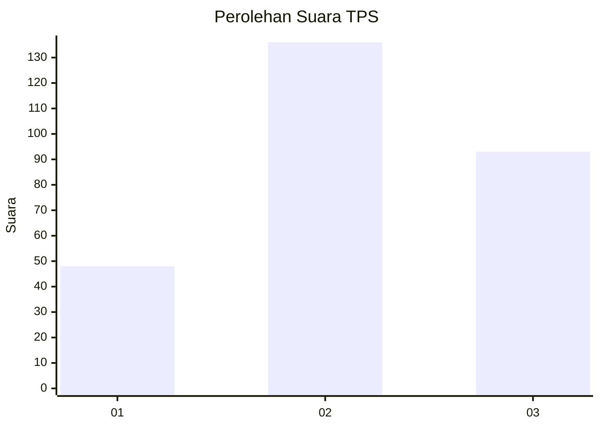
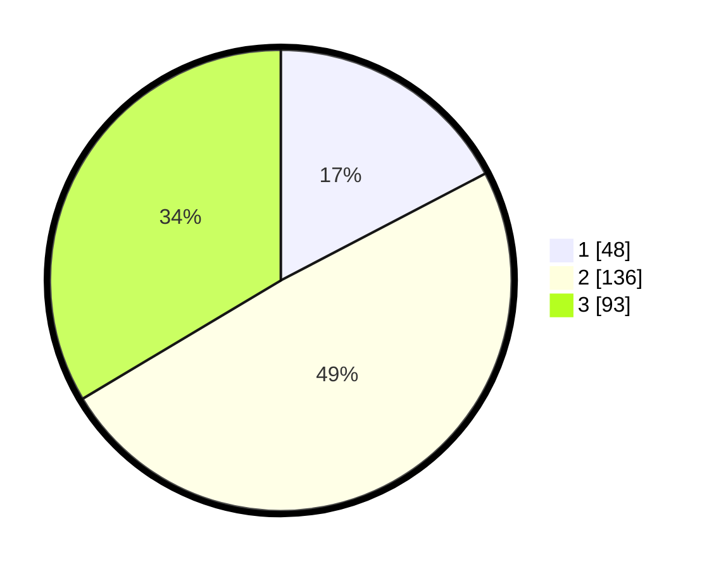

# Hasil

## Grafik

## Tabel

| No. | Nama Paslon    | Suara | Suara (raw) | Persentase |
|:--- |:-------------- | -----:| -----------:| ----------:|
| 1   | ANIES MUHAIMIN | 48    | [48][p-1]   | 17,33      |
| 2   | PRABOWO GIBRAN | 136   | [136][p-2]  | 49,10      |
| 3   | GANJAR MAHFUD  | 93    | [93][p-3]   | 33,57      |

[p-1]: https://github.com/gigit-pemilu/pemilu-2024-34-di-yogyakarta/blob/main/pilpres/hitung-suara/sub/34-di-yogyakarta/sub/04-sleman/sub/16-pakem/sub/2005-hargobinangun/sub/021-tps/sub/paslon-1.txt
[p-2]: https://github.com/gigit-pemilu/pemilu-2024-34-di-yogyakarta/blob/main/pilpres/hitung-suara/sub/34-di-yogyakarta/sub/04-sleman/sub/16-pakem/sub/2005-hargobinangun/sub/021-tps/sub/paslon-2.txt
[p-3]: https://github.com/gigit-pemilu/pemilu-2024-34-di-yogyakarta/blob/main/pilpres/hitung-suara/sub/34-di-yogyakarta/sub/04-sleman/sub/16-pakem/sub/2005-hargobinangun/sub/021-tps/sub/paslon-3.txt

## Foto C Plano

https://sirekap-obj-formc.kpu.go.id/1150/pemilu/ppwp/34/04/16/20/05/3404162005021-20240214-190500--3c609587-ea47-4d9b-b482-5a70f8b74e8f.jpg

https://sirekap-obj-formc.kpu.go.id/1150/pemilu/ppwp/34/04/16/20/05/3404162005021-20240214-190554--0de70861-7ed3-4720-a92e-51ca4e7c16be.jpg

https://sirekap-obj-formc.kpu.go.id/1150/pemilu/ppwp/34/04/16/20/05/3404162005021-20240214-190647--bae41365-6858-4bd0-9992-61b6c9b59bb2.jpg

## Metadata

| Key        | Value               |
| ---------- | ------------------- |
| Time Stamp | 2024-02-15 12:00:28 |

