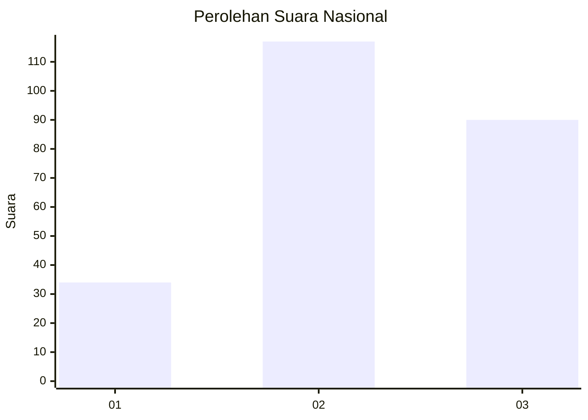
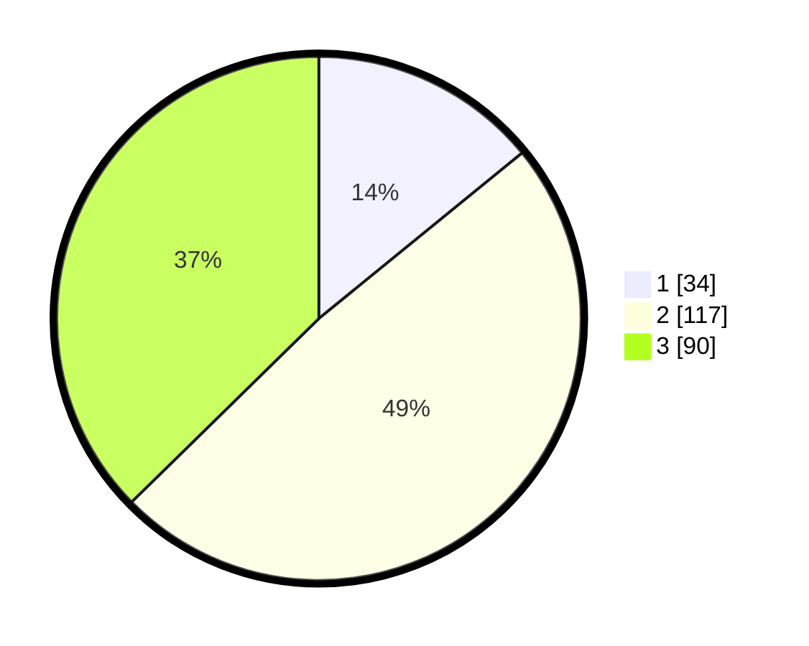

# Hasil

## Grafik

## Tabel

| No. | Nama Paslon    | Suara | Suara (raw) | Persentase |
|:--- |:-------------- | -----:| -----------:| ----------:|
| 1   | ANIES MUHAIMIN | 34    | [34][p-1]   | 14,11      |
| 2   | PRABOWO GIBRAN | 117   | [117][p-2]  | 48,55      |
| 3   | GANJAR MAHFUD  | 90    | [90][p-3]   | 37,34      |

[p-1]: https://github.com/gigit-pemilu/pemilu-2024/blob/main/pilpres/hitung-suara/sub/34-di-yogyakarta/sub/04-sleman/sub/16-pakem/sub/2005-hargobinangun/sub/024-tps/sub/paslon-1.txt
[p-2]: https://github.com/gigit-pemilu/pemilu-2024/blob/main/pilpres/hitung-suara/sub/34-di-yogyakarta/sub/04-sleman/sub/16-pakem/sub/2005-hargobinangun/sub/024-tps/sub/paslon-2.txt
[p-3]: https://github.com/gigit-pemilu/pemilu-2024/blob/main/pilpres/hitung-suara/sub/34-di-yogyakarta/sub/04-sleman/sub/16-pakem/sub/2005-hargobinangun/sub/024-tps/sub/paslon-3.txt

## Foto C Plano

https://sirekap-obj-formc.kpu.go.id/2cb0/pemilu/ppwp/34/04/16/20/05/3404162005024-20240214-201437--740c21e9-7da8-473f-89fc-8069bdeef7d6.jpg

https://sirekap-obj-formc.kpu.go.id/2cb0/pemilu/ppwp/34/04/16/20/05/3404162005024-20240214-202357--b3cb859e-dc29-4b82-8b19-89d2e23cd470.jpg

https://sirekap-obj-formc.kpu.go.id/2cb0/pemilu/ppwp/34/04/16/20/05/3404162005024-20240214-201742--cd052f05-ea29-4304-9553-7c1f5f4d4c81.jpg

## Metadata

| Key        | Value               |
| ---------- | ------------------- |
| Time Stamp | 2024-02-15 00:41:44 |

