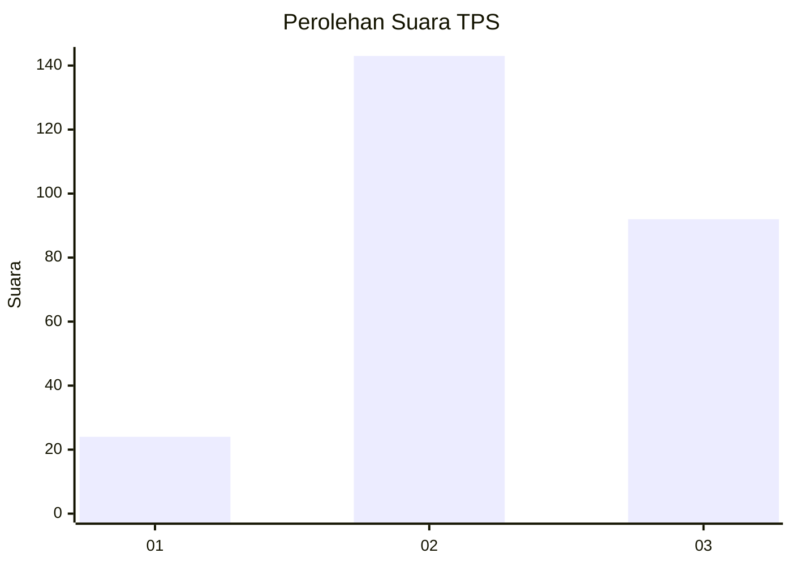
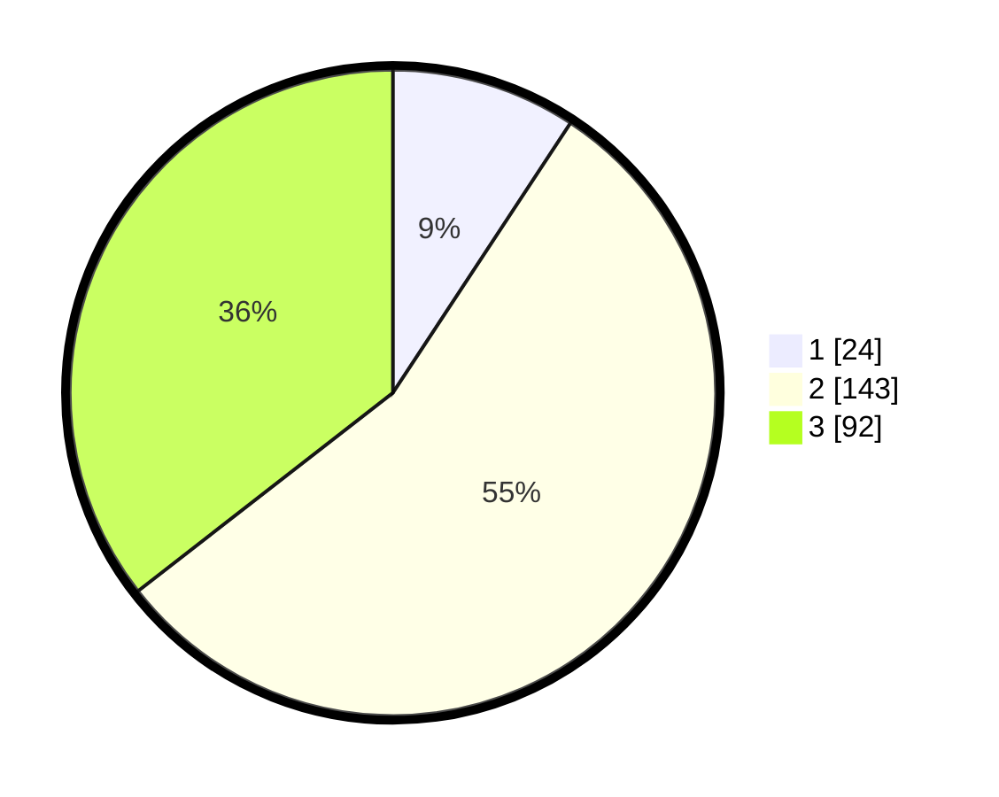

# Hasil

## Grafik

## Tabel

| No. | Nama Paslon    | Suara | Suara (raw) | Persentase |
|:--- |:-------------- | -----:| -----------:| ----------:|
| 1   | ANIES MUHAIMIN | 24    | [24][p-1]   | 9,27       |
| 2   | PRABOWO GIBRAN | 143   | [143][p-2]  | 55,21      |
| 3   | GANJAR MAHFUD  | 92    | [92][p-3]   | 35,52      |

[p-1]: https://github.com/gigit-pemilu/pemilu-2024-34-di-yogyakarta/blob/main/pilpres/hitung-suara/sub/34-di-yogyakarta/sub/04-sleman/sub/16-pakem/sub/2005-hargobinangun/sub/027-tps/sub/paslon-1.txt
[p-2]: https://github.com/gigit-pemilu/pemilu-2024-34-di-yogyakarta/blob/main/pilpres/hitung-suara/sub/34-di-yogyakarta/sub/04-sleman/sub/16-pakem/sub/2005-hargobinangun/sub/027-tps/sub/paslon-2.txt
[p-3]: https://github.com/gigit-pemilu/pemilu-2024-34-di-yogyakarta/blob/main/pilpres/hitung-suara/sub/34-di-yogyakarta/sub/04-sleman/sub/16-pakem/sub/2005-hargobinangun/sub/027-tps/sub/paslon-3.txt

## Foto C Plano

https://sirekap-obj-formc.kpu.go.id/4e6d/pemilu/ppwp/34/04/16/20/05/3404162005027-20240214-231548--579eccf4-3c62-446d-9004-fa7e782a69ac.jpg

https://sirekap-obj-formc.kpu.go.id/4e6d/pemilu/ppwp/34/04/16/20/05/3404162005027-20240214-231714--b25e344f-23a6-4fe0-a0c5-2e65df7bbb74.jpg

https://sirekap-obj-formc.kpu.go.id/4e6d/pemilu/ppwp/34/04/16/20/05/3404162005027-20240214-231822--12a72b4f-48a3-43c4-8129-8208a3b7abaa.jpg

## Metadata

| Key        | Value               |
| ---------- | ------------------- |
| Time Stamp | 2024-02-16 22:01:00 |

