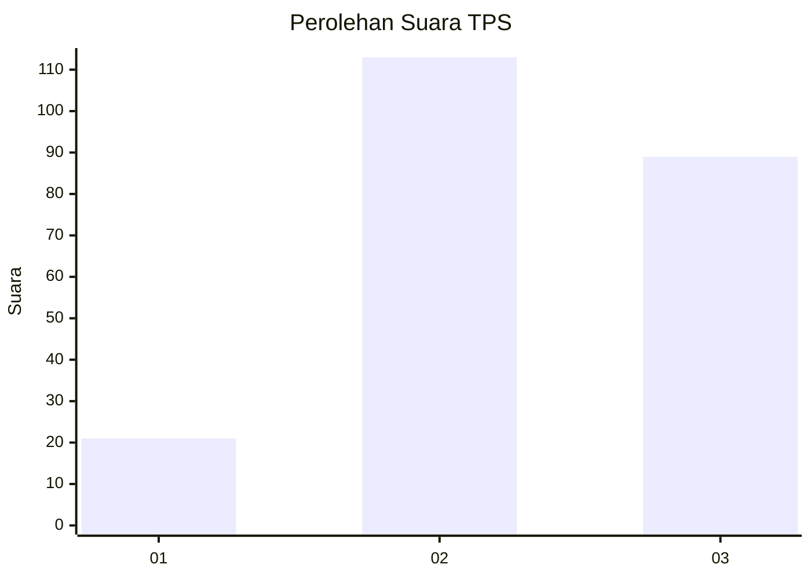
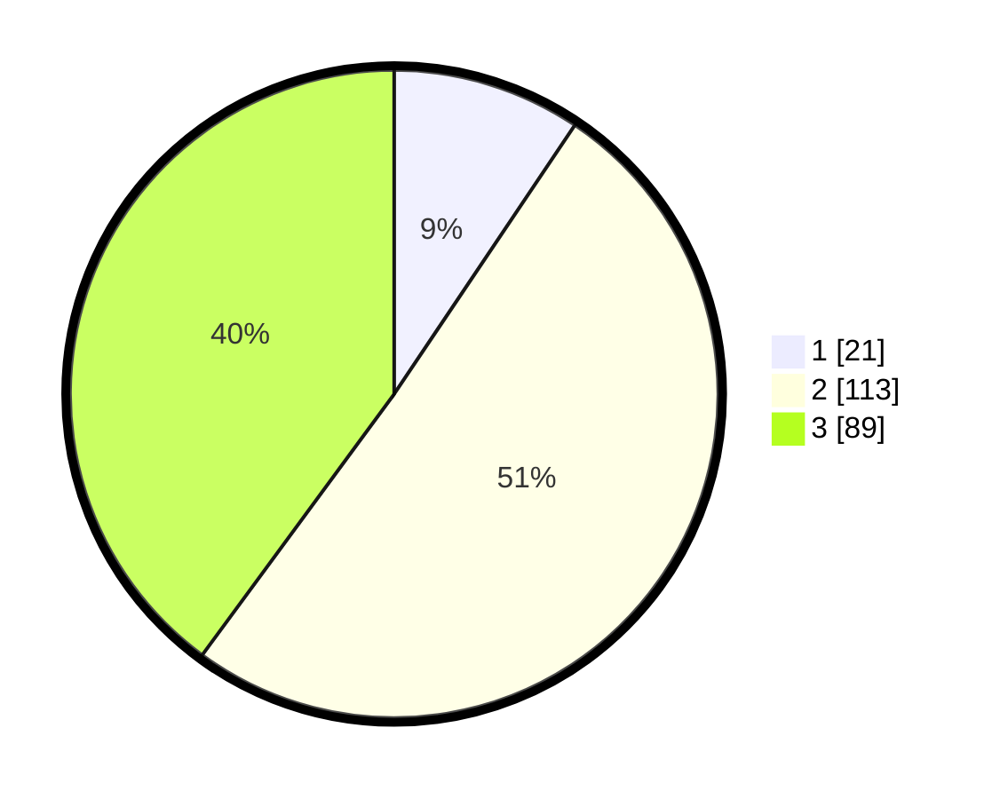

# Hasil

## Grafik

## Tabel

| No. | Nama Paslon    | Suara | Suara (raw) | Persentase |
|:--- |:-------------- | -----:| -----------:| ----------:|
| 1   | ANIES MUHAIMIN | 21    | [21][p-1]   | 9,42       |
| 2   | PRABOWO GIBRAN | 113   | [113][p-2]  | 50,67      |
| 3   | GANJAR MAHFUD  | 89    | [89][p-3]   | 39,91      |

[p-1]: https://github.com/gigit-pemilu/pemilu-2024-34-di-yogyakarta/blob/main/pilpres/hitung-suara/sub/34-di-yogyakarta/sub/04-sleman/sub/17-cangkringan/sub/2001-argomulyo/sub/001-tps/sub/paslon-1.txt
[p-2]: https://github.com/gigit-pemilu/pemilu-2024-34-di-yogyakarta/blob/main/pilpres/hitung-suara/sub/34-di-yogyakarta/sub/04-sleman/sub/17-cangkringan/sub/2001-argomulyo/sub/001-tps/sub/paslon-2.txt
[p-3]: https://github.com/gigit-pemilu/pemilu-2024-34-di-yogyakarta/blob/main/pilpres/hitung-suara/sub/34-di-yogyakarta/sub/04-sleman/sub/17-cangkringan/sub/2001-argomulyo/sub/001-tps/sub/paslon-3.txt

## Foto C Plano

https://sirekap-obj-formc.kpu.go.id/5ff4/pemilu/ppwp/34/04/17/20/01/3404172001001-20240214-235521--44deebdc-c3b8-4372-b158-ced5cd593f16.jpg

https://sirekap-obj-formc.kpu.go.id/5ff4/pemilu/ppwp/34/04/17/20/01/3404172001001-20240214-235715--67458055-8282-4f84-bcf4-7573109747cb.jpg

## Metadata

| Key        | Value               |
| ---------- | ------------------- |
| Time Stamp | 2024-02-25 12:00:00 |

