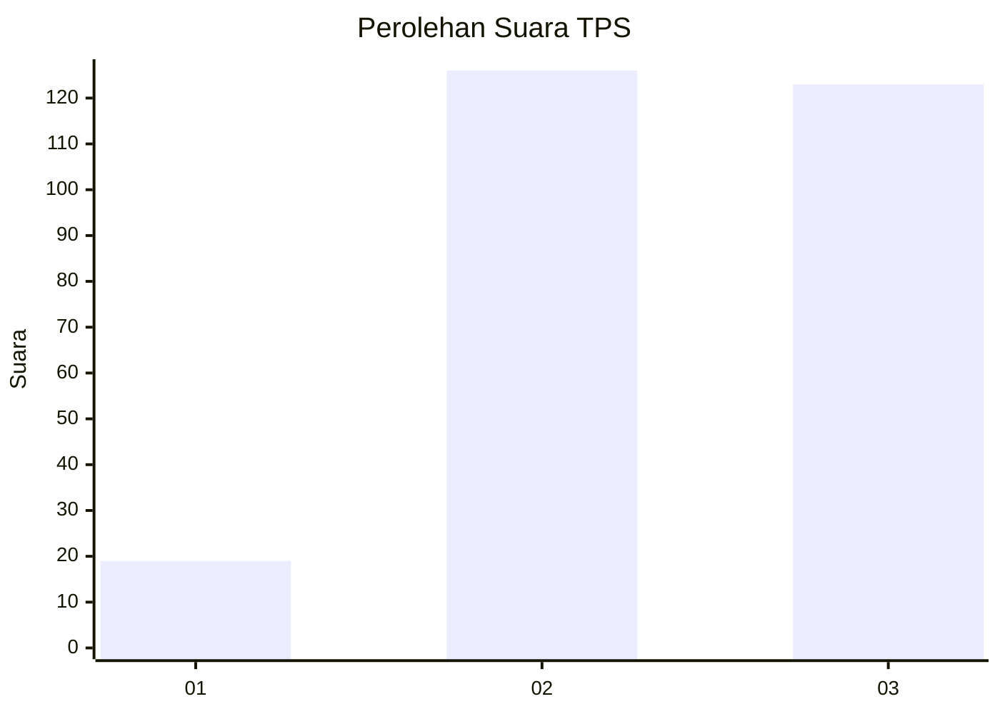
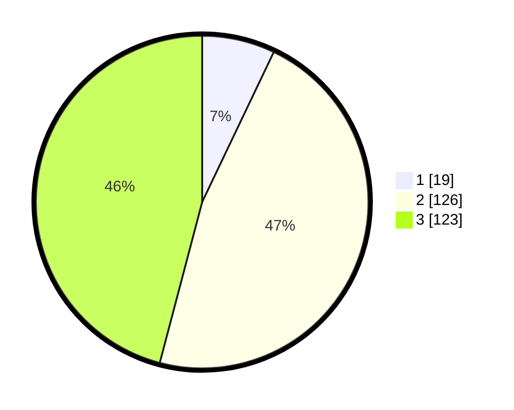

# Hasil

## Grafik

## Tabel

| No. | Nama Paslon    | Suara | Suara (raw) | Persentase |
|:--- |:-------------- | -----:| -----------:| ----------:|
| 1   | ANIES MUHAIMIN | 19    | [19][p-1]   | 7,09       |
| 2   | PRABOWO GIBRAN | 126   | [126][p-2]  | 47,01      |
| 3   | GANJAR MAHFUD  | 123   | [123][p-3]  | 45,90      |

[p-1]: https://github.com/gigit-pemilu/pemilu-2024-34-di-yogyakarta/blob/main/pilpres/hitung-suara/sub/34-di-yogyakarta/sub/04-sleman/sub/17-cangkringan/sub/2001-argomulyo/sub/002-tps/sub/paslon-1.txt
[p-2]: https://github.com/gigit-pemilu/pemilu-2024-34-di-yogyakarta/blob/main/pilpres/hitung-suara/sub/34-di-yogyakarta/sub/04-sleman/sub/17-cangkringan/sub/2001-argomulyo/sub/002-tps/sub/paslon-2.txt
[p-3]: https://github.com/gigit-pemilu/pemilu-2024-34-di-yogyakarta/blob/main/pilpres/hitung-suara/sub/34-di-yogyakarta/sub/04-sleman/sub/17-cangkringan/sub/2001-argomulyo/sub/002-tps/sub/paslon-3.txt

## Foto C Plano

https://sirekap-obj-formc.kpu.go.id/ac94/pemilu/ppwp/34/04/17/20/01/3404172001002-20240215-011208--e8f6ee36-c61d-4f88-a511-52de6f0ffea1.jpg

https://sirekap-obj-formc.kpu.go.id/ac94/pemilu/ppwp/34/04/17/20/01/3404172001002-20240215-011355--b9ee9fcd-b40e-4ce7-ba05-16d39607db2d.jpg

https://sirekap-obj-formc.kpu.go.id/ac94/pemilu/ppwp/34/04/17/20/01/3404172001002-20240215-011518--3c332f67-6ef9-480c-9c3c-924c12a634b2.jpg

## Metadata

| Key        | Value               |
| ---------- | ------------------- |
| Time Stamp | 2024-02-15 12:00:28 |

## DATA PEMILIH TETAP

Jumlah pemilih dalam DPT: **293**.
 * L: **144**.
 * P: **149**.

## DATA PENGGUNA HAK PILIH

Jumlah pengguna hak pilih dalam DPT: **263**.
 * L: **130**.
 * P: **133**.

Jumlah pengguna hak pilih dalam DPTb: **6**.
 * L: **5**.
 * P: **1**.

Jumlah pengguna hak pilih dalam DPK: **4**.
 * L: **2**.
 * P: **2**.

Jumlah pengguna hak pilih: **273**.
 * L: **137**.
 * P: **136**.

## JUMLAH SUARA SAH DAN TIDAK SAH

JUMLAH SELURUH SUARA SAH: **268**.

JUMLAH SUARA TIDAK SAH: **5**.

JUMLAH SELURUH SUARA SAH DAN SUARA TIDAK SAH: **273**.

