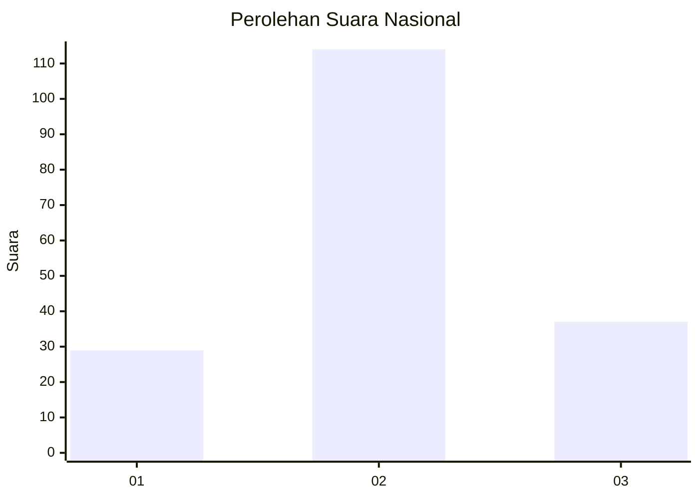
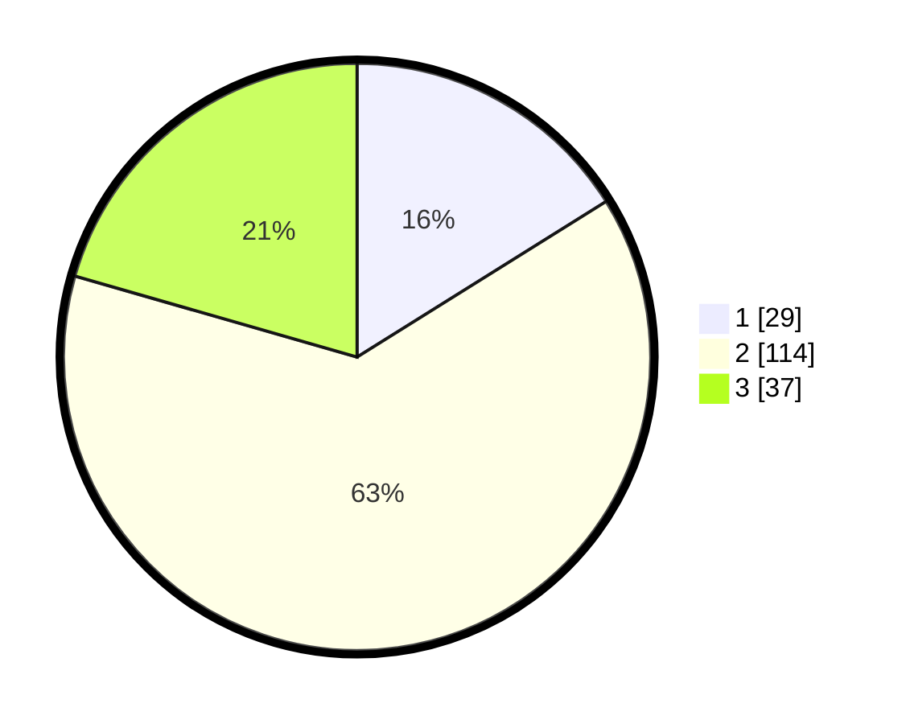

# Hasil

## Grafik

## Tabel

| No. | Nama Paslon    | Suara | Suara (raw) | Persentase |
|:--- |:-------------- | -----:| -----------:| ----------:|
| 1   | ANIES MUHAIMIN | 29    | [29][p-1]   | 16,11      |
| 2   | PRABOWO GIBRAN | 114   | [114][p-2]  | 63,33      |
| 3   | GANJAR MAHFUD  | 37    | [37][p-3]   | 20,56      |

[p-1]: https://github.com/gigit-pemilu/pemilu-2024/blob/main/pilpres/hitung-suara/sub/34-di-yogyakarta/sub/04-sleman/sub/17-cangkringan/sub/2001-argomulyo/sub/003-tps/sub/paslon-1.txt
[p-2]: https://github.com/gigit-pemilu/pemilu-2024/blob/main/pilpres/hitung-suara/sub/34-di-yogyakarta/sub/04-sleman/sub/17-cangkringan/sub/2001-argomulyo/sub/003-tps/sub/paslon-2.txt
[p-3]: https://github.com/gigit-pemilu/pemilu-2024/blob/main/pilpres/hitung-suara/sub/34-di-yogyakarta/sub/04-sleman/sub/17-cangkringan/sub/2001-argomulyo/sub/003-tps/sub/paslon-3.txt

## Foto C Plano

https://sirekap-obj-formc.kpu.go.id/33b9/pemilu/ppwp/34/04/17/20/01/3404172001003-20240214-213144--28b51ffc-5d6e-4142-91dd-6d251b0727a4.jpg

https://sirekap-obj-formc.kpu.go.id/33b9/pemilu/ppwp/34/04/17/20/01/3404172001003-20240214-213202--17ed6fe6-b680-4b51-bbf8-187cdb07d5d2.jpg

https://sirekap-obj-formc.kpu.go.id/33b9/pemilu/ppwp/34/04/17/20/01/3404172001003-20240214-213219--c62e7117-bfde-4e6b-a954-a95e1d2db04d.jpg

## Metadata

| Key        | Value               |
| ---------- | ------------------- |
| Time Stamp | 2024-02-15 20:00:44 |

## DATA PEMILIH TETAP

Jumlah pemilih dalam DPT: **190**.
 * L: **97**.
 * P: **93**.

## DATA PENGGUNA HAK PILIH

Jumlah pengguna hak pilih dalam DPT: **179**.
 * L: **91**.
 * P: **88**.

Jumlah pengguna hak pilih dalam DPTb: **5**.
 * L: **1**.
 * P: **4**.

Jumlah pengguna hak pilih dalam DPK: **0**.
 * L: **0**.
 * P: **0**.

Jumlah pengguna hak pilih: **184**.
 * L: **92**.
 * P: **92**.

## JUMLAH SUARA SAH DAN TIDAK SAH

JUMLAH SELURUH SUARA SAH: **180**.

JUMLAH SUARA TIDAK SAH: **4**.

JUMLAH SELURUH SUARA SAH DAN SUARA TIDAK SAH: **184**.

